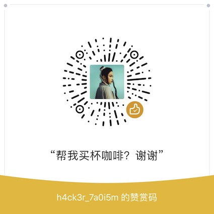

# 简介 ReadME

## hacker\_taoism\_book

## 7a0i5m的黑客之书

## About this

A git book by h4ck3r\_7a0i5m

> 会尽量尝试双语书写，由于英语水平一般，会有很多错误。（重在练习）
>
> I will try to write with Chinese and English both, but my English is really bad, so there maybe many mistakes.
>
> The walkthrough by Engl
>
> 完成每天阅读，并将相关链接及笔记写在每日阅读栏目
>
> I'll finish my reading everyday and post the links at daily reading part.
>
> 将过去写的`walkthrough`整理更新在对应的靶场部分
>
> I'll post my walkthroughs with boxes which from HTB, vulnhub, etc.

## About me

Nobody, Noob hacker, try to get Guru on HackTheBox.

## IF

如果你要转载任何东西出去，请注明出处，谢谢。

If you want to forward anything from me, please indicate the source.

如果觉得有帮助或者想表达什么，欢迎打赏

If you think my posts have a little helpful, welcome to buy me a coffee, thanks a lot.

点击

Bymeacoffee

[https://www.buymeacoffee.com/7a0i5m](https://www.buymeacoffee.com/7a0i5m)

或扫码

or use wechat

