# Apocalyst\_46

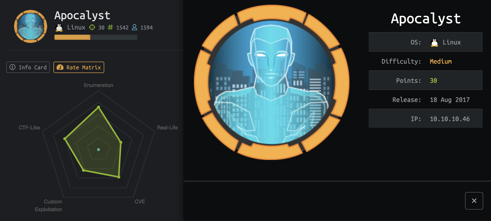

显示不完整。将apocalyst加入host解析

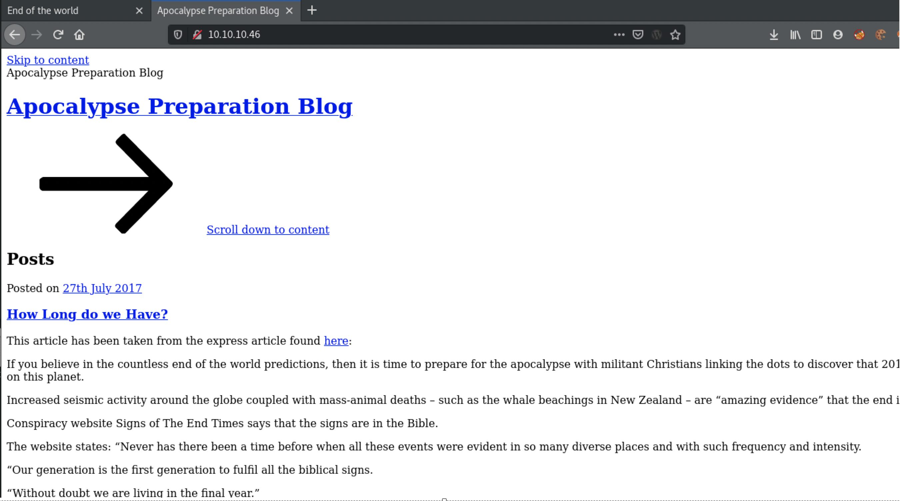

正常了


首先这个盒子很扯淡。，正常字典打的目录会让你止步不前。应该先收集一下，我怀疑oscp的中的某个其实也有这个问题。所以还是做了。

看网页发现，how long we have 这个作者，怀疑是用户名`falaraki`


写cewl收集一下网站，。然后。再附加到正常字典里再打目录

```bash
$ cewl 10.10.10.46 > wordlist.txt
```

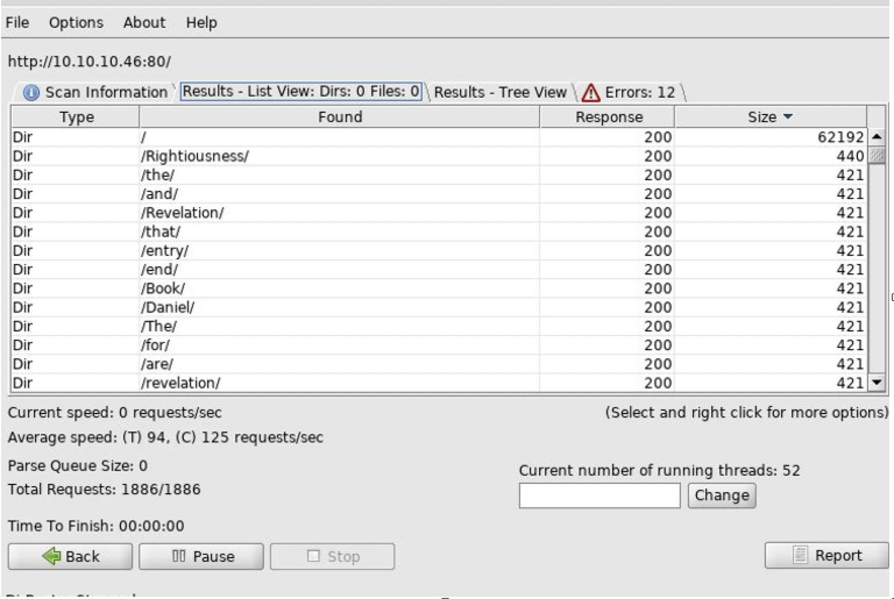

多个页面会频繁出现这个图片，下载。


从这开始整个靶机就非常扯了其实 安装一个图片解码工具

```bash
$ apt-get install steghide
$ steghide extract -sf apocalyst.jpg
Enter passphrase:
wrote extracted data to "list.txt".
```


提示输入的时候直接回车跳过

生成了一个新的文件list.txt，看文件内容应该是一个字典。

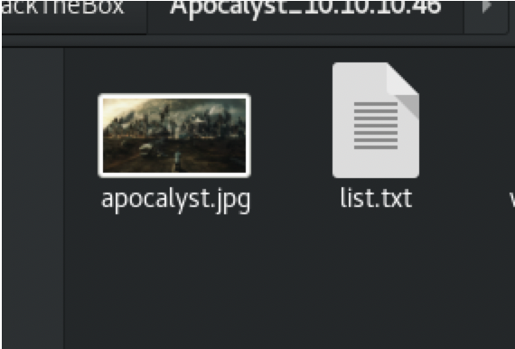

我们已经看到 网站应该是另一个wp，现在有有一个用户名`falaraki`,一个字典。

扔到wpscan里尝试暴力一下

```bash
$ wpscan --url http://10.10.10.46 --wordlist /root/HackTheBox/Apocalyst_10.10.10.46/list.txt --username falaraki
```


```bash
login: falaraki
password: Transclisiation
```

使用这个凭证从wp后台登陆。

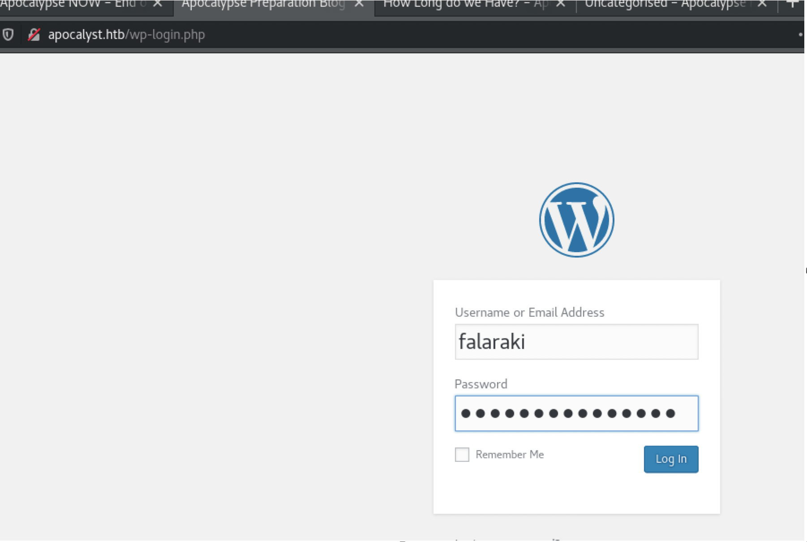

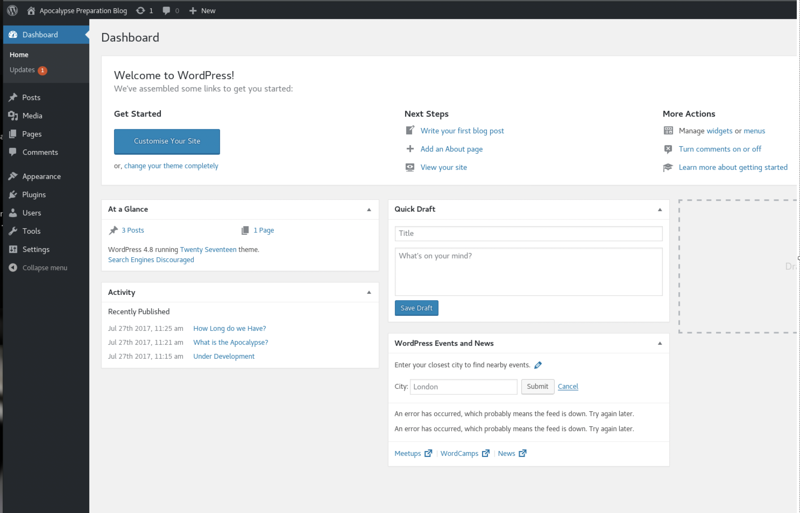

老套路通过修改`single.php`文件为php reverse shell 文件内容

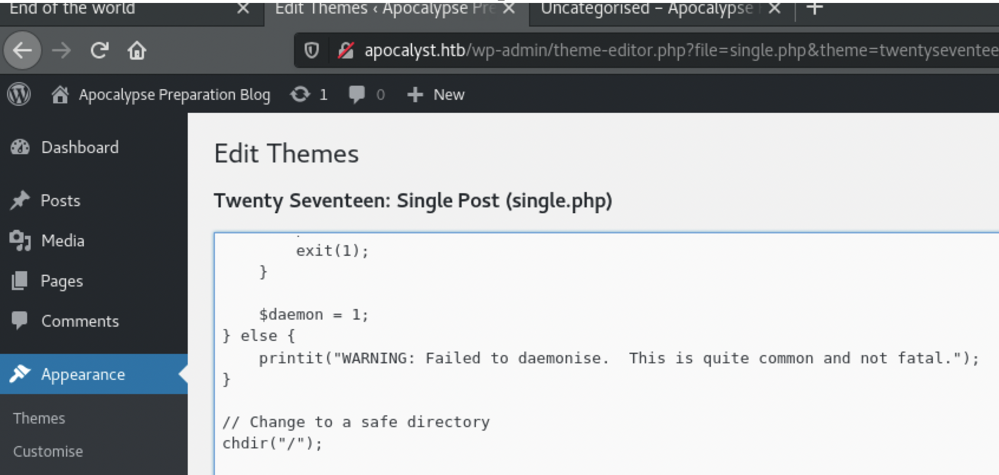

修改为kali IP，并上传

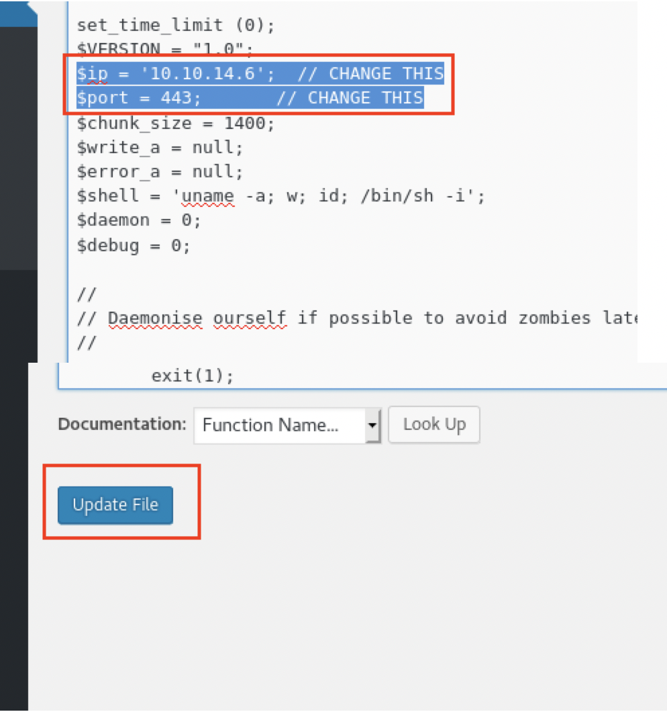

kali本地设立监听


回到网页随便点一个文章题目就能得到shell


先尝试获得更方便的bash shell

```bash
$ /bin/bash -i
```


获得user

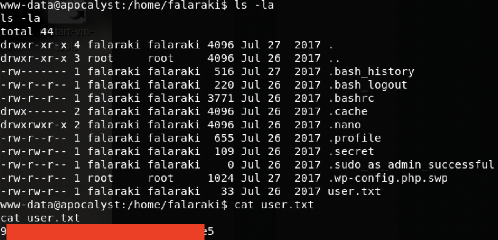

注意到一个隐藏文件`.secret`


查看内容发现一串base64编码


```bash
S2VlcCBmb3JnZXR0aW5nIHBhc3N3b3JkIHNvIHRoaXMgd2lsbCBrZWVwIGl0IHNhZmUhDQpZMHVBSU50RzM3VGlOZ1RIIXNVemVyc1A0c3M=
```

base64解码


所以用户的凭证可能是

```bash
falaraki:Y0uAINtG37TiNgTH!sUzersP4ss
```

ssh登陆成功

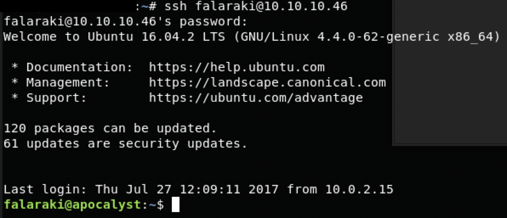

上传linEnum帮助枚举

LinEnum: [https://github.com/rebootuser/LinEnum](https://github.com/rebootuser/LinEnum)

枚举发现passwd可写


直接在passwd文件最后追加一行新的用户及对应凭证。将最后面的用户部分改为root

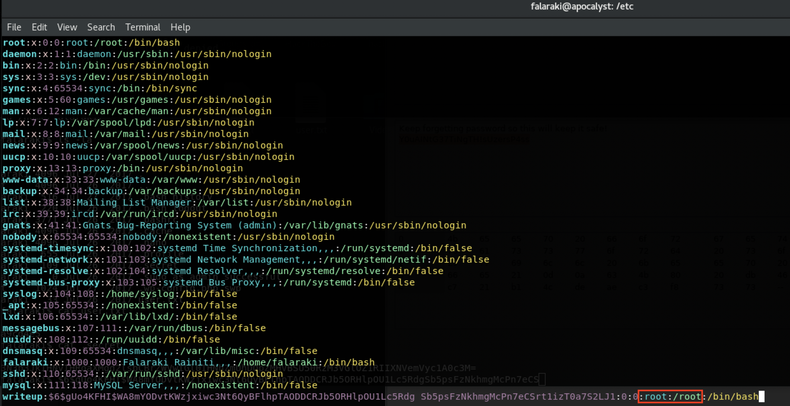

这相当于增加了新的root用户

su切换到新用户就获得了root shell

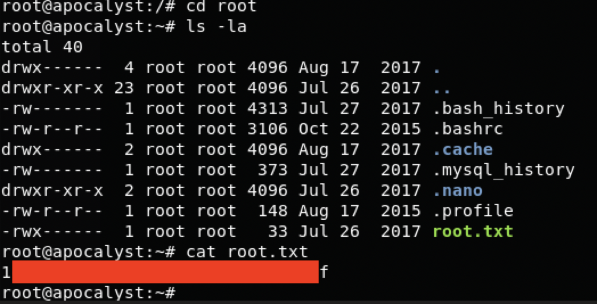

