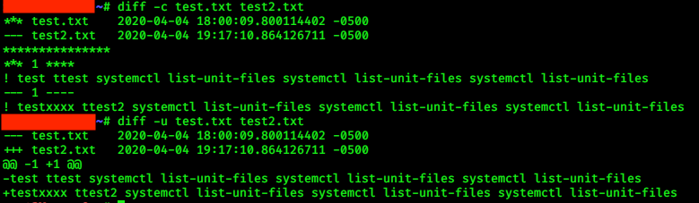

> 这是一个PWK2.0更新后的自我重修过程，用来更新我的PWK知识，提升基础技能的认知度。
>
> 同时也是一个自我反省的过程。我希望我多年之后仍能回忆起，我在OSCP认证道路上所经历
>
> 的一切。
>
> 这篇笔记由于是在OSCP认证之后的重修升级，因此常用技能和简单问题不再记录。

# 基础命令

**输出**

文件流stdin(输入)，stdout(输出)和stderr(错误)的文件描述符分别为0、1和2。

```bash
$ ls /fake/directory 2> err.txt		#输出执行错误到一个文件
$ ls /fake/directory > out_err.txt 2>&1		#输出执行信息和错误到一个文件
$ ls /fake/directory &> peanuts.txt		#输出执行信息和错误到一个文件的更短的写法
$ ls /fake/directory 2> /dev/null		#这样子可以不输出到任何文件，也不打印到屏幕/正确执行正确的命令，忽略错误信息
```

**man**

```man -k <cmd>```

可以查看某命令 同时附带简要叙述

例如：

```	man -k passwd ```

可以返回跟passwd相关的所有命令并带有简述

还可以使用正则表达式，来进行模糊搜索，然后通过man加编号即可查看这个命令

```bash
kali@kali:~$ man -k '^passwd$'
passwd (1)			-change user password
passwd (1ssl)		-compute password hashes
passwd (5)          -the password file
kali@kali:~$ man 5 passwd
```

---

**apropos**

``` apropos <cmd> ```

apropos于man -k 等效

---

**mkdir**

mkdir创建文件夹时候，创建多个目录

``` mkdir -p testdir/{dir1,dir2,dir3}```

---

**find**

> 因为find是最容易忘记的命令。加强一遍

查找文件名保护sbd的文件

```bash
kali@kali:~$ sudo find / -name sbd*
/usr/bin/sbd
/usr/share/doc/sbd
/usr/share/windows-resources/sbd
/usr/share/windows-resources/sbd/sbd.exe
/usr/share/windows-resources/sbd/sbdbg.exe
/var/cache/apt/archives/sbd_1.37-1kali3_amd64.deb
/var/lib/dpkg/info/sbd.md5sums
/var/lib/dpkg/info/sbd.list
```

> / 是从哪个目录递进查找，需要在 etc目录查找就 ```find /etc/ -name passwd```

**ss**

> 与netstat同等的网络信息查看工具

**systemctl list-unit-files**

> 查看各项服务状态，返回一个别表，服务对应状态

**export echo  $ env**

> `export`命令使变量可供我们可能从当前Bash实例产生的任何子进程访问。 如果我们设置了一个没有进行export的环境变量，那么它将仅在当前shell中可用。我们可以使用``echo "$$"``来显示当前shell实例的进程ID，以确保我们确实在两个不同的shell中发出命令。``env``可以帮助我们查看当前所有生效的全局变量

```bash
export a=10.10.10.10
ping -c4 $a //显然，我们可以用export建立全局变量，并在任意命令中使用这个变量
```

```bash
echo "$$" //打印当前shell进程ID

var = "My var"
echo $var //打印某个变量，这个只能打印在相同shell的变量

export var ="Global Var"
echo $var //同样是打印变量，但是因为使用的是export，所以这个变量在任何shell中都可以打印

```

**history**

使用history命令，可以显示之前在命令行使用过的命令，使用`!<n>`可以再次执行序号为n的命令使用`!!`则可以执行上一条命令。***所以一定要注意当字符串中连续出现叹号时要进行转义处理如：`echo \!\!\!\!`***

在查找命令 历史的时候也可以使用<kbd>Ctrl</kbd>+<kbd>r</kbd>然后输入关键字，这种方法可以快速检索输入过的命令<kbd>Return</kbd>可以执行，上下方向键可以帮助退出检索状态

**wc -m < test.txt**

查询test.txt的字数，同样的执行效果还可以通过另外的命令实现 `cat test.txt | wc -m`我们使用管道字符（|）将cat命令的输出重定向到wc命令的输入。 这个概念看似微不足道，但将不同的命令组合在一起是处理各种数据的强大工具。

**grep sed cut awk**

*注意，处理的文件流*

**grep**

> 最常用的开关包括`-r` 递归搜索和`-i` 忽略文本大小写。 

```bash
root@mkii:~# ls -la | grep -i pub
drwxr-xr-x  2 root root  4096 Dec  6 17:30 Public
root@mkii:~#  
```

**sed**

> 对流中的一部分进行替换

```bash
root@mkii:~# echo "let us try hard" | sed 's/hard/harder/'
let us try harder
```

**cut**

> `-d "<strings>"` 以某个字符串或字符分割输出。`-f <n>` 输出第n个片段

```bash
kali@kali:~$ echo "I hack binaries,web apps,mobile apps, and just about anything else"| cut -f 2-d ","
web apps

kali@kali:~$ cut -d ":" -f 1 /etc/passwd
root
daemon
bin
```

**awk**

> 与cut相比，更好的适用于使用多个分隔符进行切割，并且支持更多的处理,如编程等。
>
> 参考https://www.runoob.com/linux/linux-comm-awk.html

```bash
root@mkii:~# echo "hello::there;friend" | awk -F '[::;]' '{print $1, $3}' 
hello there 
```

**diff**

> diff命令用于检测文件之间的差异，类似于comm命令。 但是，要复杂得多，并支持许多输出格式。 最受欢迎的两种格式包括上下文格式（-c）和统一格式（-u）。



**ps**

> `-e`所有进程
>
> `-f`格式化显示
>
> `-c`用命令检索

```bash
查看系统上的每个进程：
ps -e
ps -ef
ps -eF
ps -ely 
要使用BSD语法查看系统上的每个进程：
ps ax
ps axu
要打印过程树：
ps -ejH
ps axjf
获取有关线程的信息：
ps -eLf
ps axms

要以用户格式查看以root身份运行的每个进程（真实和有效ID）
ps -U root -u root u
只格式化打印bash进程的信息
ps -f -C bash
仅打印syslogd的进程ID
ps -C syslogd -o pid=
只打印进程42的名字
ps -q 42 -o comm= 
```

**tail**

> tail 可以在文件被占用时镜像文件进行显示监视，使用`-f`参数动态跟随显示正在更新的文件信息，使用`-n<n>`可以限制只显示最后更新的N行

**watch**

> watch可以定时执行某项命令,如`watch -n 5 date`每5s执行date命令显示当前时间，`-n <n>`参数用来定义定时器间隔，单位秒

**axel**

> axel是一个支持多线程的下载加速器，可通过多个连接从FTP或HTTP服务器传输文件。 该工具具有众多功能，但最常见的功能是`-n`，用于指定要使用的线程数量。 `-a`选项用于更简洁的进度指示器，并且`-o`为下载的文件指定其他文件名。

`axel -a -n 20 -o report_axel.pdf https://www.offensive-security.com/reports/penetration-testing-sample-report-2013.pdf`

**alias  unalias**

> 别名可以简化命令输入，同时。也可以在目标机器上做一些手脚比如执行`alias whoami='echo "you are nobody"'`此时再执行whoami命令就可以被替换成想要的显示，或者其他命令。但是这种操作无法修改bash脚本所执行的明确命令。要取消别名可以使用`unalias whoami` 设置之后的可以在shell环境文件中找到 系统的/etc/bash.bashrc  单独用户的/home/bob/.bashrc

**uniq**

```bash
$ uniq reading.txt		#去重
$ uniq -c reading.txt		#查询重复数量
$ uniq -u reading.txt		#显示重复值
$ uniq -d reading.txt		#显示不重复的值
$ sort reading.txt | uniq	#排序再去重

```

**wc nl**

> wc（单词计数）命令显示文件中单词的总数。它分别显示行数`-l`，字数`-w`和字节数`-c`。

```bash
wc /etc/passwd
 96     265    5925 /etc/passwd
 行数	   字数	字节数
```

