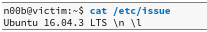

# linux提权

## 不安全的文件权限：Cron案例研究

可以检查cron日志文件（/var/log/cron.log）是否正在运行cron作业

似乎在root用户的上下文中执行了一个名为user_backups.sh的脚本位于 / var / scripts /。从时间戳来看，此作业似乎每五分钟运行一次。由于我们知道了脚本的位置，因此可以检查其内容和权限

本地用户可写

由于无特权的用户可以修改备份脚本的内容，因此我们可以对其进行编辑并添加一个反向shell单行代码。五分钟的时间。

时间到会在监听上得到root的反向shell

## 不安全的文件权限：/ etc / passwd案例研究

passwd文件正常应该保持不可写的权限，一旦可写，则可以通过修改passwd文件来替代密码。

openssl可以帮助我们生产符合格式的，被linux支持的密码hash

## 内核漏洞利用提权

枚举基本信息

搜索漏洞，编译，漏洞利用。太简单了，不累述