# 信息搜集之Recon-ng

> 只写不常用或记忆偏差的

## Recon-ng

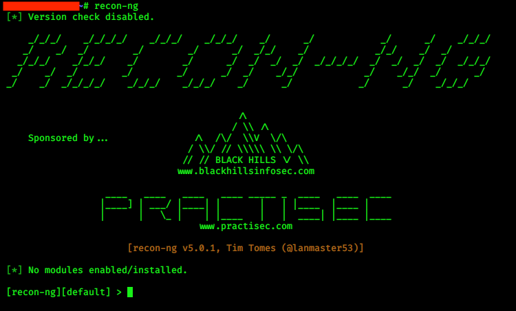

> 根据输出，我们需要加载各种模块才能使用recon-ng。我们可以从recon-ng市场中添加模块。我们将使用`mainplace search`从主提示中搜索市场，并提供一个搜索字符串作为 在本示例中，我们将搜索包含术语github的模块`marketplace search github`

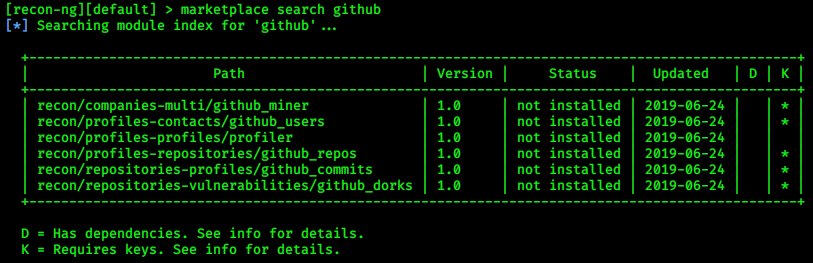

* K栏打` * `的为需要授权key，或者其他凭据，可以通过`marketplace info`查看具体信息

我们来安装另外一个模块用来对网址域名进行侦察`recon/domains-hosts/google_site_web`
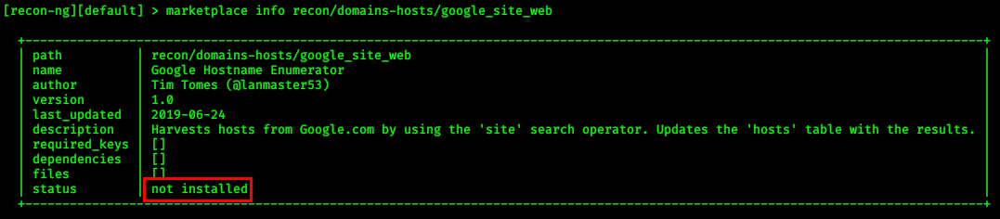

需要先使用`marketplace install`安装模块，然后加载模块则使用`modules load`加上路径即可

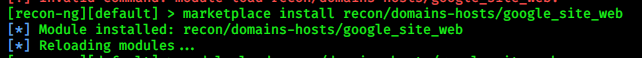

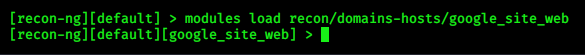

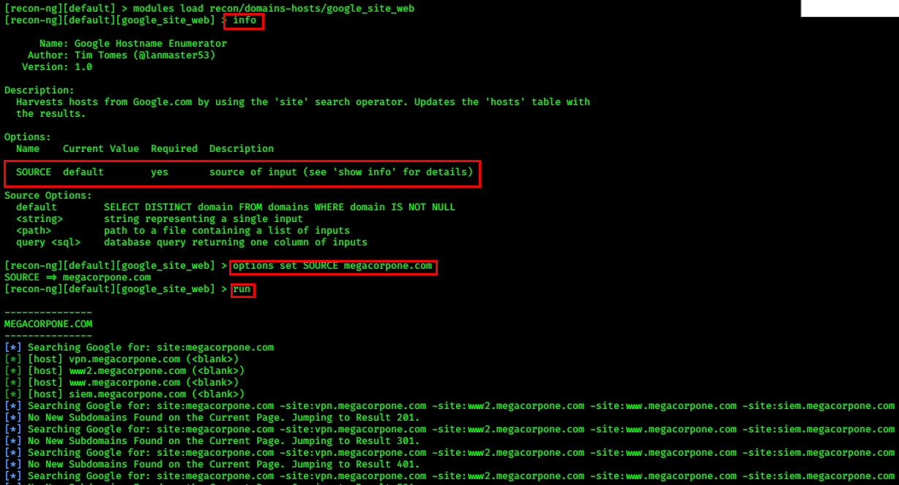

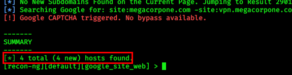

>  结果会存储在本地数据库中，这些结果将传入入其他侦查模块。我们可以使用`back`命令退回上一层，并使用`show hosts`命令查看存储的数据

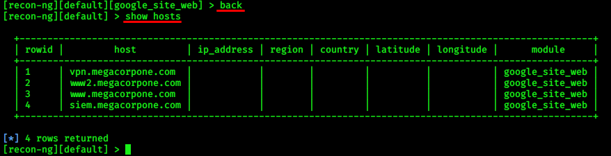

可以`show`的信息

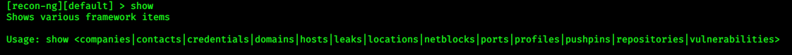

现在我们需要侦察域名对应的IP地址

可以使用`recon/hosts-hosts/resolve` 模块

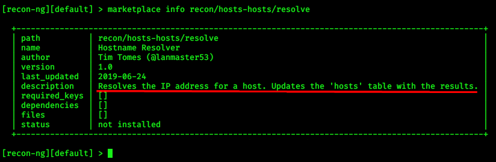

再执行一遍安装和读取模块

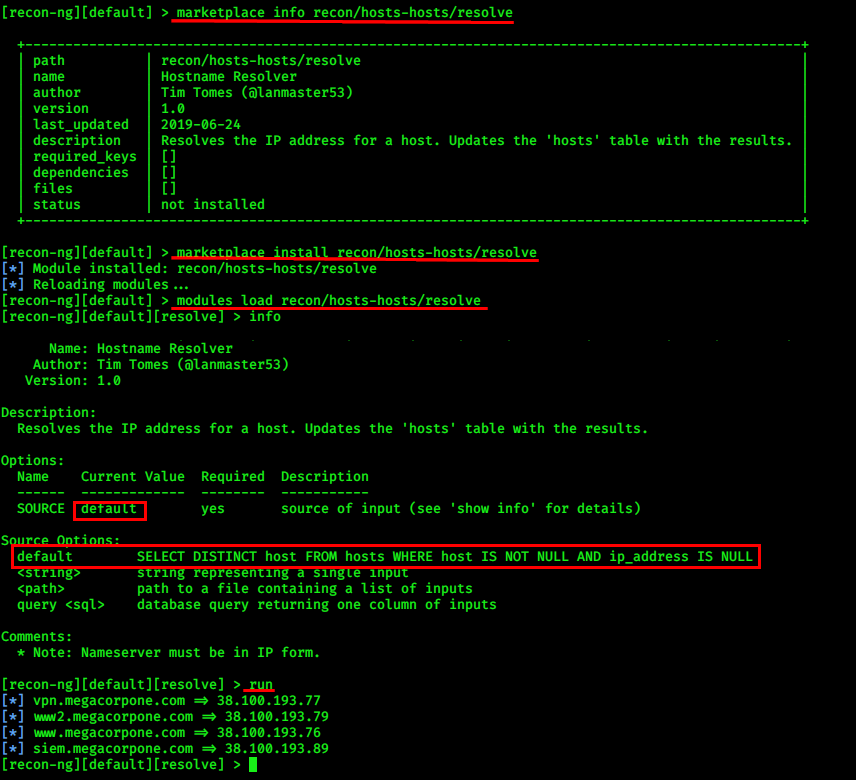

目标虽然是默认，但是默认的定义是自动选择host中ip地址是空的进行侦察。

完成后`back`再次`show hosts`就会发现ip地址已经填充

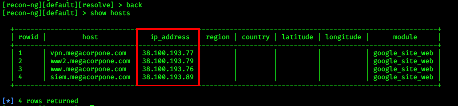