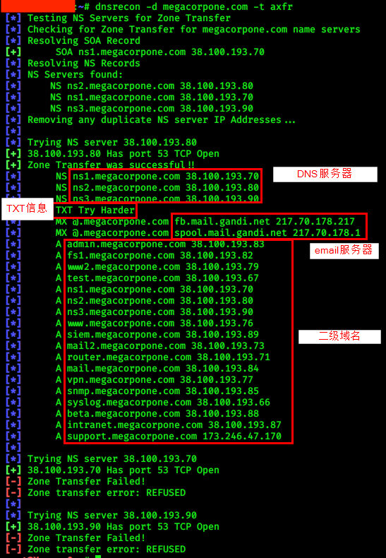

# 4.主动信息搜集

## DNS枚举

> 每个域可以使用不同类型的DNS记录。  DNS记录的一些最常见类型包括

* `NS`-Nameserver记录包含托管域DNS记录的权威服务器的名称。

* `A`-也称为主机记录，“一条记录”包含主机名的IP地址（例如www.megacorpone.com  ）。

* `MX`-Mail Exchange记录包含负责处理域电子邮件的服务器的名称。 一个域可以包含多个MX记录。

* `PTR`-PointerRecords用于反向查找区域，用于查找与IP地址关联的记
* `CNAME`-规范名称记录用于为其他主机记录创建别名。
* `TXT`- 文本记录可以包含任何任意数据，并且可以用于多种目的，例如域所有权验证。

`host www.test.com`查询IP地址，增加`-t <type>`选项查询其他信息

`host -l <domain name> <dns server address>`

```bash
kali@kali:~$ host www.megacorpone.com
www.megacorpone.com has address 38.100.193.76

kali@kali:~$ host -t mx megacorpone.com
megacorpone.com mail is handled by 10 fb.mail.gandi.net.
megacorpone.com mail is handled by 50 mail.megacorpone.com.
megacorpone.com mail is handled by 60 mail2.megacorpone.com.
megacorpone.com mail is handled by 20 spool.mail.gan

kali@kali:~$ host -t txt megacorpone.com
megacorpone.com descriptive text "Try Harder"
```

### 自动化工具

`dnsrecon -d test.com -t axfr`



`dnsenum test.com`