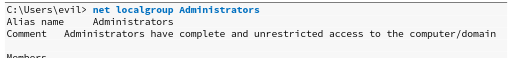
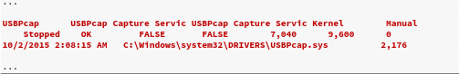

# win提权实例讲解

## 	个windows权限机制

Windows操作系统使用称为access tokens的对象。一旦对用户进行身份验证，Windows就会生成并分配给该用户。令牌本身包含各种信息，可有效描述给定用户的安全上下文，包括用户权限。

这些令牌需要是唯一可识别的。这是使用安全标识符或SID完成的，该标识符是分配给每个对象（包括令牌）（例如用户或组帐户）的唯一值。这些SID由 Windows Local Security Authority生成和维护

Windows除了特权外，还实现了所谓的完整性机制。这是Windows安全体系结构的核心组件，通过为应用程序进程和安全对象分配完整性级别而起作用。这描述了操作系统的信任级别。具有正在运行的应用程序或安全对象。例如，配置的完整性级别指示应用程序可以执行哪些操作，包括从本地文件系统读取或写入本地文件系统的能力。也可以从特定的完整性级别阻止API。

* 系统完整性过程：系统权限

* 高完整性过程：管理权限
* 中等完整性过程：标准用户权限
* 低完整性过程：沙盒过程中经常使用的非常受限制的权限

## 用户账户控制（UAC）

用户帐户控制（UAC）是Microsoft随Windows Vista和Windows Server 2008引入的一种访问控制系统。必须强调的是，Microsoft并不认为它是安全的。

UAC会强制应用程序和任务在非管理帐户的上下文中运行，直到管理员授权提升的访问权限为止。

UAC的作用是任何希望执行可能会对整个系统产生影响的操作的应用程序都不能默默地执行。至少在理论上

**即使以管理用户身份登录，该帐户也将具有两个安全令牌，一个以中等完整性级别运行，另一个以高完整性级别运行。**

正常的管理员运行级别


为了更改管理员用户的密码，即使我们以管理员用户身份登录，也必须切换到较高的完整性级别。在我们的示例中，一种方法是通过powershell.exe使用Start-Process指定“以管理员身份运行”选项运行cmd程序：


再次检查运行级别则会发现实际运行级别变为高，修改密码等操作可以正常进行。


### 用户帐户控制（UAC）绕过：fodhelper.exe案例研究

该技术允许管理员用户通过将我们的完整性级别从中级静默提升到高级来绕过UAC

大多数公知的UAC绕过技术都针对特定的操作系统版本。在这种情况下，目标是运行Windows 10 build 1709的客户端。我们将利用基于fodhelper.exe的有趣的UAC旁路，该Microsoft支持应用程序负责管理操作系统中的语言更改。具体而言，只要本地用户在“应用和功能” Windows设置中选择`“管理可选功能（Manage optional features）”`选项就会启动fodhelper，当然我们需要在命令行下启动。


fodhelper.exe在Windows 10 1709上以高完整性运行。由于fodhelper可以在没有管理特权的情况下修改的注册表项进行交互。我们将尝试查找和修改这些注册表项，以便以较高的完整性运行我们选择的命令。

首先应该在，cmd命令行下执行fodhelper


为了收集有关fodhelper完整性级别和运行此过程所需的权限的详细信息，我们将检查其应用程序清单。应用程序清单是一个XML文件，其中包含的信息使操作系统知道如何处理程序。开始。我们将使用`Sysinternals`的`sigcheck`检查清单，并通过`-a`参数以获得扩展信息，并`-m`转储清单。


结果表明该应用程序应由管理用户运行，因此需要完整的Administrator令牌。此外，autoelevate标志设置为true，这允许可执行文件自动提升到高完整性，而无需提示管理员用户同意。

我们可以使用Sysinternals套件中的Process Monitor来收集有关该工具执行的更多信息。


> 当我们的目标是了解特定进程如何与文件系统和Windows注册表进行交互时，Process Monitor是一个非常有用的工具。它是识别注册表劫持，DLL劫持等缺陷的出色工具。

该过滤器显着减少了输出，但是对于此特定漏洞，我们仅对此应用程序如何与当前用户可以修改的注册表项进行交互感兴趣。为了缩小结果范围，我们将通过add搜索条件“ Reg”来调整过滤器，Procmon用来标记注册表操作


这些结果更易于管理，但我们希望进一步缩小重点。具体来说，我们想看看fodhelper应用程序是否正在尝试访问不存在的注册表项。如果是这种情况，并且这些注册表项的权限允许，我们可能会篡改这些条目，并有可能干扰目标高完整性进程正在尝试执行的操作。add过滤关键词  “NAME NOT FOUN“


但是，由于我们不能随意修改每个配置单元中的注册表项，因此我们需要集中精力于我们可以控制的注册表配置单元。在这种情况下，我们将专注于HKEY_CURRENT_USER（HKCU）配置单元，我们当前的用户具有读写访问权限。


现在结果变为


根据此输出，我们看到一些相当有趣的东西。fodhelper.exe应用程序尝试查询HKCU：\ Software \ Classes \ ms-settings \ shell \ open \ command注册表条目，该条目似乎不存在。

为了更好地了解这种情况的发生原因以及该注册表项的确切用途，我们将修改路径下的检查，并专门查找对包含ms-settings \ shell \ open \ command的条目的任何访问权限。

如果该过程可以成功访问其他配置单元中的密钥，则结果将为我们提供更多线索

果然我们可以在HKCR配置单元中找到同样的条目

当fodhelper在HKCU中找不到ms-settings \ shell \ open \ command注册表条目时，它将立即尝试访问HKEY_CLASSES_ROOT（HKCR）配置单元中的同一密钥。由于该条目确实存在，因此访问成功

此时，我们可以利用我们已经可以修改注册表的基础权限发挥作用，在HKCU单元增加这个条目，这样，fodhelper就会由于先在HKCU单元查找到此条目，而不会执行HKCR中真正正确的条目。劫持

利用REG添加注册表条目


清除“流程监视器”中的所有结果，重新启动fodhelper.exe，并监视流程活动：


这时，已经可以在监视器中看到新增的条目

我们的希望是，当fodhelper发现此空值时，它将遵循MSDN的应用程序协议规范，并寻找要在Shell \ Open \ command \ Defaultkey条目中指定的启动程序。

添加任何注册表项时，条目值将自动创建为null。我们将遵循应用程序协议规范，并将空（默认）值替换为我们选择的可执行文件cmd.exe。这应该迫使fodhelper使用我们自己的可执行文件来处理ms-settings：protocol！为了检验该理论，我们将设置新的注册表值。我们还将使用/ d“ cmd.exe”和/ f指定新的注册表值，以静默方式添加该值


再次在命令行执行fodhelper时则会弹出cmdshell，通过`whoami /groups`检查，已经是高级权限，uac已绕过


### 不安全的文件权限：Serviio案例研究

在Windows系统上提升特权的一种常见方法是在以nt authority\ system运行的服务上，利用不安全的文件权限进行提权。

一个作为Windows服务运行的程序。在安装过程中，开发人员不保护程序的权限，从而允许对Everyone group的所有成员拥有完全的读取和写入访问。结果，特权较低的用户可以用恶意程序替换该程序。重新启动服务或重新启动计算机时，将以SYSTEM特权执行恶意文件。

我们可以将PowerShell `Get-WmiObject` 与`win32_service` WMI类一起使用。在此示例中，我们将输出输出到`Select-Object`以显示我们感兴趣的字段，并使用`Where-Object`显示正在运行的服务`{$ _。State -like'Running'}`


Serviio服务已安装在Program Files目录中，这意味着该服务是用户安装的，软件开发人员负责目录结构以及软件许可。这些情况使它更容易出现此类漏洞。

我们可以运行icacls，将完整的程序路径作为参数传递。枚举关联的权限


权限参照表：


系统上的任何用户（BUILTIN \ Users）都具有对该文件的完全读写访问权限

我们可以用自己的恶意二进制文件替换ServiioService.exe，然后通过重新启动服务或重新启动计算机来触发它。

重新编写一个C程序，用来添加一个evil用户，并添加到管理员组

```c
#include <stdlib.h>
int main ()
{
    int i;
    i = system ("net user evil Ev!lpass /add");
    i = system ("net localgroup administrators evil /add");
    return 0;
}
```

编译

```bash
kali@kali:~$i686-w64-mingw32-gcc adduser.c -o adduser.exe
```

上传到目标，备份原文件，使用我们的程序替换文件


停止服务


我们没有足够的特权来停止Serviio服务。这是预期的，因为大多数服务是由管理用户管理的，由于我们无权手动重新启动服务，因此我们必须考虑另一种方法。如果服务设置为“自动”，我们可以通过重启让系统自动启动该服务

使用wmic查询服务的状态，自动，说明重启后会自动启动。


查询当前用户的权限，看看是否拥有重启权限。


让我们继续并在零秒（/ t 0）重新启动（/ r）


重启后使用添加的用户凭证`evil:Ev!lpass`登录系统。

查询管理员组。发现确实成功添加用户




### 错误的目录引用

每个***Windows服务***都映射到一个可执行文件，该文件将在服务启动时运行。大多数情况下，第三方软件随附的服务存储在C：\ Program Files目录下，该目录的名称中包含空格而且在设置服务时并没有使用引号进行修饰，这有可能变成特权升级攻击的机会.

当使用包含空格的文件或目录路径时，开发人员应始终确保将其用引号引起来。但是，如果不是这种情况，并且路径名未加引号，则可以利用。因为对于可执行文件路径，每个空格字符之后的所有内容都将被视为可执行文件的潜在参数或选项。

例子：

`c:\`下如果存在一个可执行程序，文件名为`Program.exe`。则当我们在执行`C:\Program Files\app.exe`时，如果没有对`"Program Files"`进行引号限制，则系统会认为`Files\app.exe`是`C:\Program`程序的一个参数。实际执行的程序就会是`c:\`下的`Program.exe`并传递进去一个参数。

而如果这个目录足够复杂，则系统会尝试在每一个可能解释的位置执行服务。

例如：


创建一个恶意可执行文件，将其放置在与解释路径之一相对应的目录中，并对其进行命名，使其也与解释文件名匹配。然后，当服务运行时，它应该以与服务启动时相同的特权执行我们的文件。通常，这恰好是NT \ SYSTEM帐户，从而导致成功的特权升级攻击

### Windows内核漏洞：USBPcap案例研究

尝试利用系统级软件（例如驱动程序或内核本身）时，我们必须特别注意几个因素，包括目标操作系统，版本和体系结构。无法准确识别这些因素可能会在运行漏洞利用程序时触发蓝屏死机（BSOD）。

考虑到我们必须采取的谨慎级别，在下面的示例中，我们将首先确定目标操作系统的版本和体系结构


第三方驱动程序漏洞利用更为普遍。因此，在诉诸更困难的攻击之前，我们应始终先尝试调查此攻击面。




输出主要包括典型的Microsoft安装的驱动程序和数量非常有限的第三方驱动程序，例如USBPcap。重要的是要注意，***即使此驱动程序被标记为已停止***，我们仍然可以与它进行交互，因为它仍然加载在内核内存空间中。由于Microsoft安装的驱动程序的补丁周期相当严格，因此第三方驾驶员通常会呈现出更具吸引力的攻击面。例如，让我们在漏洞利用数据库中搜索USBPcap


为了成功利用漏洞，需要确认适用，根据漏洞信息，系统版本没问题，现在需要确认驱动版本

C：\ Program Files中有一个USBPcap目录。但是，请记住，驱动程序目录通常位于C：\ Windows \ System32 \ DRIVERS下。让我们检查USBPcap.inf的内容，以了解有关驱动程序版本的更多信息


编译漏洞利用程序

利用成功

