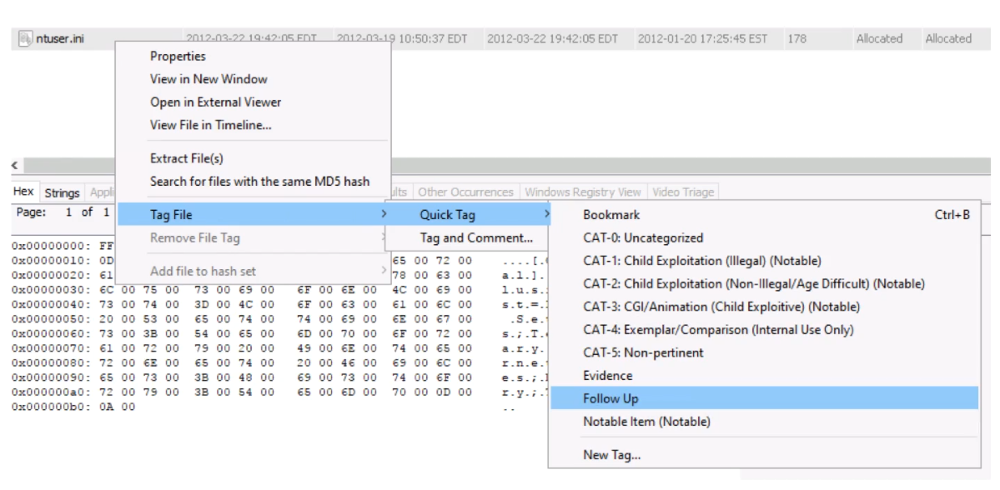
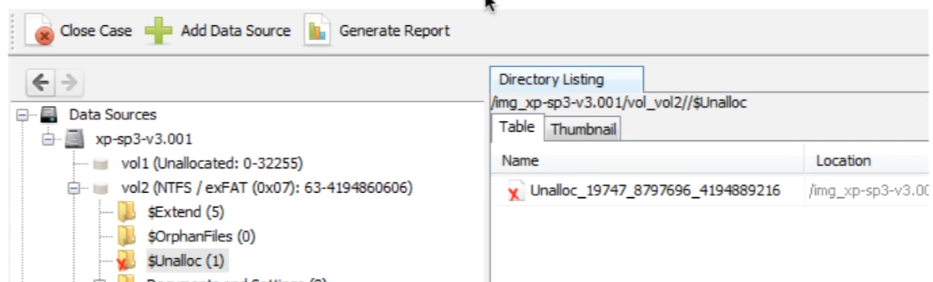

# AutoPSY

> 官方8小时入门课程笔记

## 下载

- 64-bit Autopsy: http://www.autopsy.com/download 

- All of the files at one of the following sites (they are the same files at both sites):
  - https://drive.google.com/drive/folders/1YJ0v9izpUZUfB2U3IAQ8ke3T9dUe57Jb?usp=sharing
    - OR
  - https://file.ac/21euCO1oZvAsFaNoGrTIuA/
  
- NIST NSRL Hash Set: https://sourceforge.net/projects/autopsy/files/NSRL/NSRL-266m-computer-Autopsy.zip/download

  

- 视频取证模组  [https://www.autopsy.com/add-on-modules/video-triage/](https://www.autopsy.com/add-on-modules/video-triage/))

> 快速识别隐藏在其他内容中的视频文件（例如，生日聚会视频中间的极端主义材料）。无需观看任何视频，即可获取在调查过程中发现的任何视频文件内容的摘要。在几秒钟内确定视频中是否有可能需要进一步调查的内容。

## 基础操作

### 新建一个case

### 选择数据源，确认时间

### 确认模组

### 预览和手动分析数据

### 标记结果

### 准备报告

## 开发类型介绍

> 分为独立用户和团队或多用户

### 独立用户

#### 功能

* 案件一次只能被一个用户打开

* 几乎所有其他取证工具都采用类似的方法

#### 技术

* 所有东西运行于同一台电脑

* 简单安装
* 只要开启Autopsy就会启动所有附属服务(数据库等)

### 团队用户

#### 功能

* 案件可以被同时打开
* 允许“自动摄取”模式，其中新媒体文件被多节点自动24 * 7进行分析
* 分析的更快，因为数据库开启的更快

#### 技术

* 使用方法相同
* 为数据库/文本等提供中心服务
* 使用中央高速硬盘

## 安装

### Windows平台

* 安装msi
* 使用默认值
* 安装会产生一个版本目录，你可以同时安装多版本，已方便在多人使用时，处于同样的处理环境

### Linux/OS X

* 使用包管理器安装依存环境
* 下载zip并解压
* 运行unix_setup.sh拷贝文件到目录

### 团队用户

#### 需求

#### 设置

`Tools`->`Options`->`Central Repository panel`

设置翻译

`Tools`->`Optins`->`Translation`

### 个人用户
安装一键，略过

## 首次打开

> 这里如果是多人用户的话，其他用户也可以通过浏览器访问 \\IP\cases\case_name访问case

> 数据库不会拷贝文件，只有文件的信息，所以数据库会保持较小的容量

### 数据源

#### 硬盘镜像或vm文件

##### 支持格式

* Raw(dd)
* E01
* Android 手机 Raw硬盘images
* Virtual machine 格式

> 成组文件只需要指定第一个文件，如：E01 -> E02,E03        * 不支持E01文件夹整个导入

##### 分卷系统

* 使用开源工具The Sleuth Kit (TSK) 对镜像内容进行分析
* 容量检测系统(Detects Volume Systems) 会将硬盘进行计划划分
* 文件检测系统(Detects File Systems)会排列这些文件，使他们可以正确存储
* 分卷系统(Volume Systems)将硬盘镜像重新组织成一个卷或多卷
* 定位到硬盘镜像开始的地方

* 支援的类型:DOS,GPT,Mac,BSD,Solaris

* Autopsy会显示硬盘的每一个卷，以及未使用的区域

  

* 每一卷都会被分析，用来找到文件系统
* 如果没有找到任何内容，导入的镜像会被当做文件系统进行分析

##### 文件系统

* 文件系统通常位于卷内部的开头或者磁盘映像的开头
* 支援的格式：NTFS,FAT,ExFAT,HFS+,ISO9660,Ext2/3/4,YAFFS2,UFS

##### Orphan 文件

* Orphan文件是那些由于与之链接的应用程序或文件已被移动或删除的文件

* 他们会被存储在`$OrphanFile`文件夹下

* 在FAT文件系统中搜集Orphan文件是非常费时的

  > 每一个簇都会被读取分析。可以在导入镜像时取消选择这个选项

##### Carving 还原功能

* Carving功能无需得知文件系统类型即可恢复已删除的文件

* 依赖于文件的结构

* 需要文件系统的指针不再指向文件内容

###### Carvin 还原原理：

* 删除前的文件如下:

  

* 删除后文件名和元数据都无法定位

  

* 扫描每一个无法定位的段，我们可以看到文件类型的起始特征，文件头

  

* 当找到头的时候，继续找与它对应的结束

  

##### Autopsy中的Carving

* Autopsy包含PhotoRec(一款开源还原工具)

* 它在未分配空间上运行
* 还原的文件会在`$CarvedFiles`文件夹下

##### 未分配空间

* 未分配空间在Autopsy中会已文件的形式表示

* 直接存储在卷中或`$Unallioc`文件夹下

* 命名格式`Unalloc_ParentID_StartByte_EndByte`

  

##### 增加硬盘镜像作为数据源

> 注意事项：1.不支持RAID 2.不支持逻辑卷 3.不支持Bitlocker加密

#### 本地驱动器

##### 支持

* 本地硬盘C.D.E
* 预览在线系统
* USB设备(即使不可写)

##### 分析

* 与磁盘镜像相同的过程
* 需要进入所有设备的管理员权限
* 分析不能在USB设备拔出后进行

##### 加载本地驱动器

> 制作VHD
> * 在分析时制作一个小VHD镜像，这会帮助你分流，及备份
> * 当数据被读取时，Autopsy会判读是否已经查看过这个部分，如果没有，则会存一份拷贝
> * 如果你刚刚开始分析，则会得到一份完整的镜像
> * 选择了这个选项后，会在文件筐中选择文件位置。如果勾选"Update case ....."则会在镜像完成后让案件使用VHD文件

#### 本地文件

##### 支持

* 本地计算机文件系统支持的文件
* 逻辑取证文件(logical evidence file)  L01

##### 过程

* 用户添加的指定文件或文件夹
* 文件夹会递归添加
* 文件的基本信息会被添加到数据库
* 文件不会被拷贝或者移动

##### 添加本地文件或文件夹

### UI图形界面

#### 结构树

#### 监听窗口

> 右键菜单增加`notable tag`或者增加`tag and comment`，删除也在右键菜单中

#### 信息窗口

