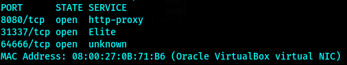
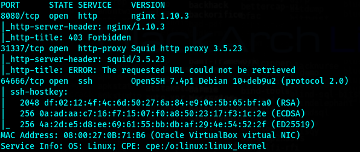
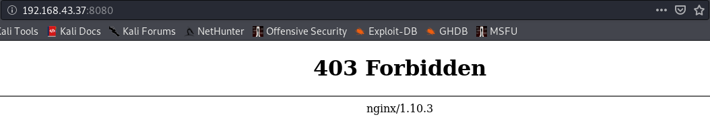
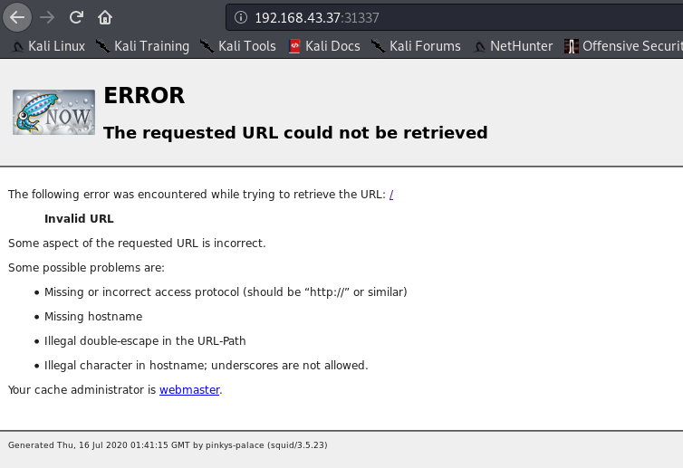
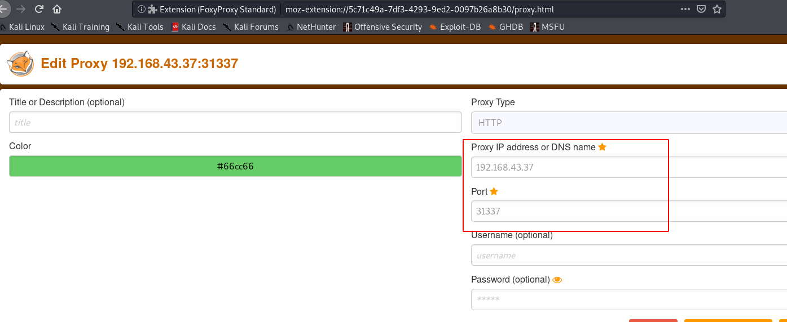
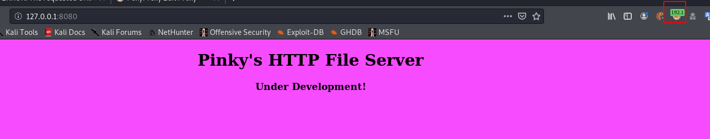
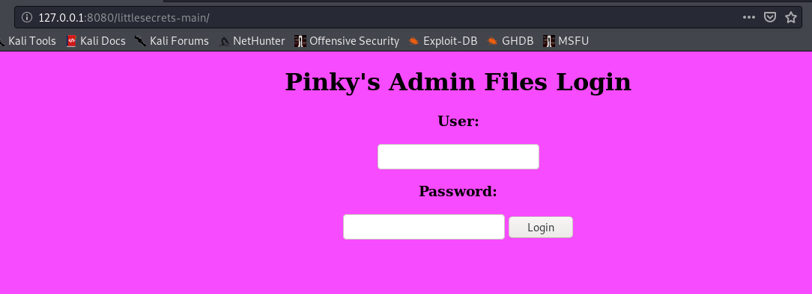

# Pinkys-PalaceV2









显然31337是代理



加入代理，重新浏览127.0.0.1:8080

因为已经代理了，所以ip应该使用127.0.0.1



现在可以正常浏览了，就可以利用代理对目标网址进行测试

目录

```bash
dirb http://127.0.0.1:8080/ /usr/share/wordlists/dirbuster/directory-list-lowercase-2.3-medium.txt -p http://192.168.43.37:31337/
```


```bash

```


